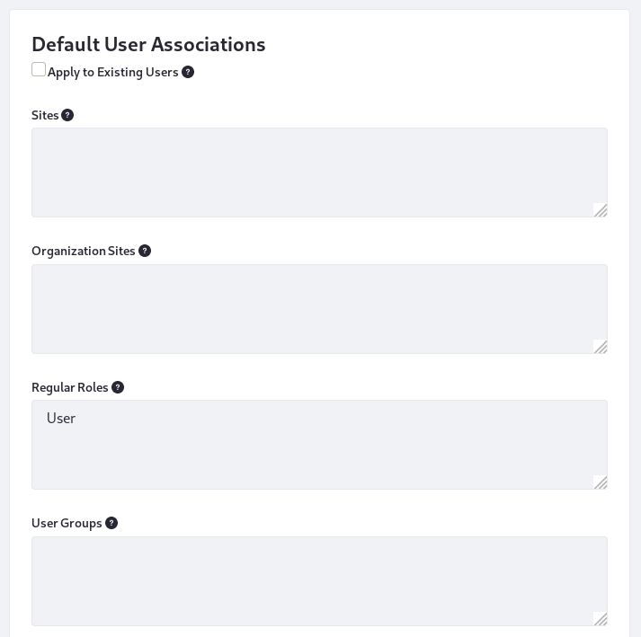
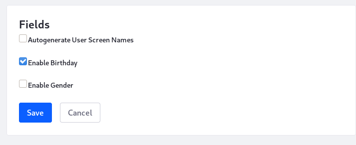

# Configuring a Virtual Instance: Users

The Users configuration defines the look and feel of the Personal Menu, the default user associations for Users, and defines whether specific fields are available when a new User creates an account. 

To access the Users settings, Open the Control Panel and navigate to *Configuration* &rarr; *Instance Settings*, and select the *Users* category under the *PLATFORM* section. 

The Users Instance configuration contains three entries:

| Configuration | Purpose |
| --------- | ------------ |
| Personal Menu | Configure the look and feel of personal applications and whether the Personal Menu appears in the Control Menu |
| Default User Associations | Automatically confer membership to some Sites, Roles, and User Groups |
| Fields | Enable and disable some optional fields from the User form |

## Personal Menu

The Personal Menu configuration entry specifies whether personal applications use the same look and feel as the current site or if they should use the look and feel of the My Dashboard pages instead. You can also specify whether the personal menu appears in the Control Menu by toggling the *Show in Control Menu* option on and off. 

## Default User Associations

The Default User Associations configuration entry defines the default Sites, Organization Sites, Roles, and User Groups you want all new Users assigned to automatically. By default, new Users are only assigned to the Users Role. User groups are handy tools for pre-populating your Users' private Sites with pages, assigning Roles and permissions, and managing site membership. If you update this configuration after your Users have created their accounts, you can apply the updates to existing Users by checking the *Apply to Existing Users* checkbox. Changes take effect the next time the User signs in. 

## Fields

The Fields configuration entry contains settings for enabling/disabling the fields listed below on the Add/Edit User Form:

- Autogeneration of screen names (disabled by default)
- Birthday field (enabled by default)
- Gender field (disabled by default)

