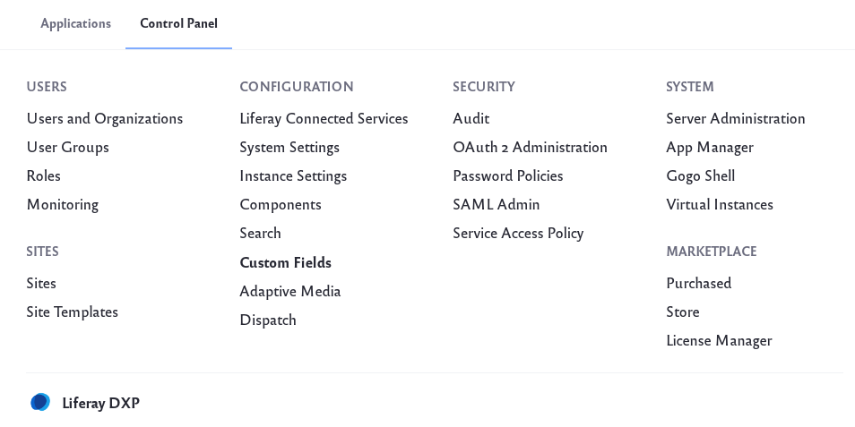
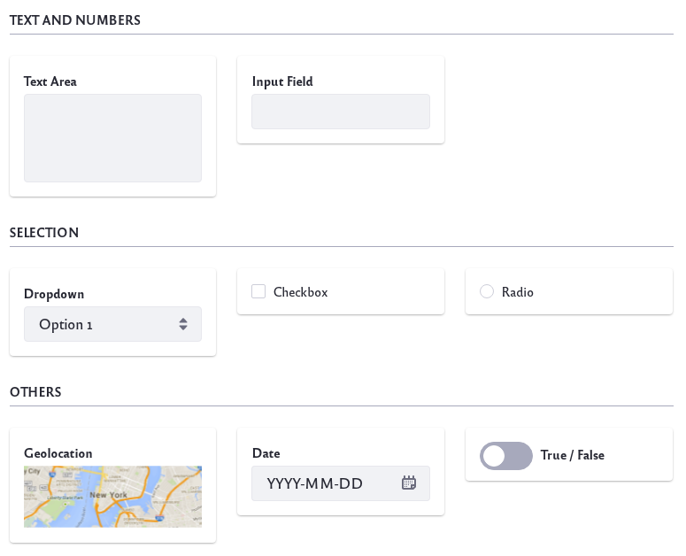
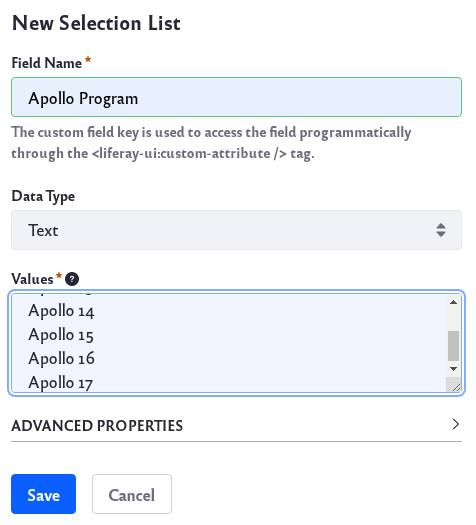
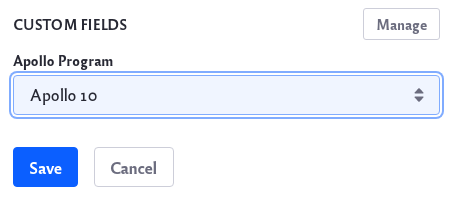

# Adding Custom Fields to Users

Many of Liferay's assets and resources can be extended with new fields. This includes adding custom fields for Users:

1. Navigate to *Control Panel* &rarr; *Configuration* &rarr; *Custom Fields*.

   

1. Scroll down and click the link for *User*.

1. Click *Add* () to add a new custom field.

1. Choose a field type and click _Save_. 

## Field Types

### Text and Numbers

**Text Area:** Collect longer lines of text. 

**Input Field:** Collect a string of text, a decimal number, or an integer. 

### Selection

**Dropdown:** Provide a dropdown list to select a single option. The list can be text, decimal numbers, or integers.

**Checkbox:** Provide a list of checkboxes to select one or more options. 

**Radio:** Provide a list of radio buttons to toggle a single option.

### Other Field Types

**Geolocation:** Collect the User's geolocation information. 

**Date:** Collect date and time information. 

**True/False:** Provide a choice of True or False.

For example, you can select the _Dropdown_ field type to add a custom category for your users to select. 

## Using Your New Field

1. Navigate to *Control Panel* &rarr; *Users* &rarr; *Users and Organizations*. 

1. Click the *Add* icon () to add a new User. You should now see the newly added custom field at the bottom of the form.

   
