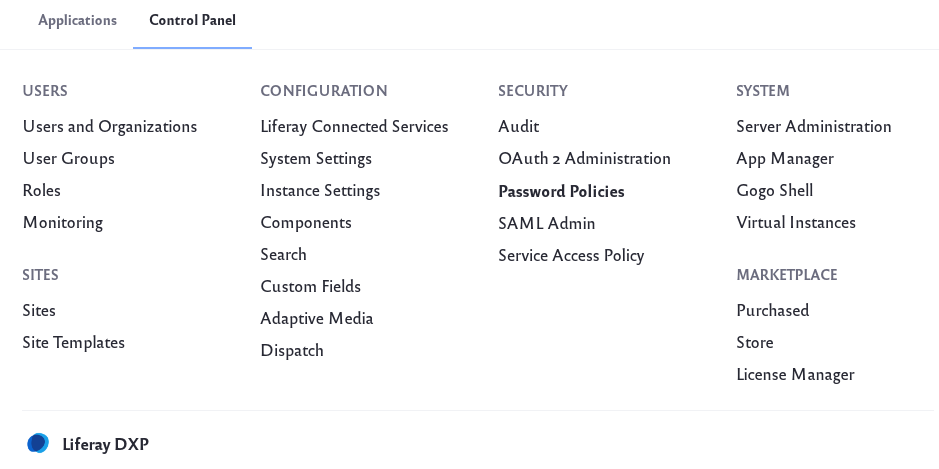
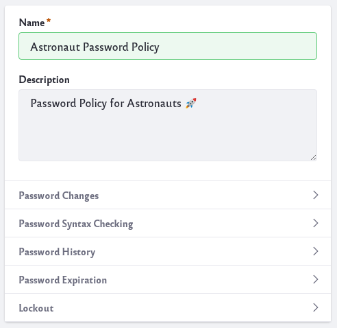
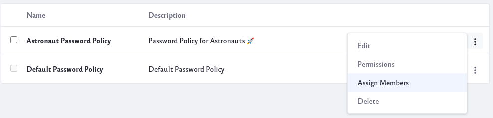
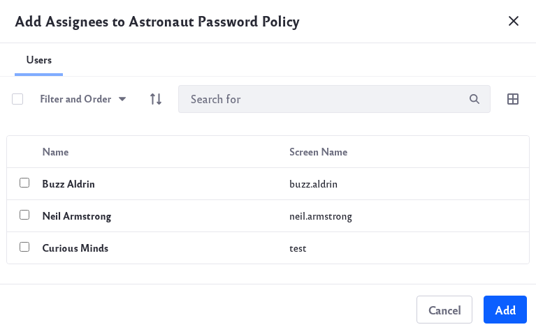

# Configuring a Password Policy

Password policies can enhance the security of Liferay DXP. You can use the default policy that ships with Liferay (modified or as is), or you can create your own policies. Policies can be assigned to users or organizations.

## Adding and Configuring Password Policies

To add a new password policy,

1. Navigate to *Control Panel* → *Security* → *Password Policies*.

    

1. Click on the Actions button () next to an existing policy and click *Edit*. Or click the *Add* icon () to add a new policy.

1. In the configuration window, provide a *Name* and *Description* for your password policy. 

    

    You can set the following parameters:

    **Password Changes:** Allow or disallow users to change their passwords, and set a time limit on the validity of password reset links.

    **Password Syntax Checking:** If enabled, require users to use a certain syntax when choosing a password. You can disallow dictionary words, set a minimum length, and more in this section.

    **Password History:** If enabled, decide how many passwords to keep in the history, preventing users from reusing an old password.

    **Password Expiration:** Decide whether passwords will expire. If they will, specify how long passwords are valid, whether a warning will be sent, when and whether a warning will be sent, and how many times they can log in after the password is expired, before needing to set a new password (called a *Grace Limit)*.

    **Lockout:** If enabled, set a maximum number of failed authentication attempts before the account is locked, how long the number of attempts is stored, and how long the lockout lasts.

    Once you configure the policy to your liking, click the *Save* button.

## Assigning Members to a Password Policy

Once you have created a new password policy, you need to assign members to it,

1. Click on the Actions button () next to the password policy. Click on *Assign Members*.

    

1. You can choose to add individual users to the password policy or add organizations. Click on the add icon () and a new window will pop up.

    

1. Make your selection (of users or organizations) and click on the *Add* button. 

    

    Your users or organizations should now be associated with your password policy.

