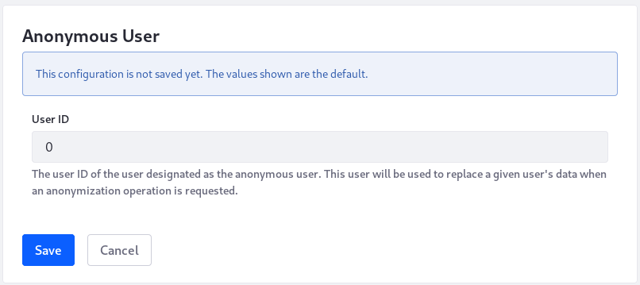

# Configuring the Anonymous User

Internet users are increasingly and justifiably concerned about how their personal data is processed by the systems they use. Liferay is aware of the need for functionality to address User data management. [Deleting User data](./sanitizing-user-data.md#the-personal-data-erasure-screen) is the safest way to honor _right to be forgotten_ requests.

When User data must be preserved, automatic anonymization of the data is in order. Users being anonymized must have their identifiers (for example, User ID and User Name) removed from content they've interacted with. Since portal content usually requires this information for its applications to work properly, the User's identifiers must be replaced by something, or someone. That someone is *Anonymous Anonymous*. This deactivated User becomes the User whose identifiers are assigned to anonymized content. This identity swap is an important step in the anonymization process, but additional manual intervention may be necessary to truly achieve anonymization.


The easiest way to set up a new User as the Anonymous User is to edit an existing Anonymous User configuration, passing in a different User ID. 

To edit an existing configuration,

1. Go to Control Panel &rarr; Configuration &rarr; Instance Settings &rarr; Users &rarr; Anonymous User.

1. Edit the existing configuration, providing a different User ID.

   Get the User ID from Control Panel &rarr; Users &rarr; Users and Organizations. Click on the User and find the User ID in the User Display Data section of the Edit User screen.

1. Click *Update*.

To create a brand new Anonymous User, first [create the User](../users/adding-and-managing-users.md) to use for data anonymization, then follow the same steps described above.

There can only be one Anonymous User configured for each instance.



## Using a Configuration File

As with all System Settings and Instance Settings, a `.config` [file](../../system-administration/configuring-liferay/configuration-files-and-factories/using-configuration-files.md) can be deployed to `[Liferay Home]/osgi/configs/` as an alternative to working in the Control Panel UI. To do this you'll leverage [Factory Configuration](../../system-administration/configuring-liferay/configuration-files-and-factories/using-factory-configuration.md) files. Create an Anonymous User for each Virtual Instance using files following the pattern

```bash
com.liferay.user.associated.data.web.internal.configuration.AnonymousUserConfiguration.scoped-[uniqueId].config
```

```tip::
   Using the Web ID or Instance ID (equivalent to the Company ID) for each Virtual Instance as its configuration file's `-subname` can help you differentiate between the files at a glance.
```

Give it contents like this:

```properties
companyId=20098
userId=36059
```

To find the `companyId` for a [Virtual Instance](../../system-administration/virtual_instances.rst), go to Control Panel &rarr; System &rarr; Virtual Instances. The Instance ID displayed in the table is the `companyId` to use in the configuration file.

```note::
   `Why is there an extra field in the configuration file?`

   When configuring the Anonymous User by configuration file, you must provide the Company ID of the instance. In Instance Settings the configuration is already associated to the instance where it's being configured, but the configuration file is deployed at the system scope, so it must contain the ID of the instance where it applies.
```
