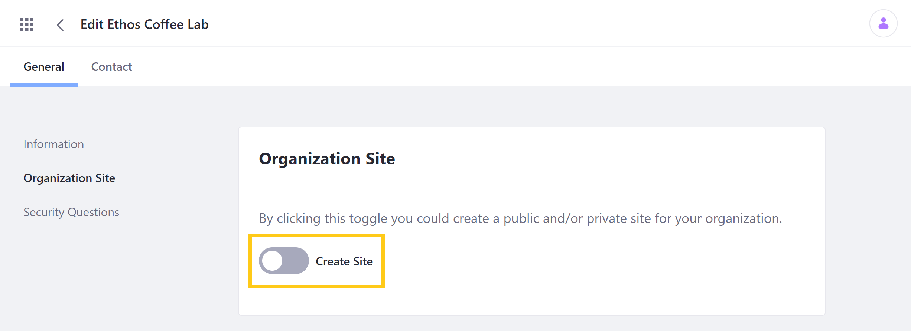

# Organization Sites

Liferay [Organizations](./understanding-organizations.md) enable distributed User management, providing a convenient way to organize and manage instance users and roles to reflect your organizational hierarchy. Once an organization is created, you can also enable a dedicated Site for your Organization to facilitate distributed portal administration. This feature is available for both parent and child Organizations, so you can quickly create a hierarchy of Sites with content created, administered, and tailored specifically to each group's needs.

## Creating an Organization Site

Follow these steps to create an Organization Site:

1. Open the *Global Menu*, and go to *Control Panel* &rarr; *Users* &rarr; *Users and Organizations*. Then, click on the *Organizations* tab.

1. Click on the *Actions* button () for an existing Organization, and select *Edit*.

    

1. Under *General* settings, go to *Organization Site*, and toggle the *Create Site* button.

    

1. Click on *Save*.

This creates a new blank Site with your Organization's Users and general information.

## Organization Site Users and Roles

When you create an Organization Site, your Organization's Users are automatically assigned to it with implicit Site roles that correspond to their Organization roles. For example, Organization Users are functionally equivalent to Site Members, possessing basic Site privileges, while Organization Administrators function as Site Administrators and can manage Site pages, widgets, and content. See [Organization Roles](./organization-roles.md) and the [Default Roles Reference](../roles-and-permissions/default-roles-reference.md#organization-roles) for more information.

## Additional Information

* [Understanding Organizations](./understanding-organizations.md)
* [Creating and Managing Organizations](./creating-and-managing-organizations.md)
* [Organization Roles](./organization-roles.md)
