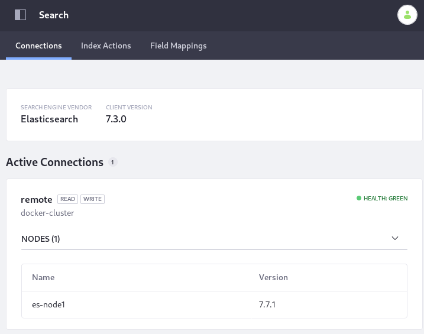

# Exercise: Install Elasticsearch

> Availability: Liferay DXP 7.3, Liferay Portal CE 7.3 GA4

Here you can walk through an example setup on your local machine to see how the [Rest Client](https://www.elastic.co/guide/en/elasticsearch/client/java-rest/7.x/java-rest-high.html) connection between Elasticsearch and Liferay DXP 7.3 is configured. The example uses two Docker containers: one Elasticsearch container and one Liferay DXP container. For more conceptual and production-like information see [Installing Elasticsearch](./installing-elasticsearch.md).

Subsequent exercises will secure the connection and configure monitoring (Liferay Enterprise Search only).

## Create Local Folders for Bind Mounting to the Docker Containers

Create a local folder structure that can be bind mounted to the Elasticsearch and DXP containers' system folders for providing plugins and configuration files:

```bash
mkdir -p test-es-install/dxp/files/osgi/configs && mkdir -p test-es-install/elasticsearch && cd test-es-install
```

```tip::
   The ``cd test-es-install`` command at the end will put you in the ``test-es-install`` folder. Make sure you run the remaining commands for both Elasticsearch and Liferay DXP from this folder.
```
## Install Elasticsearch

1. Configure and start an Elasticsearch 7.7.1 container named `elasticsearch771`:

   ```bash
   docker run -it --name elasticsearch771 -p 9200:9200 -p 9300:9300 -e "discovery.type=single-node" -e "node.name=es-node1" -v $(pwd)/elasticsearch:/usr/share/elasticsearch/data docker.elastic.co/elasticsearch/elasticsearch:7.7.1
   ```

1. Install the required Elasticsearch plugins. Use `docker exec -it` to access an interactive bash shell:

   ```bash
   docker exec -it elasticsearch771 bash -c '/usr/share/elasticsearch/bin/elasticsearch-plugin install analysis-icu && /usr/share/elasticsearch/bin/elasticsearch-plugin install analysis-kuromoji && /usr/share/elasticsearch/bin/elasticsearch-plugin install analysis-smartcn && /usr/share/elasticsearch/bin/elasticsearch-plugin install analysis-stempel'
   ```

1. Restart the Elasticsearch container to register the plugins. CTRL+C stops the container, then start it again by running 

   ```bash
   docker start -i elasticsearch771
   ```

1. Get the IPv4 address of the running Elasticsearch container:

   ```bash
   docker network inspect bridge
   ```

   In this example it's `172.17.0.2`. If your system provides a different IP address, you must use it in the `docker run --add-host elasticsearch771:[IP]...` command when running Liferay DXP.

   ```bash
   "Containers": {
               "2d4614fdcce2159322fa7922bfc5f866b79bd7f609a65cc888f9a260f80731f4": {
                   "Name": "elasticsearch771",
                   "EndpointID": "e89c3d0a87cc528753470eb359cee3b85fea9f9a5df3b249d54d203741a650a8",
                   "MacAddress": "02:42:ac:11:00:02",
                   "IPv4Address": "172.17.0.2/16",
                   "IPv6Address": ""
               }
           },
   ```

## Install Liferay DXP

Specify the properties Liferay DXP needs to connect with Elasticsearch, then run the DXP container.

1. First populate the Elasticsearch 7 configuration file by running

   ```bash
   cat <<EOT >> dxp/files/osgi/configs/com.liferay.portal.search.elasticsearch7.configuration.ElasticsearchConfiguration.config
   operationMode="REMOTE"
   remoteClusterConnectionId="remote"
   EOT
   ```

1. Configure the remote connection by running

   ```bash
   cat <<EOT >> dxp/files/osgi/configs/com.liferay.portal.search.elasticsearch7.configuration.ElasticsearchConnectionConfiguration.config
   active="true"
   networkHostAddresses="http://elasticsearch771:9200"
   connectionId="remote"
   EOT
   ```

1. Once the configuration files are in place, start the DXP container with 

   ```bash
   docker run -it --name dxp73  --add-host elasticsearch771:172.17.0.2 -p 8080:8080 -v $(pwd)/dxp:/mnt/liferay liferay/portal:7.3.2-ga3
   ```

1. **Checkpoint:** Verify that the Elasticsearch connection is active in Control Panel &rarr; Configuration &rarr; Search.

   

Re-index your search and spell check indexes. Both re-index actions are carried out from the Index Actions tab of Control Panel &rarr; Configuration &rarr; Search.

## Related Topics

[Liferay Enterprise Search](../../liferay_enterprise_search.rst)
[Search Pages](../../search-pages-and-widgets/working-with-search-pages/search-pages.md)
[Administering and Tuning Search](../../search_administration_and_tuning.rst)
[Search Configuration Reference Guide](../../search-configuration-reference.md)

