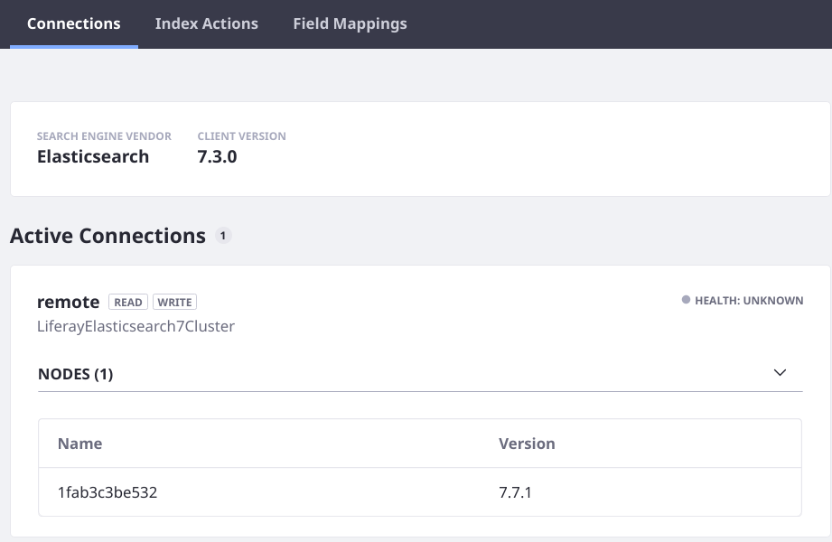

# Exercise: Upgrading the Example Liferay DXP Cluster

> Prerequisite: Configure the simple example cluster in the [Clustering for High Availability](../../../installation-and-upgrades/setting-up-liferay-dxp/clustering_for_high_availability.rst) section.

The example cluster demonstrated in the [Clustering for High Availability section](../../../installation-and-upgrades/setting-up-liferay-dxp/clustering-for-high-availability/example-creating-a-simple-dxp-cluster.md) uses the  same Elasticsearch version as the default bundled Elasticsearch, so you can get a DXP cluster up and running quickly. While convenient, you should always use the latest supported version of Elasticsearch. There are a few additional steps to those basic instructions:

1. Start an Elasticsearch 7 Docker container.
1. Configure a new DXP 1 Container:
   - Remove the existing `dxp-1`.
   - Disable the default connector to Elasticsearch 6 and the bundled Elasticsearch 6 APIs.
   - Install and configure the latest Liferay Connector to Elasticsearch (includes new API versions).
   - Run the newly configured DXP 1 and Re-index into Elasticsearch 7.
1. Stop DXP 2 and the running Elasticsearch 6 container.
1. Configure a new DXP 2 container:
   - Remove the existing `dxp-2`.
   - Disable the default connector to Elasticsearch 6 and the bundled Elasticsearch 6 APIs.
   - Install and configure the latest Liferay Connector to Elasticsearch (includes new API versions).
   - Run the newly configured DXP 2 and Re-index into Elasticsearch 7.

```note::
   These instructions show how to completely rebuild the DXP Docker containers when upgrading to Elasticsearch 7. Therefore, the steps for connecting to Elasticsearch 7 apply equally to upgrading an existing installation or setting up a new installation.
```
<!-- Should we talk about why it's necessary? It's primarily the add-host configurations we made during the initial docker run, rather than creating a docker network, which was an intentional decision -->

These instructions assume all the example cluster's containers are running. You'll upgrade the DXP containers one by one to keep the site up and running throughout the procedure.

<!-- Table with a synopsis of the containers that are currently running when you start? -->

## Start Elasticsearch

If you don't already have an Elasticsearch tag, pull one [from here](https://www.docker.elastic.co/#):

```bash
docker pull docker.elastic.co/elasticsearch/elasticsearch:7.7.1
```

Create and configure the Elasticsearch server's container:

1. Set a local folder for storing the Elasticsearch data volume. From the local folder holding the bind-mounted DXP folders `dxp-1/`, `dxp-2/`, and `elasticsearch`, run
 
   ```bash
   mkdir -p elasticsearch7/es_data_volume
   ```
 
1. Start an Elasticsearch 7 container named `elasticsearch7`, with a bind mount to the host's data volume folder.

   ```bash
   docker run -it --name elasticsearch7 -p 9201:9200 -p 9301:9300 -e "discovery.type=single-node" -e cluster.name=LiferayElasticsearch7Cluster -e ES_JAVA_OPTS="-Xms512m -Xmx512m" -v $(pwd)/elasticsearch7/es_data_volume:/usr/share/elasticsearch/data docker.elastic.co/elasticsearch/elasticsearch:7.7.1
   ```

   Setting different host publication ports allows you to keep the Elasticsearch 6 container running simultaneously without conflicts. To understand the configuration settings (`-e`), see the [Elasticsearch documentation](https://www.elastic.co/guide/en/elasticsearch/reference/7.x/docker.html)

1. Install the required Elasticsearch plugins.

   ```bash
   docker exec -it elasticsearch7 bash -c '/usr/share/elasticsearch/bin/elasticsearch-plugin install analysis-icu && /usr/share/elasticsearch/bin/elasticsearch-plugin install analysis-kuromoji && /usr/share/elasticsearch/bin/elasticsearch-plugin install analysis-smartcn && /usr/share/elasticsearch/bin/elasticsearch-plugin install analysis-stempel'
   ```

   Stop the container, then restart it to register the plugins:

   ```bash
   docker start -i elasticsearch7
   ```

   To verify the plugins are installed, run 

   ```bash
   curl -X GET "localhost:9201/_cat/plugins"
   ```

   ```bash
   1fab3c3be532 analysis-icu      7.7.1
   1fab3c3be532 analysis-kuromoji 7.7.1
   1fab3c3be532 analysis-smartcn  7.7.1
   1fab3c3be532 analysis-stempel  7.7.1
   ```

## Configure a New dxp-1

Stop the `dxp-1` container. If it's running with `docker run -it` or `docker start -i`, just use _CTRL+C_ to stop the container. Otherwise use

```bash
docker stop dxp-1
```

Though you're going to run `docker rm dxp-1` and re-create the container, the local bind mount folder `dxp-1` remains, with its configurations. This lets you configure Liferay DXP's mechanism for disabling the Elasticsearch 6 connector and APIs before installing the new container.

### Disable the Elasticsearch 6 Connector and APIs

In the local folder you have bind mounted to the existing DXP container node called `dxp-1`, run

```bash
cat <<EOT >> dxp-1/files/osgi/configs/com.liferay.portal.bundle.blacklist.internal.BundleBlacklistConfiguration.config
blacklistBundleSymbolicNames=[ \
	"com.liferay.portal.search.elasticsearch6.api", \
	"com.liferay.portal.search.elasticsearch6.impl", \
	"com.liferay.portal.search.elasticsearch6.spi", \
	"com.liferay.portal.search.elasticsearch6.xpack.security.impl", \
	"Liferay Connector to X-Pack Security [Elastic Stack 6.x] - Impl" \
]
EOT
```

### Install and Configure the Liferay DXP Connector to Elasticsearch 7

The configuration file shown in the [example clustering article](../../../installation-and-upgrades/setting-up-liferay-dxp/clustering-for-high-availability/example-creating-a-simple-dxp-cluster.md) is for the Elasticsearch 6 connector that's installed by default on Liferay DXP 7.2 and 7.3. Once you disable Elasticsearch 6, the configuration has no effect.

1. Download the Liferay Connector to Elasticsearch 7:

   For Liferay DXP 7.2:

   - [CE](https://web.liferay.com/en/marketplace/-/mp/application/170642090)
   - [DXP](https://web.liferay.com/en/marketplace/-/mp/application/170390307)

   For Liferay DXP 7.3 (CE GA4 or later):

   - Not yet available
    <!-- LINK WHEN AVAILABLE -->

1. [Install the LPKG](../../../system-administration/installing-and-managing-apps/installing-apps/installing-apps.md).

   Make a deploy directory:

   ```bash
   mkdir dxp-1/deploy
   ```

   Copy the connector into the deploy directory:

   ```bash
   cp /path/to/downloaded/connector.lpkg dxp-1/deploy/.
   ```

Before executing `docker run` to configure and starts a new container, configure the connector you just installed.

### Configure Elasticsearch 7 for dxp-1

The Elasticsearch 7 connection <!--denote the version when this changed --> requires 2 configuration files: 

```bash
com.liferay.portal.search.elasticsearch7.configuration.ElasticsearchConfiguration.config
com.liferay.portal.search.elasticsearch7.configuration.ElasticsearchConnectionConfiguration.config
```
<!-- should the second one have a -subname since it's  a factory? -remote.config -->


In the local folder you bind mounted to the DXP container node `dxp-1` run

```bash
cat <<EOT >> dxp-1/files/osgi/configs/com.liferay.portal.search.elasticsearch7.configuration.ElasticsearchConfiguration.config
operationMode="REMOTE"
remoteClusterConnectionId="remote"
EOT
```

Then run

```bash
cat <<EOT >> dxp-1/files/osgi/configs/com.liferay.portal.search.elasticsearch7.configuration.ElasticsearchConnectionConfiguration.config
active="true"
networkHostAddresses="http://elasticsearch7:9200"
connectionId="remote"
EOT
```

All the configuration and installation you just completed was on the host folder. The container will pick up these files (and the LPKG) once you run it.

### Re-Create the Container and Re-index

1. Remove the existing `dxp-1` container:

   ```bash
   docker rm dxp-1
   ```

1. Find the IP address of the database container and the Elasticsearch 7 container:

   ```bash
   docker network inspect bridge 
   ```

   The run command below assumes that Elasticsearch 7 is running at `172.17.0.3` and the `some-mariadb` container is at `172.17.0.2`. Change the `--add-host` configurations to reflect different values differences in your setup.

1. Run the new container. From the local folder you bind mounted to the DXP container node `dxp-1` execute

   ```bash
   docker run -it --name dxp-1  --add-host elasticsearch7:172.17.0.3 --add-host some-mariadb:172.17.0.2 -e LIFERAY_JDBC_PERIOD_DEFAULT_PERIOD_JNDI_PERIOD_NAME="" -e LIFERAY_JDBC_PERIOD_DEFAULT_PERIOD_DRIVER_UPPERCASEC_LASS_UPPERCASEN_AME=org.mariadb.jdbc.Driver -e LIFERAY_JDBC_PERIOD_DEFAULT_PERIOD_URL="jdbc:mariadb://some-mariadb:3306/dxp_db?useUnicode=true&characterEncoding=UTF-8&useFastDateParsing=false" -e LIFERAY_JDBC_PERIOD_DEFAULT_PERIOD_USERNAME=root -e LIFERAY_JDBC_PERIOD_DEFAULT_PERIOD_PASSWORD=my-secret-pw -e LIFERAY_CLUSTER_PERIOD_LINK_PERIOD_ENABLED=true -e LIFERAY_CLUSTER_PERIOD_LINK_PERIOD_CHANNEL_PERIOD_LOGIC_PERIOD_NAME_PERIOD_CONTROL=control-channel-logic-name-1 -e LIFERAY_CLUSTER_PERIOD_LINK_PERIOD_CHANNEL_PERIOD_LOGIC_PERIOD_NAME_PERIOD_TRANSPORT_PERIOD_NUMBER0=transport-channel-logic-name-1 -e LIFERAY_CLUSTER_PERIOD_LINK_PERIOD_AUTODETECT_PERIOD_ADDRESS=some-mariadb:3306 -e LIFERAY_WEB_PERIOD_SERVER_PERIOD_DISPLAY_PERIOD_NODE=true -e LIFERAY_DL_PERIOD_STORE_PERIOD_IMPL=com.liferay.portal.store.db.DBStore --name dxp-1 -p 11311:11311 -p 8009:8009 -p 8080:8080 -v $(pwd)/dxp-1:/mnt/liferay liferay/portal:7.3.2-ga3
   ```



Re-index your search and spell check indexes. Both re-index actions are carried out at Control Panel &rarr; Configuration &rarr; Search, in the Index Actions tab. It doesn't matter which DXP server you execute the re-index from.

Now one node is upgraded and indexing into Elasticsearch 7. Repeat the steps on `dxp-2`.

## Stop dxp-2 and Elasticsearch 6

Stop the `dxp-2` container. If it's running with `docker run -it` or `docker start -i`, just use _CTRL+C_ to stop the container. Otherwise use

```bash
docker stop dxp-2
```

Stop Elasticsearch 6 with a similar command.

```tip::
   To see all the host's currently running containers, use 

   ``docker container ls``
```

## Configure a New dxp-2

The `dxp-2` node must also be re-created from the ground up using the same steps completed for `dxp-1`.

### Disable the Elasticsearch 6 Connector and APIs

In the local folder you have bind mounted to the DXP container node called `dxp-2`, run

```bash
cat <<EOT >> dxp-2/files/osgi/configs/com.liferay.portal.bundle.blacklist.internal.BundleBlacklistConfiguration.config
blacklistBundleSymbolicNames=[ \
	"com.liferay.portal.search.elasticsearch6.api", \
	"com.liferay.portal.search.elasticsearch6.impl", \
	"com.liferay.portal.search.elasticsearch6.spi", \
	"com.liferay.portal.search.elasticsearch6.xpack.security.impl", \
	"Liferay Connector to X-Pack Security [Elastic Stack 6.x] - Impl" \
]
EOT
```

### Configuring Elasticsearch 7 for dxp-2

In the local folder you bind mounted to the DXP container node `dxp-2` run

```bash
cat <<EOT >> dxp-2/files/osgi/configs/com.liferay.portal.search.elasticsearch7.configuration.ElasticsearchConfiguration.config
operationMode="REMOTE"
remoteClusterConnectionId="remote"
EOT
```

Then run

```bash
cat <<EOT >> dxp-2/files/osgi/configs/com.liferay.portal.search.elasticsearch7.configuration.ElasticsearchConnectionConfiguration.config
active="true"
networkHostAddresses="http://elasticsearch7:9200"
connectionId="remote"
EOT
```

### Re-Create the Container and Re-index

1. Remove the existing `dxp-2` container:

   ```bash
   docker rm dxp-2
   ```

1. Find the IP address of the database container and the Elasticsearch 7 container:

   ```bash
   docker network inspect bridge 
   ```

   The run command below assumes that Elasticsearch 7 is running at `172.17.0.3` and the `some-mariadb` container is at `172.17.0.2`. Change the `--add-host` configurations to reflect different values differences in your setup.


1. Run the new container. From the local folder that contains the bind mounted folders execute

   ```bash
   docker run -it --name dxp-2  --add-host elasticsearch7:172.17.0.3 --add-host some-mariadb:172.17.0.2 -e LIFERAY_JDBC_PERIOD_DEFAULT_PERIOD_JNDI_PERIOD_NAME="" -e LIFERAY_JDBC_PERIOD_DEFAULT_PERIOD_DRIVER_UPPERCASEC_LASS_UPPERCASEN_AME=org.mariadb.jdbc.Driver -e LIFERAY_JDBC_PERIOD_DEFAULT_PERIOD_URL="jdbc:mariadb://some-mariadb:3306/dxp_db?useUnicode=true&characterEncoding=UTF-8&useFastDateParsing=false" -e LIFERAY_JDBC_PERIOD_DEFAULT_PERIOD_USERNAME=root -e LIFERAY_JDBC_PERIOD_DEFAULT_PERIOD_PASSWORD=my-secret-pw -e LIFERAY_CLUSTER_PERIOD_LINK_PERIOD_ENABLED=true -e LIFERAY_CLUSTER_PERIOD_LINK_PERIOD_CHANNEL_PERIOD_LOGIC_PERIOD_NAME_PERIOD_CONTROL=control-channel-logic-name-1 -e LIFERAY_CLUSTER_PERIOD_LINK_PERIOD_CHANNEL_PERIOD_LOGIC_PERIOD_NAME_PERIOD_TRANSPORT_PERIOD_NUMBER0=transport-channel-logic-name-1 -e LIFERAY_CLUSTER_PERIOD_LINK_PERIOD_AUTODETECT_PERIOD_ADDRESS=some-mariadb:3306 -e LIFERAY_WEB_PERIOD_SERVER_PERIOD_DISPLAY_PERIOD_NODE=true -e LIFERAY_DL_PERIOD_STORE_PERIOD_IMPL=com.liferay.portal.store.db.DBStore --name dxp-2 -p 11312:11311 -p 9009:8009 -p 9080:8080 -v $(pwd)/dxp-2:/mnt/liferay liferay/portal:7.3.2-ga3
   ```

Re-index your search and spell check indexes. Both re-index actions are carried out at Control Panel &rarr; Configuration &rarr; Search, in the Index Actions tab. It doesn't matter which DXP server you execute the re-index from.

Once finished you can destroy the Elasticsearch 6 container and remove the configuration file for the Elasticsearch 6 connector (in `files/osgi/container` of both DXP bind mounted folders).

## Related Topics

- [Creating a Simple DXP Cluster](../../../installation-and-upgrades/setting-up-liferay-dxp/clustering-for-high-availability/example-creating-a-simple-dxp-cluster.md)
- [Troubleshooting Elasticsearch Installation](./troubleshooting-elasticsearch-installation.md)
- [Installing Elasticsearch](./installing-elasticsearch.md)
