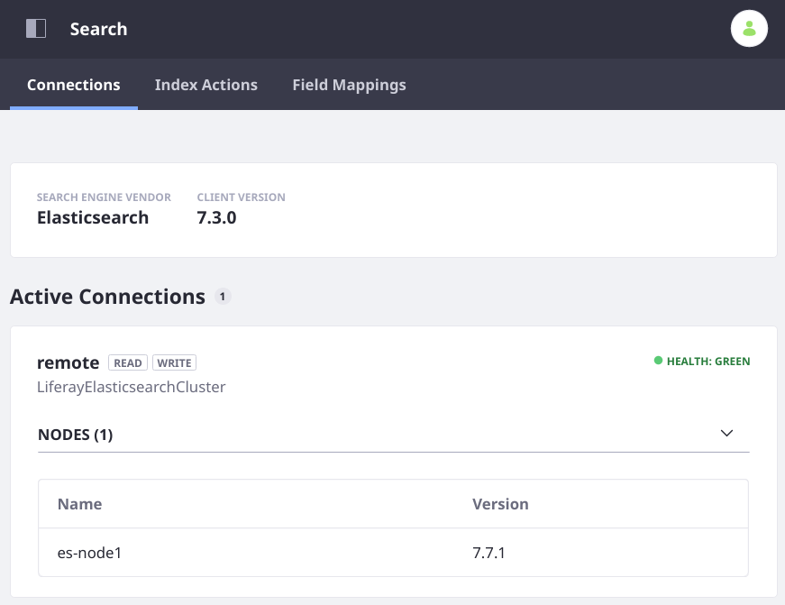

# Installing Elasticsearch

> Latest Supported Elasticsearch Version: 7.7
> Available: Liferay DXP 7.2 SP3+ and Liferay DXP 7.3 GA4+

You should always install the latest [supported version](https://help.liferay.com/hc/sections/360002103292-Compatibility-Matrix) of Elasticsearch for Liferay DXP. Whether installing DXP and Elasticsearch clusters in a local on-premise configuration, installing single-node testing or development servers for each, or setting up a production Docker installation, this guide walks you through the setup procedure for the latest supported version of Elasticsearch.

## Prerequisites

### Production-Like Local Environment: Add Hosts

You can skip this if you'll set up a testing environment using `localhost`. For a production-like setup on your local machine, add the hosts for Liferay DXP and the Elasticsearch cluster. Add this to your operating system's `path/to/etc/hosts` file:

```properties
<your IP> es-node1
<your IP> es-node2
<your IP> es-node3
<your IP> dxp.liferay.com
```

Use the real IP address of your system, not the loopback address `127.0.0.1`.

### Docker Containers: Add Hosts

The Liferay DXP container(s) must recognize the Elasticsearch IP(s) to establish a connection. Add `/etc/hosts/` entries on the DXP nodes that map the Elasticsearch container name to the Elasticsearch server host IP address. This can be established during the `docker run` phase by passing an `--add-host elasticsearch:[IP address]` argument for each Elasticsearch node.

To obtain the IP addresses of all running containers, run 

```bash
docker network inspect bridge
```

The example value presented here is `172.17.0.2`:

```bash
docker run -it --name dxp-1 --add-host elasticsearch7:172.17.0.2 ...
```

### Increase the Virtual Memory of Elasticsearch's Host

You can skip this step if you're setting up a `localhost` testing environment with a downloaded Elasticsearch archive. Elasticsearch requires a higher _mmap count_ (for mapping the directory holding its indexes into memory) than most operating systems are configured for by default. On Linux and as the root user, run

```bash
sysctl -w vm.max_map_count=262144
```

See [Elasticsearch's documentation](https://www.elastic.co/guide/en/elasticsearch/reference/7.x/vm-max-map-count.html) to learn more, including how to set it permanently.

## Install Elasticsearch

1. Obtain Elasticsearch. See [Elastic's](https://www.elastic.co) website for a local download or [pull a docker image](https://www.docker.elastic.co/):

   ```bash
   docker pull docker.elastic.co/elasticsearch/elasticsearch:7.8.0
   ```

1. If you downloaded Elasticsearch directly, install it by extracting its archive to the system where you want it to run.

1. Install some required Elasticsearch plugins. Run these commands from the `bin` folder on each node:

   ```bash
   ./elasticsearch-plugin install analysis-icu
   ./elasticsearch-plugin install analysis-kuromoji
   ./elasticsearch-plugin install analysis-smartcn
   ./elasticsearch-plugin install analysis-stempel
   ```

   If you have a running Docker container, you can use [`docker exec -it`](https://docs.docker.com/engine/reference/commandline/exec/) to execute `elasticsearch-plugin` directives in an interactive bash shell:

   ```bash
   docker exec -it [container-name] bash -c '/usr/share/elasticsearch/bin/elasticsearch-plugin install analysis-icu && /usr/share/elasticsearch/bin/elasticsearch-plugin install analysis-kuromoji && /usr/share/elasticsearch/bin/elasticsearch-plugin install analysis-smartcn && /usr/share/elasticsearch/bin/elasticsearch-plugin install analysis-stempel'
   ```

## Configure Elasticsearch

To configure an Elasticsearch cluster of Docker containers, use a [`docker-compose.yml` file](https://www.elastic.co/guide/en/elasticsearch/reference/7.x/docker.html#docker-compose-file). A local installation is configured via the `Elasticsearch Home/config/elasticsearch.yml` file.

```tip::
   **Docker:** For a simple single-node test cluster, you can specify the cluster name (and any other configuration options) when first creating and starting the container (see below for an example ``docker run ...`` directive).
```

These properties should have unique values for each node in the cluster:

- `node.name`
- `http.port`
- `network.host`
- `transport.port`

For example,

```yaml
node.name: es-node1
http.port: 9200
# Set this to the value declared in your etc/hosts file for the node
# TODO: Set to something unique from the node name for clarity?
network.host: es-node1
# The transport port you configure is used for discovery
transport.port: 9300
```

Depending on your system's design, every node in the Elasticsearch cluster can have identical values for these settings:
<!-- hmm, not necessarily so -->

- `cluster.initial_master_nodes`
- `discovery.zen.minimum_master_nodes`
- `discovery.seed_hosts`

For example, `es-node1`:

```yaml
cluster.initial_master_nodes:
  - es-node1
  - es-node2
  - es-node3
discovery.zen.minimum_master_nodes: 2
discovery.seed_hosts:
  - es-node1:9300
  - es-node2:9301
  - es-node3:9302
```

The `elasticsearch.yml` configuration is simpler for a single-node cluster:

```yaml
# Single node, remote elasticsearch.yml example:
discovery.type: single-node
discovery.seed_hosts:
  - es-node1:9300
http.port: 9200
network.host: es-node1
node.name: es-node1
transport.port: 9300
```

However, make sure you [force the bootstrap checks](https://www.elastic.co/guide/en/elasticsearch/reference/7.x/bootstrap-checks.html#_forcing_the_bootstrap_checks) if you're running a single-node production server by setting a property at the end of `ES_HOME/config/jvm.options`:

```properties
# For a single node production cluster
-Des.enforce.bootstrap.checks=true
```

To configure an Elasticsearch cluster of Docker containers, the `docker-compose.yml` will contain `services` entries for each node and some common `volume` and `network` properties:

```yaml
version: '2.2'
services:
  es01:
    image: docker.elastic.co/elasticsearch/elasticsearch:7.5.2
    container_name: es01
    environment:
      - node.name=es01
      - cluster.name=es-docker-cluster
      - discovery.seed_hosts=es02,es03
      - cluster.initial_master_nodes=es01,es02,es03
      - bootstrap.memory_lock=true
      - "ES_JAVA_OPTS=-Xms512m -Xmx512m"
    ulimits:
      memlock:
        soft: -1
        hard: -1
    volumes:
      - data01:/usr/share/elasticsearch/data
    ports:
      - 9200:9200
    networks:
      - elastic
  # ...
  # more nodes
  # ...
volumes:
  data01:
    driver: local
  data02:
    driver: local
  data03:
    driver: local

networks:
  elastic:
    driver: bridge
```

## Start Elasticsearch

If using the un-packaged Elasticsearch archive, from the `bin` folder, run 

```bash
./elasticsearch
```

If using a Docker container to drive a multi-node Elasticsearch cluster configured with a `docker-compose.yml` file, run

```bash
docker-compose up
```

A single-node test cluster can be started and configured at the same time within the `docker run` command:


```bash
docker run -p 9200:9200 -p 9300:9300 -e "cluster.name=LiferayElasticsearchCluster" -e "discovery.type=single-node" docker.elastic.co/elasticsearch/elasticsearch:7.7.1
   ```

<!--
Elasticsearch starts, and one of its status messages includes a transport address: 

```sh
[2019-04-01T16:55:50,127][INFO ][o.e.t.TransportService   ] [HfkqdKv] publish_address {127.0.0.1:9300}, bound_addresses {[::1]:9300}, {127.0.0.1:9300}
```

Take note of this address if you're running Lideray DXP 7.2; you'll need to give it to your DXP server(s) so it can find Elasticsearch on the network. 
-->

## Connect Liferay DXP to Elasticsearch

> Stop each Liferay DXP server node before completing these steps.

### DXP 7.2: Install the Liferay Connector to Elasticsearch 7

On Liferay DXP 7.2, the bundled connector application and APIs are for Elasticsearch 6 and must be disabled to install the connector for Elasticsearch 7. Create a file called

```
com.liferay.portal.bundle.blacklist.internal.BundleBlacklistConfiguration.config
```

Give it these contents:

```properties
blacklistBundleSymbolicNames=[ \
	"com.liferay.portal.search.elasticsearch6.api", \
	"com.liferay.portal.search.elasticsearch6.impl", \
	"com.liferay.portal.search.elasticsearch6.spi", \
	"com.liferay.portal.search.elasticsearch6.xpack.security.impl", \
	"Liferay Connector to X-Pack Security [Elastic Stack 6.x] - Impl" \
]
```

Place it in `[Liferay Home]/osgi/configs`. When Liferay DXP is started (not yet) this file is read and the bundles declared will not be started.

Beginning in Liferay DXP 7.3 GA4, the Liferay Connector to Elasticsearch 7 is bundled. If you're running Liferay DXP 7.2 SP3+, you can download and install the latest connector application from Marketplace, which includes Elasticsearch 7 APIs corresponding to the ones you uninstalled for Elasticsearch 6.

1. Download the Liferay Connector to Elasticsearch 7.

   Make sure the connector you download corresponds to your Elasticsearch version. Note that the client libraries in the connector can be for an older version of Elasticsearch (e.g., 7.3) even though the Connector application supports a newer version (e.g., 7.8.0). Testing is done with the connector when a new minor version of Elasticsearch is released to ensure no updates to the client are required. As always, consult the [Compatibility Matrix](https://help.liferay.com/hc/sections/360002103292-Compatibility-Matrix).

<!-- will these links change or stay the same? --> 

   - [CE](https://web.liferay.com/en/marketplace/-/mp/application/170642090)
   - [DXP](https://web.liferay.com/en/marketplace/-/mp/application/170390307)

1. [Install the LPKG](../../../system-administration/installing-and-managing-apps/installing-apps/installing-apps.md) by placing it in the folder

   ```bash
   [Liferay Home]/deploy
   ```

   If you're using a Liferay DXP Docker container, there's [more than one way](../../../installation-and-upgrades/installing-liferay/using-liferay-dxp-docker-images/providing-files-to-the-container.md) to get the LPKG into the container. Here's a `docker cp` command you can use:

   ```bash
   docker cp ~/path/to/Liferay\ CE\ Connector\ to\ Elasticsearch.lpkg [container]:/mnt/liferay/deploy
   ```

   When you start the server (not yet) the LPKG is processed and deployed.

1. Create a configuration file for the remote Elasticsearch connection:

   ```bash
   [Liferay Home]/osgi/configs/com.liferay.portal.search.elasticsearch7.configuration.ElasticsearchConnectionConfiguration.config
   ```

   Activate the connection, set the URL to each Elasticsearch node in the network host addresses property, and identify the connection you're configuring:

   ```properties
   active="true"
   networkHostAddresses=["http://es-node1:9200","http://es-node3:9200","http://es-node3:9200"]
   connectionId="remote"
   ```

   ```tip::
      The network host address format is ``http[s]://[hostname]:[port]``. If using a Docker container, the hostname was mapped to the Elasticsearch container's IP address, declared in the DXP container's ``/etc/hosts`` file. Sometimes this is done as part of the DXP container's ``docker run ...`` command, using the ``--add-host`` option. The port was defined in the Elasticsearch container's docker run command as the first value of the ``-p 1234:5678`` option (it's ``1234`` in that case). If running a local test environment without HTTPS enabled, all the addresses can be ``http://localhost:port``.
   ```

1. Create a configuration file to turn on REMOTE mode and point at your newly configured connection: 

   ```bash
   [Liferay Home]/osgi/configs/com.liferay.portal.search.elasticsearch7.configuration.ElasticsearchConfiguration.config
   ```

   Declared the operation mode and the connection ID to use:

   ```properties
   operationMode="REMOTE"
   remoteClusterConnectionId="remote"
   ```

<!--
   default to security https:// 
   link to reference docs when written
-->

1. **Checkpoint:** Start Liferay DXP. Once it's running, verify that the Elasticsearch connection is active in Control Panel &rarr; Configuration &rarr; Search.

   

   Reindex your search and spell check indexes. Both reindex actions are carried out from the Index Actions tab of Control Panel &rarr; Configuration &rarr; Search.

Now the configuring and searching fun can really begin.

## Related Topics

[Liferay Enterprise Search](../../liferay_enterprise_search.rst)
[Search Pages](../../search-pages-and-widgets/working-with-search-pages/search-pages.md)
[Administering and Tuning Search](../../search_administration_and_tuning.rst)
[Search Configuration Reference Guide](../../search-configuration-reference.md)

