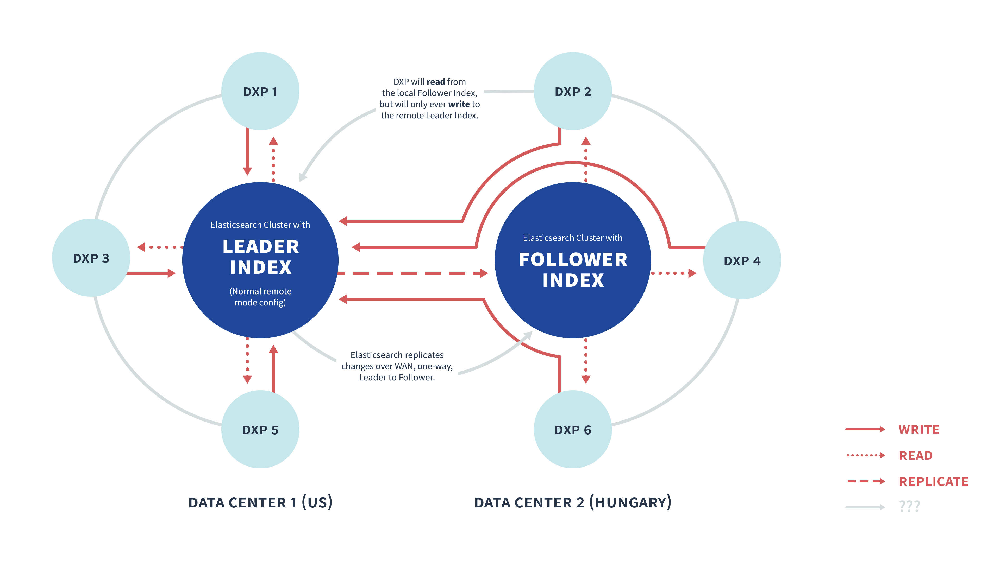

# Cross-Cluster Replication

> **Liferay Enterprise Search (LES) Subscribers**

In a classic Liferay DXP/search engine installation, one Liferay DXP cluster talks to one Elasticsearch cluster, sending all of its read (e.g., execute a search query) and write (e.g., create a document) requests through one connection to the search engine cluster. In this setup, all search engine servers are located in the same data center (though they could be in a different data center from the Liferay DXP servers).

Responding to concerns about data locality and disaster recovery, Elasticsearch released a [Cross-Cluster Replication (CCR)](https://www.elastic.co/guide/en/elasticsearch/reference/current/xpack-ccr.html) feature that can be used with a [LES subscription](https://www.liferay.com/products/dxp/enterprise-search), for both Elasticsearch 6 and 7 (refer to the [LES compatibility matrix](https://www.liferay.com/compatibility-matrix/liferay-enterprise-search) for version compatibility details). With the LES CCR module you can achieve a limited form of multi-data-center deployment, in that it does not allow distributing an Elasticsearch cluster's nodes over multiple data centers, but does allow configuring a separate Elasticsearch cluster in each data center. In this setup, there is at least one cluster containing _leader_ indexes and one cluster containing _follower_ indexes that are replicated from leader and only ever used by Liferay DXP for reading data.




Liferay DXP has long supported the idea of a distributed cluster, with nodes in disparate locations, via Wide Area Network (WAN) protocols. Liferay DXP's flexibility and Elasticsearch's support for Cross-Cluster Replication can support different system designs.

To set up Cross-Cluster Replication you must

- [Purchase a LES subscription](https://www.liferay.com/products/dxp/enterprise-search)
- Install the CCR Module on Liferay DXP
- Decide which indexes to replicate from the leader cluster
- Configure the Elasticsearch Clusters
- Configure the Liferay DXP Cluster
- Define the Leader and Follower
- Replicate the Leader Indexes

Read this article for an overview of the steps, then see the next article, [a step-by-step tutorial](./configuring-cross-cluster-replication.md), to get a local example up and running.

## Liferay DXP: Install the LES Cross-Cluster Replication Module

<!-- Does a docker container constitute a single node in a cluster? if so we'll need to instruct to use the mp app in control panel to install the ccr module into each dxp node that will use a read-only connection to the follower cluster. -->

Any Liferay DXP node that will read from a local cluster's follower indexes and write through a separate connection to the remote cluster's leader indexes, must have the CCR module installed. This module is available with your LES subscription.

Though all DXP nodes will have the CCR module installed, those that read and write from the same cluster only need to configure a normal REMOTE mode connection to the Elasticsearch cluster.

##  Liferay DXP: Decide Which Indexes to Replicate from the Remote Cluster

The default Liferay DXP indexes in your installation approximate the list below (subject to change):
<!-- This table is probably good info to include somewhere more central, not just in CCR docs -->

| Index ID                                      | Index Type    | Index Purpose |
| --------------------------------------------- | ------------- | ------------- |
| liferay-0                                     | System Index  | Searching in the System Settings application |
| liferay-20101                                 | Company Index | Searching the indexed assets of the Liferay DXP Virtual Instance |
| liferay-20101-search-tuning-rankings          | App Index     | Primary data storage for the Result Rankings application (per virtual instance as of Liferay DXP 7.3) |
| liferay-search-tuning-synonyms-liferay-20101  | App Index     | Primary data storage for the Synonym Sets application for the given virtual instance |
| workflow-metrics-instances-20101              | App Index     | Store data about Workflow Instances for the Workflow Metrics application |
| workflow-metrics-nodes-20101                  | App Index     | Store data about Workflow Nodes for the Workflow Metrics application |
| workflow-metrics-processes-20101              | App Index     | Store data about Workflow Processes for the Workflow Metrics application |
| workflow-metrics-sla-instance-results-20101   | App Index     | Primary storage for SLA results per Workflow Instance for the Workflow Metrics application |
| workflow-metrics-sla-task-results-20101       | App Index     | Primary storage for SLA results per Workflow Task for the Workflow Metrics application |
| workflow-metrics-tokens-20101                 | App Index     | Store data about Workflow Tokens for the Workflow Metrics application |
| your-custom-index-[companyId]                 | Dev Index     | Your own storage and searching needs |

```note::
   Liferay DXP provides APIs for creating and using (writing to and reading from) Elasticsearch indexes that remain completely under your control. See the [Developer Guide](../developer_guide.rst) for information on using these APIs.
```

Unless your setup reveals a very compelling reason not to, you should replicate all of the Liferay DXP indexes and all of your custom Dev Indexes into the follower Elasticsearch cluster. 

## Configure the Elasticsearch Clusters

> **Elasticsearch 6 Only:** [Soft deletes](https://www.elastic.co/guide/en/elasticsearch/reference/6.7/ccr-requirements.html) must be enabled for any indexes you want to replicate. Read [here](./configuring-ccr-enabling-soft-deletes-on-elasticsearch-6.md) to learn more about this.

Set up the Elasticsearch clusters, using versions supported with Liferay DXP that also support Cross-Cluster Replications (Elasticsearch 7.7 and later). See the [LES compatibility matrix](https://help.liferay.com/hc/en-us/articles/360016511651-Liferay-Enterprise-Search-Compatibility-Matrix) for details.

Make sure you Install the Elasticsearch [plugins Liferay DXP needs](../installation/installing-elasticsearch.md), and provide cluster names to differentiate your follower and leader clusters.

CCR requires an Elasticsearch Platinum level license, but [LES customers](./introduction-to-les.md)) already have this. If you're testing locally, you'll need to install a [trial license](https://www.elastic.co/guide/en/elasticsearch/reference/7.x/start-trial.html) on each cluster.

## Configure the Liferay DXP Cluster 

Configure the Liferay Clustering behavior first. In the example provided in the tutorial, some configuration will be provided for testing purposes. See the [clustering documentation](../../installation-and-upgrades/setting-up-liferay-dxp/configuring-clustering-for-high-availability/01-introduction-to-clustering-liferay-dxp.md) for more information on setting up a production cluster.

### Configure the DXP Nodes that Reside with the Leader Indexes

Configure the DXP nodes located in the same data center with the remote Elasticsearch cluster containing the leader indexes. Provide the proper Elasticsearch Configuration values (via a `.config` file), then start the DXP nodes that will write to the leader indexes, to make sure they're reading and writing properly.

### Configure the DXP Nodes that Reside with the Follower Indexes

Any DXP nodes that are going to read from local follower Elasticsearch indexes and write to remote leader indexes must have the CCR module deployed and configured (use a `.config` file).

Start the nodes and install the LES app.

## Make the Running Elasticsearch Clusters Know Their Respective Roles

From the local cluster containing the follower indexes, set the leader and perform the initial index replication. This involves calling two Elasticsearch APIs:

- Call the `/_cluster/settings` Elasticsearch API to define the cluster that acts as the remote cluster containing leader indexes.

## Replicate the Leader Indexes

- Call the `[indexName]/_ccr/follow` Elasticsearch API to configure the follower indexes on the appropriate cluster.
