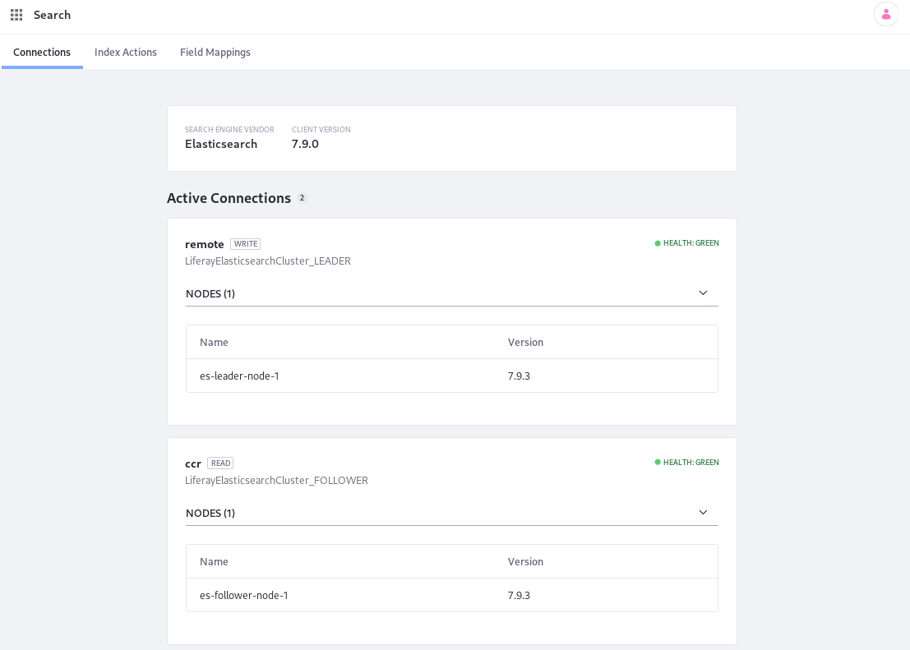

# Configuring CCR in a Local Follower Data Center

> First [configure CCR in the remote/leader data center](./configuring-ccr-in-a-remote-leader-data-center.md) before following the steps below.

The local/follower data center holds Liferay DXP cluster nodes with a read-only connection to the co-located Elasticsearch cluster, and a write-only connection to the remote/leader data center's Elasticsearch cluster.

The example configurations are also provided in full in the [CCR configuration reference guide](./ccr-basic-use-case-config-reference.md).

### Configure the Follower Elasticsearch Cluster 

The local Elasticsearch cluster must hold follower (replicated; read-only) indexes, and acts as the local search engine co-located Liferay DXP nodes can read from.

```important::
   **Securing a CCR Installation:** As `stated earlier <./configuring-an-example-ccr-installation-replicating-between-data-centers.md#prerequisite-for-security-configure-x-pack-security>`__ the Elasticsearch clusters should use node certificates signed by the same CA and the security settings of each cluster should match. For other approaches and details, `see Elastic's documentation <https://www.elastic.co/guide/en/elasticsearch/reference/7.x/cross-cluster-configuring.html>`__.
```

Configure its `elasticsearch.yml`:

`[Follower Elasticsearch Home]/config/elasticsearch.yml`

```yaml
cluster.name: LiferayElasticsearchCluster_FOLLOWER
node.name: es-follower-node-1

http.port: 9201
transport.port: 9301

xpack.security.enabled: true

### TLS/SSL settings for Transport layer
xpack.security.transport.ssl.enabled: true
xpack.security.transport.ssl.keystore.path: certs/elastic-nodes.p12
xpack.security.transport.ssl.keystore.password: liferay
xpack.security.transport.ssl.truststore.path: certs/elastic-nodes.p12
xpack.security.transport.ssl.truststore.password: liferay
xpack.security.transport.ssl.verification_mode: certificate

## TLS/SSL settings for HTTP layer
xpack.security.http.ssl.enabled: true
xpack.security.http.ssl.keystore.path: certs/elastic-nodes.p12
xpack.security.http.ssl.keystore.password: liferay
xpack.security.http.ssl.truststore.path: certs/elastic-nodes.p12
xpack.security.http.ssl.truststore.password: liferay
xpack.security.http.ssl.verification_mode: certificate

# For Kibana
xpack.monitoring.collection.enabled: true
```

To use the security settings (`xpack.security...`) you'll need to set up passwords and obtain node certificates.

Start the server. If you're in the root of the server directory, execute

```bash
./bin/elasticssearch
```

If you're just trying this out and don't yet have the proper license, start an Elasticsearch trial:

```json
POST /_license/start_trial?acknowledge=true
```

## Configure the Local Liferay DXP Cluster Node

> If testing locally configure Tomcat to use different ports than your remote DXP node. Use `9080` as the HTTP port, `9443` as the redirect port, and `9005` as the shutdown port to follow this example setup (change the server ports in `[Liferay Home]/tomcat-[version]/conf/server.xml`).

Copy the `.config` files you created to configure the connection for the remote DXP cluster node in [Configuring CCR in a Remote/Leader Data Center](./configuring-ccr-in-a-local-follower-data-center.md) to the `Liferay Home/osgi/configs` folder. Again, the `remoteClusterConnectionId` must match with the `connectionId` in the two files! This configures the write connection for the local DXP cluster node.

Now configure the read-only connection to the local Elasticsearch server with the follower indexes. Provide a configuration file to `Liferay Home/osgi/configs` named 

```bash
com.liferay.portal.search.elasticsearch7.configuration.ElasticsearchConnectionConfiguration-ccr.config
```

Give it these contents:

```properties
active=B"true"
connectionId="ccr"
username="elastic"
password="liferay"
authenticationEnabled=B"true"
httpSSLEnabled=B"true"
networkHostAddresses=["https://localhost:9201"]
truststorePassword="liferay"
truststorePath="/PATH/TO/elastic-nodes.p12"
truststoreType="pkcs12"
```

You can use any suffix (`-ccr` in this example) for the [configuration file name](../../../system-administration/configuring-liferay/configuration-files-and-factories/using-factory-configuration.md), but for consistency you should make it identical to the `connectionId` property in the configuration.

Now start the Liferay DXP cluster node.

Now the connection is configured. All that's left is to enable and configure CCR itself.

## Configure the Cross-Cluster Replication Module

The LES Cross-Cluster Replication module triggers the following of the leader cluster and the initial replication of all indexes from the leader cluster to the follower cluster. Triggering follow and replication relies on enabling the CCR functionality in the System Settings UI, and not via configuration file (`.config`). Configure CCR from any Liferay DXP node in either data center:

1. Open the Global Menu and navigate to Control Panel &rarr; System Settings. Open the _Search_ category.  

1. Open _Cross-Cluster Replication_.

1. Check the box for _Enabled_.

1. Set one value in _Cross-Cluster Replication Local Cluster Connection Configurations_ `localhost:9080,ccr`.

   ```important::
      Never set the value to the remote data center here (in the example, it would be ``localhost:8080,remote``). Setting this would cause follower indexes to be created in the remote cluster, where leader indexes of the same name already reside.
   ```

   This defines the connections that should be read-only. In human language, each entry here is saying "the Liferay server at this address (``localhost:9080``) reads from the Elasticsearch connection with this name (``ccr`` in this example)." 

1. Click _Update_.

In a production setup, you will probably want to set a different transport address for the remote Elasticsearch cluster other than the default or you may need to exclude some indexes from being replicated to the follower Elasticsearch cluster. There are configuration fields for those purposes:
* *Remote Cluster Seed Node Transport Address*: The transport address of a node in the remote cluster to be used for establishing a connection between the remote and local cluster. Defaults to `localhost:9300`.
* *Excluded Indexes*: You can enter the index names that will be excluded from cross-cluster replication. Indexes starting with a period (.) will always be excluded. By default, all indexes in the remote cluster will be replicated to the local cluster. This setting is ignored if Automatic Replication is not enabled.
* *Automatic Replication Enabled*: Enable or disable automatic creation of follower indexes in the local Elasticsearch clusters when Read from Local Clusters is enabled. Disable this setting if replication will be managed manually through Elasticsearch. Defaults to enabled.

Once the connections are configured and the indexes replicated, verify the system is working properly.

## Verify the Setup

On the follower DXP cluster node, navigate to Control Panel &rarr; Configuration &rarr; Search. Your connections look like this:



Now CCR is configured. If you run into trouble with your configuration, check out the [troubleshooting guide](./troubleshooting-cross-cluster-replication.md).
