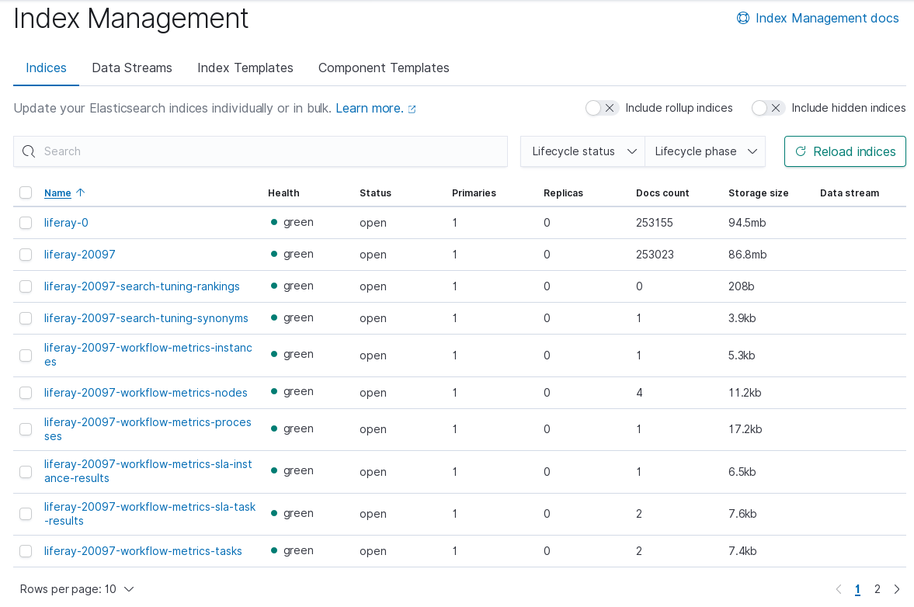

# Configuring CCR In a Remote Leader Data Center

> Ensure you have completed any necessary [prerequisite steps](./configuring-an-example-ccr-installation-replicating-between-data-centers.md) before following the steps below.

This data center holds Liferay DXP cluster nodes with a read-write connection to a co-located Elasticsearch cluster.

The example configured here consists of a single Liferay DXP node and a single Elasticsearch node. The example configurations can also be found in the [CCR configuration reference](./ccr-basic-use-case-config-reference.md), including the security configuration settings.

### Configure the Remote Leader Elasticsearch Cluster

In our example setup, the first Elasticsearch cluster is a REMOTE mode cluster with no CCR-specific configuration required: it accepts reads and writes from it's local Liferay DXP node, and write requests from the Liferay DXP nodes that are in a separate data center.

Configure its `elasticsearch.yml` by specifying a sensible cluster name, the `http.port`, and the `transport.port`, at a minimum:

`[Remote Elasticsearch Home]/config/elasticsearch.yml`

```yaml
cluster.name: LiferayElasticsearchCluster_LEADER
http.port: 9200
node.name: es-leader-node-1
transport.port: 9300
```

Start the server. If you're in the root of the server directory, execute

```bash
./bin/elasticssearch
```

If you're just trying this out and don't yet have the proper license, start an [Elasticsearch trial license](https://www.elastic.co/guide/en/elasticsearch/reference/7.x/start-trial.html):

```json
POST /_license/start_trial?acknowledge=true
```

<!--
> On Elasticsearch 6, use
> 
> `POST _xpack/license/start_trial?acknowledge=true`
-->

You'll see a `- valid` message in your log when it installs successfully: 

```bash
[2020-02-26T10:19:36,420][INFO ][o.e.l.LicenseService     ] [es-leader-node-1] license [lf263a315-8da3-41f7-8622-lfd7cc14cae29] mode [trial] - valid
```
### Configure the Remote Liferay DXP Cluster Node

The remote Liferay DXP node talks with the REMOTE mode Elasticsearch server. Even though they're both called _remote_, they're co-located in this setup.

Configure the Liferay Connector to Elasticsearch X [6 or 7], by providing a configuration file in the `Liferay Home/osgi/configs` folder. If using Elasticsearch 7, name it

```bash
com.liferay.portal.search.elasticsearch7.configuration.ElasticsearchConfiguration.config
```

Give it these contents:

```properties
clusterName="LiferayElasticsearchCluster_LEADER"
operationMode="REMOTE"
transportAddresses=["localhost:9300"]
```
<!--
If using Elasticsearch 6, the configuration file is named

```bash
com.liferay.portal.search.elasticsearch6.configuration.ElasticsearchConfiguration.config
```

Give it these contents:

```properties
clusterName="LiferayElasticsearchCluster_LEADER"
operationMode="REMOTE"
transportAddresses=["localhost:9300"]

# Uncomment the below setting for Elasticsearch 6:
# additionalIndexConfigurations="index.soft_deletes.enabled: true"
```
-->

> If configuring security, you'll also need a `XPackConfiguration.config` file. See the [configuration reference](./ccr-basic-use-case-config-reference.md) for the details.

Though configuration values are propagated throughout the cluster, for transparency you should provide an identical configuration file for each Liferay DXP node. Therefore, make sure all the Liferay DXP nodes in both data centers have identical Elasticsearch connector configurations.

```tip::
   During development and testing, it's useful to set ``logExceptionsOnly="false"`` in the configuration files as well.
```

<!--
Soft deletes are enabled by default in Elasticsearch 7, but must be enabled manually for Elasticsearch 6 as described [here](./configuring-ccr-enabling-soft-deletes-on-elasticsearch-6.md).
-->

Start the Liferay DXP server.

```important::
   If you're configuring a new DXP installation, make sure to reindex the spell check indexes at Control Panel > Configuration > Search, in the *Index Actions* tab.
```

If Kibana is connected to your remote/leader Elasticsearch cluster, navigate to Management &rarr; Index Management to see the available Liferay indexes:



Once the data center containing the remote/leader Elasticsearch servers up and running, you're ready to set up the [local/follower data center](./configuring-ccr-in-a-local-follower-data-center.md).
