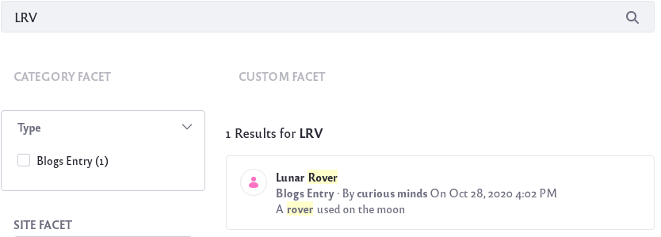

# Defining Synonym Sets

Synonym Sets are sets of words or phrases that you (the admin) create so that if a User searches for a certain keyword or phrase, the synonymous terms in your set are also searched. 

For example, a user might search for the word "US". Most likely, the user would want search results that also included synonyms such as *America*, *U.S.A*, *United States*, etc. By creating Synonym Sets, you can ensure your users get the most out of their searches.

## Requirement and Limitations

Synonym Sets are only supported when using Elasticsearch as your search engine. If you are using Solr or need to install Elasticsearch, check out the [Getting Started with Elasticsearch](../installing-and-upgrading-a-search-engine/elasticsearch/getting-started-with-elasticsearch.md) page.

Synonym Sets work with fields indexed in two locales: English and Spanish. Thus, the assets supporting localization out-of-the-box work with Synonym Sets.

The [`=>` format](https://www.elastic.co/guide/en/elasticsearch/guide/current/synonyms.html) supported in Elasticsearch is not supported through the Synonyms Set UI.

## Creating and Managing Synonym Sets

Create a synonym set by adding as many synonymous keywords to a set as you like. Once the synonym set is saved, any searches in the same company scope (that’s any site from the Virtual Instance where the synonyms were configured) take effect.

Follow these steps to create a new synonym set:

1. Navigate to *Applications* → *Search Tuning* → *Synonyms*.

    

1. Click the Add icon () to add a new Synonym Set.

1. Enter the list of synonyms in the set. The input of a synonym is accomplished by clicking *Enter* or by entering a comma.

    

1. You can delete synonym by clicking on the *X* next to it. When you finish your set, click *Publish*.

1. To edit or delete a set, simply click on the Options icon () and click on *Edit* or *Delete*.

    

    Once your synonym set is published, it is ready to be used.

## Using Synonym Sets

You can test your synonym set by searching for one of the synonym keywords you saved in the set. Results matching the keyword and any synonyms are returned in the Search Results widget.

In the example above, this blog article about a lunar rover does not contain the word "LRV" but is now returned as a search result match. Note that the synonym is also highlighted.

## Known Issues

There are several known issues for Synonym Sets:

[LPS-100272](https://issues.liferay.com/browse/LPS-100272): Reindexing permanently deletes all Synonym Sets. Please refer to the ticket for a way to backup and preserve (restore) Synonym Sets across reindex operations.

[LPS-98126](https://issues.liferay.com/browse/LPS-98126) Users can create duplicate Synonym Set entries and update other Synonym Sets unintentionally.

