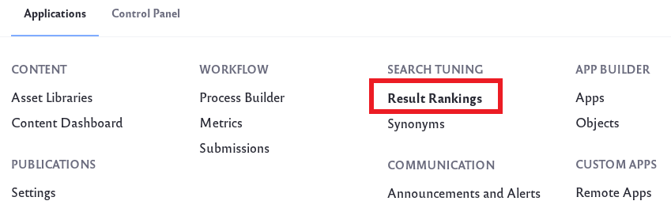
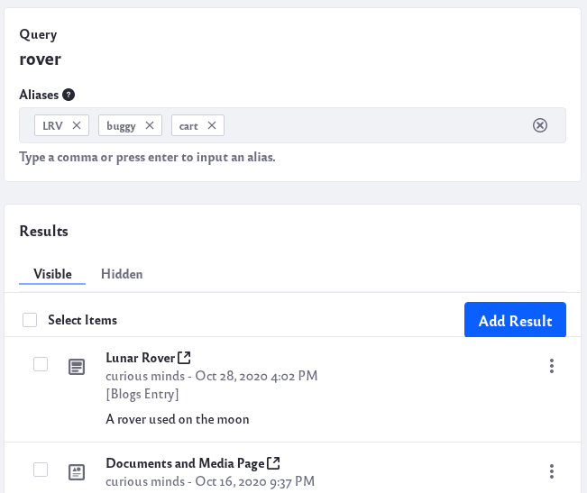
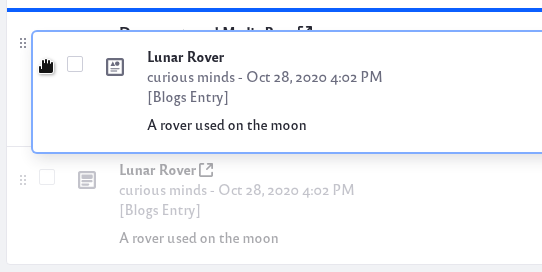

# Result Rankings

> **Subscribers**

Result Rankings are for changing the list of returned results for specific keywords.

With Results Rankings you can

* Designate results to pin to the top of the results list.
* Hide certain results for a search.
* Add results that normally wouldn't be returned for a certain keyword.
* Re-order pinned results with a drag-and-drop interface.

```note::
   Result Rankings affect only searches using the newer search widgets (Search Bar, Search Results, etc.). The rankings you customize do not apply to the legacy Search portlet results or to the individual application search bars.
```

## Requirement and Limitations

Result Rankings are only supported when using Elasticsearch as your search engine. Learn about installing Elasticsearch in [Getting Started with Elasticsearch](../installing-and-upgrading-a-search-engine/elasticsearch/getting-started-with-elasticsearch.md).

An existing ranking entry cannot be renamed. Renaming requires recreating the ranking under a different name. See [LPS-96357](https://issues.liferay.com/browse/LPS-96357) for more information.

## Creating and Managing Result Rankings

To create a new Result Rankings,

1. From the Global Menu () navigate to *Applications* &rarr; *Search Tuning* &rarr; *Result Rankings*.

   

1. Click the Add icon () to add a new Result Rankings.

1. Enter the keyword or phrase you want to use. Click *Customize Results*.

1. A search query is executed and the results appear.

   The Result Rankings can be applied to additional keywords by adding words or phrases into the Aliases field. Click *Enter* or use a comma to input additional aliases.

   

   Click the *X* next to a keyword to remove an alias.

1. To pin a specific result, click the _Options_ icon () and click *Pin Result*. You can also hover your mouse over a result and click on the pin icon.

   

   Once more than one result is pinned, you can re-order your pinned results. Move your cursor to the left edge of the item you wish to re-order. Click and hold the item and drag it up or down your results list.

   

   As you drag, your selected item appears as a rectangular box that you can move. The highlighted blue line indicates the item insertion point.

1. To hide a specific result, click _Options_ () &rarr; *Hide Result*. You can also hover your mouse over a result and click on the hide result icon.

   

   The list of hidden results can be found by clicking the *Hidden* tab of the results. To make a hidden result visible again click _Options_ () &rarr; *Show Result*. You can also hover your mouse over a result and click on the show result icon. 

1. To add additional results, click _Add Result_. In the new window, use other search terms to locate additional results. Mark the results you want to add with a check and click the _Add_ button.

   

   In the list of results you now see the additional results you just added.

 1. Finish configuring your Result Rankings and click *Save*.

 1. If you like, you can choose to deactivate specific Result Rankings. Click _Options_ () &rarr; *Deactivate*.

   

   To make a Result Rankings active again, click _Options_ () &rarr; *Activate*. 

   If you wish to permanently delete a Result Rankings, click _Options_ () &rarr; *Delete*.

## Result Rankings Scope and Permissions

Because configuration of Result Rankings happens at the virtual instance scope, there are scoping and permissions behaviors to note.

Scope is disregarded for pinned results. Pinned results existing in Site A always appear in searches from Site B, even if the Search Bar Scope is set to *This Site* as opposed to searching *Everything*.

Search from Result Rankings is global. When searching for results in Result Rankings admin, relevant results from all Sites are returned.

Permissions are applied as usual. If a User doesn't have permission to see an asset, pinning it does not make it appear in the search results for that User.

## Result Rankings Aliases versus Synonyms Sets

The similarities between Result Rankings and Synonym Sets might cause some confusion. Remember that [Synonym Sets ](./synonym-sets.md) expand the search to include results matched by additional (synonymous) keywords, so more results are returned if there are matches to the synonyms.

Result Rankings are keywords that also have the particular ranking interventions applied to them. Only the searched keyword is matched to results, and then the pins, hides, re-ordering, and additional results take effect after that. Of course, if you add a Synonym Set that includes an identical set of search terms as the Result Ranking you configure, the features can be used together. All the synonymous terms return the same result set, with the customized rankings applied on top.
