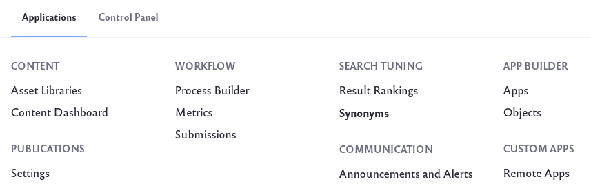
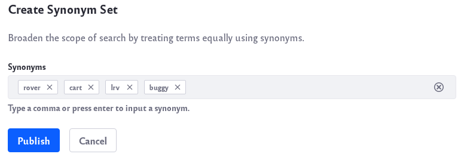

# Synonym Sets

> **Subscribers**

Synonym Sets are administrator-created groups of words or phrases with the same meaning. If a User searches for a certain keyword or phrase, the synonymous terms in your set are also searched. 

For example, a user might search for the word "US". Most likely, the user would want search results that also included synonyms such as *America*, *U.S.A*, *United States*, etc. By creating Synonym Sets, you can ensure your users get the most out of their searches.

## Requirements and Limitations

Synonym Sets are only supported when using Elasticsearch as your search engine. Learn about installing Elasticsearch in [Getting Started with Elasticsearch](../installing-and-upgrading-a-search-engine/elasticsearch/getting-started-with-elasticsearch.md).

Synonym Sets currently work with fields indexed in either of the following out-of-the-box locales: English or Spanish. Liferay assets with localizable fields in either of these two languages work with Synonym Sets.

The [`=>` format](https://www.elastic.co/guide/en/elasticsearch/guide/current/synonyms.html) supported in Elasticsearch is not supported through the Synonyms Set UI.

## Creating and Managing Synonym Sets

Create a synonym set by adding as many synonymous keywords to a set as you like. Once the synonym set is saved, searches in the same company scope (any site from the [Virtual Instance](../../system-administration/configuring-liferay/virtual-instances/understanding-virtual-instances.md) where the synonyms were configured) take effect.

To create a new synonym set,

1. From the Global Menu () navigate to *Applications* &rarr; *Search Tuning* &rarr; *Synonyms*.

   

1. Click the _Add_ icon () to add a new Synonym Set.

1. Enter the list of synonyms in the set. The input of a synonym is accomplished by clicking *Enter* or by entering a comma.

   

1. You can delete synonym by clicking on the *X* next to it. When you finish your set, click *Publish*.

1. To edit or delete a set, click the _Options_ icon () and click on *Edit* or *Delete*.

   

   Once your synonym set is published, it is ready to be used.

## Using Synonym Sets

You can test your synonym set by searching for one of the synonym keywords you saved in the set. Results matching the keyword and any synonyms are returned in the Search Results widget.


In the example above, this blog article about a lunar rover does not contain the word "LRV" but is now returned as a search result match. Note that the synonym is also highlighted.

## Creating New Synonym Language Filters

> **Supported in DXP 7.3 FP2+ and DXP 7.2 FP12+.**

Out of the box, Synonyms Sets supports synonyms in [English and Spanish only](#requirements-and-limitations), To add synonyms support for other languages through configuration, please follow the steps below. In this example, we are adding the necessary setting for _French_.

The process consists of the following steps:
1. Creating a [custom analyzer](https://www.elastic.co/guide/en/elasticsearch/reference/7.x/analysis-custom-analyzer.html) by re-implementing the default [french](https://www.elastic.co/guide/en/elasticsearch/reference/7.x/analysis-lang-analyzer.html#french-analyzer) analyzer with the necessary changes (including an extra [Synonym graph token filter](https://www.elastic.co/guide/en/elasticsearch/reference/7.x/analysis-synonym-graph-tokenfilter.html) in the pipeline)
1. Adding this custom analyzer definition to the index settings through the _Additional Index Configurations_ of the connector config.
1. Applying this custom analyzer on the desired fields by overriding Liferay DXP's default type mappings. For this purpose, we are leveraging the _Override Type Mappings_ setting of the connector.
1. Reindexing to apply the new settings

**Prerequisites**: you need to obtain the default mappings JSON that is included with the Elasticsearch connector in order to customize it through the _Override Type Mappings_.
* To get it from your bundle:
   * Go to `[Liferay Home]/osgi/marketplace`
   * Look for `Liferay Foundation - Liferay Connector to Elasticsearch 6/7 - Impl.lpkg`
   * Open with an archive manager and extract `com.liferay.portal.search.elasticsearch6/7-x.y.z.jar`
   * Open the newly extracted JAR file again with an archive manager and go to `META-INF/mappings`
   * Here you will find a file called `liferay-type-mappings.json`. This is the resource you need.
* To get it from a source: the easiest way is if you have [Liferay DXP Source Code Access](https://help.liferay.com/hc/en-us/articles/36004538929) so you can browse and find it in the specified repository in GitHub.
   * Once you have access to this repo, follow the steps from the article above to find the tag for your fix pack level.
   * Navigate to `modules/apps/portal-search-elasticsearch(6 or 7)/portal-search-elasticsearch(6 or 7)-impl/src/main/resources/META-INF/mappings`
   * Here you will find the mentioned JSON file (`liferay-type-mappings.json`).

Now that you have the default mapping file, let's make the necessary changes:

1. Go to the Elasticsearch connection's System Settings entry---Elasticsearch 6/7.

1. Add an `analysis` block to the _Additional Index Configurations_ field:

   ```json
   {
       "analysis": {
           "analyzer": {
               "custom_liferay_analyzer_fr": {
                   "filter": [
                       "french_elision",
                       "lowercase",
                       "french_stop",
                       "my-synonym-filter-fr",
                       "french_stemmer"
                   ],
                   "tokenizer": "standard"
               }
           },
           "filter": {
               "my-synonym-filter-fr": {
                   "lenient": true, 
                   "synonyms": [],
                   "type": "synonym_graph"
               },
               "french_stop":{
                   "type":"stop",
                   "stopwords":"_french_"
               },
               "french_stemmer":{
                   "type":"stemmer",
                   "language":"light_french"
               },
               "french_elision": {
                   "type": "elision",
                   "articles_case": true,
                   "articles": [
                       "l", "m", "t", "qu", "n", "s",
                       "j", "d", "c", "jusqu", "quoiqu",
                       "lorsqu", "puisqu"
                   ]
               }
           }
       }
   }

   [DESCRIBE WHAT THIS DOES AT A HIGH LEVEL]

   ```
   Adding settings in this configuration augments those available in the out of the box index settings. (You can find the related JSON in the source code as `index-settings.json`).
   Here we are creating a new analyzer called `custom_liferay_analyzer_fr` which uses a new filter `my-synonym-filter-fr`. The `synonyms` array is empty now: Synonym Sets created through the UI will appear here.

1. Using  the _Override Type Mappings_ field, change the analyzer for the `template_fr` dynamic field to use the custom analyzer (`custom_liferay_analyzer_fr`):
   
   ```important::
      This example is clipped for brevity. Override Type Mappings completely overrides and ignores Liferay's default type mappings, so you must provide a complete mappings file, not just the overridden portion.   
   ```
   ```json
   {
   	"LiferayDocumentType": {
   		"date_detection": false,
   		"dynamic_templates": [
            // (...)
   			{
   				"template_fr": {
   					"mapping": {
   						"analyzer": "custom_liferay_analyzer_fr",
   						"store": true,
   						"term_vector": "with_positions_offsets",
   						"type": "text"
   					},
   					"match": "\\w+_fr\\b|\\w+_fr_[A-Z]{2}\\b",
   					"match_mapping_type": "string",
   					"match_pattern": "regex"
   				}
           // (...)
   ```

   The important change here is that we replaced the default assigned analyzer (`french`) with our custom one (`custom_liferay_analyzer_fr`).


1. Save the changes to the configuration.

   ```tip::
      If you're using the Sidecar Elasticsearch server, you may see an error in the console. Restart Liferay DXP to resolve the issue.
   ```

1. Now go to System Settings &rarr; Search &rarr; Synonyms.

1. Add the custom filter name (e.g., `custom-synonym-filter-fr`) you created to the _Filter Names_ setting and save the configuration.

1. Perform a full re-index: in Control Panel &rarr; Search &rarr; Index Actions, click _Reindex all search indexes._

   To verify that the custom mapping has been applied successfully, go to the Field Mappings tab, choose your index (for example `liferay-20101`) and look for `template_fr` in the right panel.
   To verify that the additional index settings including your custom analyzer has also been added, make the following API call to Elasticsearch: `http://<host>:<port>/liferay-20101/_settings` and look for your analyzer name in the response.

To verify the new filter is working, 

1. Go to the Synonyms application: from the Global menu's Applications tab, click _Synonyms_ (under Search Tuning).

1. Create a new Synonym Set: `maison, logement`.

1. Create a Web Content Article with English and French translations. Add _maison_ to the French title.

1. Create another Web Content Article with English and French translations. Add _logement_ to the French title.

1. Switch to the French locale and search for _maison_. Both articles are returned.

**Disclaimer**: Just like other default configurations, the index mappings and settings can change between versions and, sometimes in Fix Packs/Service Packs. Therefore, customizations like this should be reviewed and adapted, if needed, when upgrading or moving to a new patch level. In addition, Liferay's Search team plans to add support for more languages out-of-the-box in future verisons which can make the customization unnecessary.
