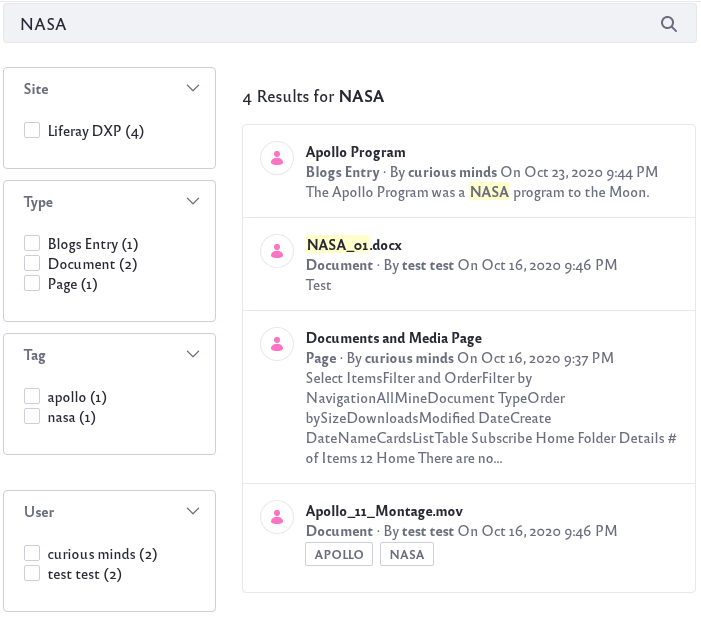
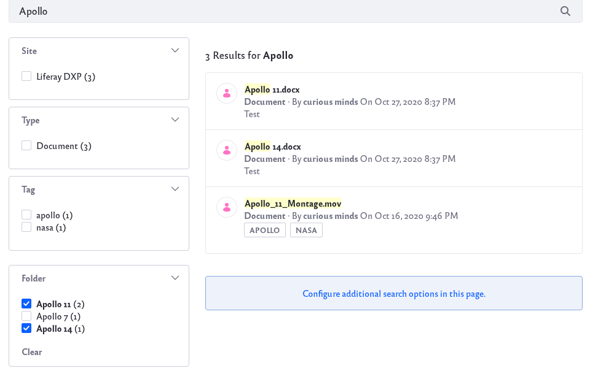

# Facets

Enter a keyword in the Search Bar and click the Search button. The default search experience redirects to a page with results on the right and a collection of *facets* on the left.

A facet aggregates search results by a common characteristic. This makes it easier for users to filter through the search results. By default, Liferay DXP includes the following facets:

**Site Facet:** Filters results by their site.

**Type Facet:** Filters results by the Asset Type.

**Tag Facet:** Filters results by Tag.

**Category Facet:** Filters results by Category.

**Folder Facet:** Filters results by Folder.

**User Facet:** Filters results by the content creator.

**Modified Facet:** Filters results by the last modified date.

**Custom Facet:** Filters results by some other indexed field. 

Each item in a facet (selected using the checkbox) is called a *Facet Term* (*term* for short).

## Using Facets

To use facets, simply check the terms to filter your search results. For example, if you were searching for documents related to Apollo, you can check a term in the Type facet.

If you were specifically looking for documents related to Apollo 11, you might also check the term in the Folder facet.

In this way, you can pare down your search results.

## Multiple Facet Selection

As seen in the example above, selecting terms in different facets are subtractive. That is, only results that match all of the filter criteria is returned.

However, selecting terms within an individual facet is additive. That is, the combined results for each term will be returned. For example, if you wanted to filter the search results for both the Apollo 11 folder and Apollo 14 folder, you could check both terms.

## Facets and Friendly URLs

The Search functionality uses friendly search URLs for facet filtering. With default settings, here's the default main search URL when searching for keyword *test*:

    http://localhost:8080/web/guest/search?q=test

Selecting a facet term adds a new parameter to the above URL. For example selecting Blogs Entry from the Type facet results in this URL:

    http://localhost:8080/web/guest/search?q=test&type=com.liferay.blogs.model.BlogsEntry

Selecting another facet term from the same facet category appends the same parameter again, but with the newly selected value:

    http://localhost:8080/web/guest/search?q=test&type=com.liferay.blogs.model.BlogsEntry&type=com.liferay.portal.kernel.model.User

The rest of the facets work the same way. Filtering by the last hour option in the Last Modified facet produces this URL: 

    http://localhost:8080/web/guest/search?q=test&modified=past-hour

The parameter names are configurable for each facet.

To learn more details of each facet type, refer to their individual articles.