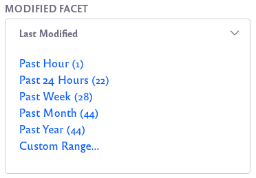

# Modified Facet

The Modified Facet narrows search results down to those that match the searched keyword and that were created or modified during a certain time period.

In addition to selecting a pre-configured time period, Users can select a Custom Range, specifying a From and To date using a date picker.

## Configuring the Modified Facet

The Modified Facet contains several configuration options. 
To configure, click on the Options icon () of facet and click *Configuration*.

* **Display Settings**: Choose between *Default*, *Compact Layout*, and *Label Layout*. The Default layout shows checkboxes next to each term but the Compact layout does not. The Label layout shows small clickable labels for each term.

* **Advanced Configuration**: The facet allows you to modify, delete, or create time ranges. 

    The available time range aliases include:

        past-hour
        past-24-hours
        past-week
        past-month
        past-year

    By default, all the time ranges end in `*`, which evaluates to *now*. For example, the past-week range is:

        [past-week TO *]

    You're not limited to ending the range to now. Instead of the `*`, specify another time range alias as the ending point.

    For example, to set up a range from 12 months ago to one month ago, 

    1.  Click the plus button in one of the existing ranges.

    2.  Give it the label **Past 1-12 Months**.

    3. Give it a Range value of 

            [past-year to past-month]

This gives you lots of flexibility in using alternative time ranges as Modified
Facet terms.