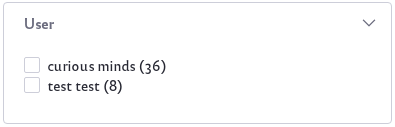
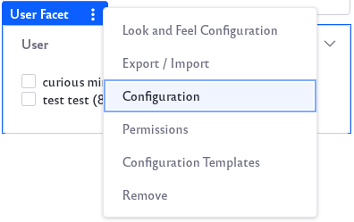

# User Facet

The User Facet narrows search results down to those created by certain Users.

## Configuring the User Facet

The User Facet contains several configuration options. To configure, click on the Options icon () of the facet and click *Configuration*.

**Display Settings:** Choose between *Default*, *Compact Layout*, and *Label Layout*. The Default layout shows checkboxes next to each term but the Compact layout does not. The Label layout shows small clickable labels for each term.

The Advanced Configuration section contains additional options: 

**User Parameter Name:** Change the parameter name in the URL for the Facet. The default is *user*. 

**Max Terms:** Set the maximum number of facet terms to display, regardless of how many matching terms are found for the facet.

**Frequency Threshold:** Set the minimum frequency required for terms to appear in the list of facet terms. For example, if the frequency threshold of a facet is set to 3, a term with two matching results will not appear in the term result list.

**Display Frequencies:** Choose whether or not to display the term frequencies.

Once finished, click the *Save* button.
