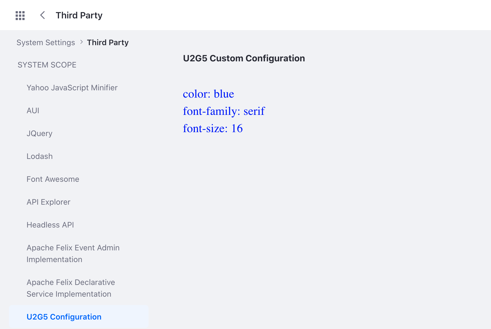

# Completely Custom Configuration

A configuration UI is generated automatically when you [create a configuration interface](./setting-and-accessing-configurations.html#creating-the-configuration-interface). But in some cases you want a completely custom UI for your configuration. For example, you plan to handle the configuration programmatically instead of using Liferay's Configuration Admin. Or maybe you want the flexibility of creating a completely custom UI. Here's how to do it. 

## See the Example Project

1. Start Liferay DXP. If you don't already have a docker container, use

    ```bash
    docker run -it -m 8g -p 8080:8080 [$LIFERAY_LEARN_DXP_DOCKER_IMAGE$]
    ```

    If you're running a different Liferay Portal version or Liferay DXP, adjust the above command accordingly. 

1. Download and unzip [Completely Custom Configuration](./liferay-u2g5.zip).

    ```bash
    curl https://learn.liferay.com/dxp/latest/en/building-applications/core-frameworks/configuration-framework/liferay-u2g5.zip -O
    ```

    ```bash
    unzip liferay-u2g5.zip
    ```

1. From the module root, build and deploy.

    ```bash
    ./gradlew deploy -Ddeploy.docker.container.id=$(docker ps -lq)
    ```

    ```{note}
    This command is the same as copying the deployed jars to /opt/liferay/osgi/modules on the Docker container.
    ```

1. Confirm the deployment in the Liferay Docker container console.

    ```bash
    STARTED com.acme.u2g5.web_1.0.0 [1034]
    ```

1. Verify that the example module is working. Open your browser to `https://localhost:8080`.

1. Navigate to *Control Panel* &rarr; *Configuration* &rarr; *System Settings* &rarr; *Third Party*. Click *U2G5 Configuration*. 

   

   Note that this view is delivered by a custom JSP file. 

## Create the Configuration Interface

Define the configurable attributes in the configuration interface. The sample project has three configurable attributes: `fontColor`, `fontFamily`, and `fontSize`.

```{literalinclude} ./completely-custom-configuration/resources/liferay-u2g5.zip/u2g5-web/src/main/java/com/acme/u2g5/web/internal/configuration/U2G5WebConfiguration.java
:language: java
:lines: 7-24
```

Note that under the `@ExtendedObjectClassDefinition` annotation, `generateUI` is set to `false`. This excludes the configuration UI from being auto-generated. 

## Add the Configuration Bean Declaration

Register the configuration class with a `ConfigurationBeanDeclaration`. This enables the system to keep track of configuration changes as they happen.

```{literalinclude} ./completely-custom-configuration/resources/liferay-u2g5.zip/u2g5-web/src/main/java/com/acme/u2g5/web/internal/settings/definition/U2G5WebConfigurationBeanDeclaration.java
:language: java
:lines: 9-18
```

## Implement the Configuration Screen

1. Declare the class as an implementation of `ConfigurationScreen` with the `@Component` annotation.

    ```java
    @Component(service = ConfigurationScreen.class)
    ```

1. Set the category key, the configuration entry's key, and its localized name. In the sample project, the category key is set to `third-party` in System Settings. The string value for the configuration's name is set by the language key in the bundle's `Language.properties` file. 

    ```{literalinclude} ./completely-custom-configuration/resources/liferay-u2g5.zip/u2g5-web/src/main/java/com/acme/u2g5/web/internal/configuration/admin/display/U2G5ConfigurationScreen.java
    :dedent: 1
    :language: java
    :lines: 24-40
    ```

1. For this example, the configuration scope is set to `system`. To learn more, see [Scoping Configurations](./scoping-configurations.md).

    ```{literalinclude} ./completely-custom-configuration/resources/liferay-u2g5.zip/u2g5-web/src/main/java/com/acme/u2g5/web/internal/configuration/admin/display/U2G5ConfigurationScreen.java
    :dedent: 1
    :language: java
    :lines: 42-45
    ```

1. The `render()` method uses `ConfigurationProvider` to get the configuration. The servlet context provides access to the request dispatcher, which allows the custom JSP to read the configuration. 

    ```{literalinclude} ./completely-custom-configuration/resources/liferay-u2g5.zip/u2g5-web/src/main/java/com/acme/u2g5/web/internal/configuration/admin/display/U2G5ConfigurationScreen.java
    :dedent: 1
    :language: java
    :lines: 47-67
    ```

1. Make sure to use the `@Reference` annotation to define the module's symbolic name. 

    ```java
    @Reference(
    	target = "(osgi.web.symbolicname=com.acme.u2g5.web)"
    )
    ```

## Add the Web-ContextPath

Specify your bundle's `Web-ContextPath` in the `bnd.bnd` file. For example, the sample project has `Web-ContextPath: /u2g5-web` in the Bnd file. This is what registers the `ServletContext` object in the Configuration Screen file. Note that a servlet context is created automatically for portlets, but since this sample doesn't have a portlet, you must add this line to the Bnd file.

## Create a Custom JSP 

1. Import the configuration interface to the JSP.

    ```markup
    <%@ page import="com.acme.u2g5.web.internal.configuration.U2G5WebConfiguration" %>
    ```

1. Access the configuration values from the request object.

    ```jsp
    <%
    U2G5WebConfiguration u2g5WebConfiguration = (U2G5WebConfiguration)request.getAttribute(U2G5WebConfiguration.class.getName());
    %>
    ```

1. The attributes `fontColor()`, `fontFamily()`, `fontSize()` can now be used in the JSP.

This sample project demonstrates a basic example of how to use `ConfigurationScreen` to read and display configuration values in a custom JSP. In your application, write your own code and create a completely custom configuration UI to meet your needs.
