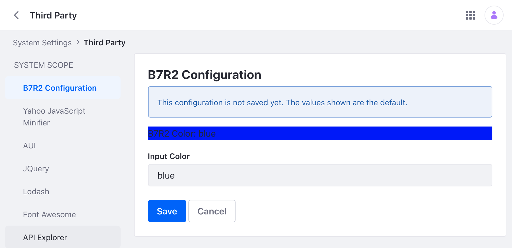

# Configuration Form Renderer

When you [create a configuration interface](./setting-and-accessing-configurations.html#creating-the-configuration-interface), a configuration UI is automatically generated. But in some cases you want customize the look and feel of the UI. For example, you want to modify the UI to match the design aesthetics of your company. Here's how to do it with a `ConfigurationFormRenderer` implementation.

## See the Example Project

1. Start Liferay DXP. If you don't already have a docker container, use

   ```bash
   docker run -it -m 8g -p 8080:8080 [$LIFERAY_LEARN_DXP_DOCKER_IMAGE$]
   ```

   If you're running a different Liferay Portal version or Liferay DXP, adjust the above command accordingly.

1. Download and unzip [Configuration Form Renderer](./liferay-b7r2.zip).

   ```bash
   curl https://learn.liferay.com/dxp/latest/en/building-applications/core-frameworks/configuration-framework/liferay-b7r2.zip -O
   ```

   ```bash
   unzip liferay-b7r2.zip
   ```

1. From the module root, build and deploy.

   ```bash
   ./gradlew deploy -Ddeploy.docker.container.id=$(docker ps -lq)
   ```

   ```{note}
   This command is the same as copying the deployed jars to /opt/liferay/osgi/modules on the Docker container.
   ```

1. Confirm the deployment in the Liferay Docker container console.

   ```bash
   STARTED com.acme.b7r2.web_1.0.0 [1034]
   ```

1. Verify that the example module is working. Open your browser to `https://localhost:8080`.

1. Navigate to *Control Panel* &rarr; *Configuration* &rarr; *System Settings* &rarr; *Third Party*. Click *B7R2 Configuration*.

   

   Note that this view is delivered by a custom JSP file.

## Create the Configuration Interface

Define the configurable attributes in the configuration interface. The sample project has one configurable attribute: `b7r2Color`.

```{literalinclude} ./configuration-form-renderer/resources/liferay-b7r2.zip/b7r2-web/src/main/java/com/acme/b7r2/web/internal/configuration/B7R2WebConfiguration.java
:language: java
:lines: 9-14
```

Note that when using `ConfigurationFormRenderer`, the `generateUI` annotation is not necessary to [hide the generated UI](./hiding-the-configuration-ui.md).

## Add the Configuration Bean Declaration

Register the configuration class with a `ConfigurationBeanDeclaration` class. This enables the system to keep track of configuration changes as they happen.

```{literalinclude} ./configuration-form-renderer/resources/liferay-b7r2.zip/b7r2-web/src/main/java/com/acme/b7r2/web/internal/settings/definition/B7R2WebConfigurationBeanDeclaration.java
:language: java
:lines: 10-18
```

## Implement the Configuration Form Renderer

1. Create an implementation of `ConfigurationFormRenderer`. In the `@Component` annotation, declare the service as a `ConfigurationScreen.class`.

   ```java
   @Component(service = ConfigurationScreen.class)
   ```

1. Override the `getPid()` method. Make sure to return the full configuration ID as specified in the configuration class's `@Meta.OCD` annotation.

   ```{literalinclude} ./configuration-form-renderer/resources/liferay-b7r2.zip/b7r2-web/src/main/java/com/acme/b7r2/web/internal/configuration/admin/display/B7R2ConfigurationFormRenderer.java
   :dedent: 1
   :language: java
   :lines: 26-29
   ```

1. Override the `getRequestParameters()` method. In the method, read the parameters sent by the custom UI and put them in a map where the keys match the fields found in the configuration interface.

   ```{literalinclude} ./configuration-form-renderer/resources/liferay-b7r2.zip/b7r2-web/src/main/java/com/acme/b7r2/web/internal/configuration/admin/display/B7R2ConfigurationFormRenderer.java
   :dedent: 1
   :language: java
   :lines: 31-42
   ```

1. Override the `render()` method. In the example, `ConfigurationProvider` accesses the configuration object. The servlet context provides access to the request dispatcher, which allows the custom JSP to read the configuration.

1. Make sure to use the `@Reference` annotation to define the module's symbolic name.

   ```java
   @Reference(
   	target = "(osgi.web.symbolicname=com.acme.b7r2.web)"
   )
   ```

## Add the Web-ContextPath

Specify your bundle's `Web-ContextPath` in the `bnd.bnd` file. For example, the sample project has `Web-ContextPath: /b7r2-web` in the Bnd file. This is what registers the `ServletContext` object in the configuration form renderer file. Note that a servlet context is created automatically for portlets, but since this sample doesn't have a portlet, you must add a servlet context to the `bnd.bnd` file.

## Create a Custom JSP

1. Import the configuration interface to the JSP.

   ```markup
   <%@ page import="com.acme.u2g5.web.internal.configuration.B7R2WebConfiguration" %>
   ```

1. Access the configuration values from the request object.

   ```jsp
   <%
   B7R2WebConfiguration b7r2WebConfiguration = (B7R2WebConfiguration)request.getAttribute(B7R2WebConfiguration.class.getName());
   %>
   ```

1. Use an `<aui:input>` tag to read any new configuration inputs a user submits on the JSP file.

   ```jsp
   <aui:input name="b7r2Color" value="<%= b7r2WebConfiguration.b7r2Color() %>" />
   ```

This sample project demonstrates a basic customized configuration UI with the use of `ConfigurationFormRenderer`. In your application, write your own code to further customize the look and feel of your configuration UI.
