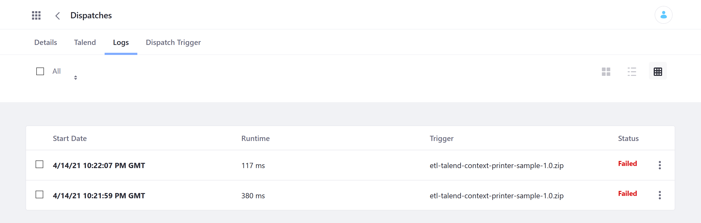

# Dispatch UI Reference

## Dispatch Triggers

The Dispatch Triggers tab lists all Dispatch Tasks added to the Liferay instance.

Click *Add* () to create a Dispatch Task using a Dispatch Task Executor template.

Once created, the following fields are displayed for each Dispatch Task:

| Field | Description |
| --- | --- |
| Name | The name of the Dispatch Task |
| Task Executor Type | The Dispatch Task Executor template used to create the Dispatch Task |
| System | Indicates whether it is a system task |
| Create Date | When the Dispatch Task was created |
| Next Run Date | The next time the Dispatch Task is scheduled to run |
| Status | The Status of the Dispatch Task's most recent execution (e.g., *Successful*, *Failed*) |
| Run Now | Button for manually executing the Dispatch Task |

From here, click a Dispatch task to access the following details and configuration options.

### Details Tab

| Field | Description |
| --- | --- |
| Name | View/Edit the Dispatch Task's name |
| Settings Editor | Code editor for defining properties that are injected into the Dispatch Task at runtime |

### Talend Tab (For Talend Dispatch Tasks Only)

Upload a Talend *Job Archive* `.zip` file to your Dispatch Task.

### Logs Tab

View and remove *Logs* for the Dispatch Task.
Includes *Start Date*, *Runtime*, *Trigger*, and *Status*.

| Field | Description |
| --- | --- |
| Start Date | Timestamp for when the execution started |
| Runtime | The duration of the execution |
| Trigger | The name of the Dispatch Task that was executed |
| Status | The status of the execution (e.g., *Successful*, *Failed*) |

Click on a Log entry to also see any errors and output from the execution.

### Dispatch Trigger Tab

Configure the Dispatch Trigger to schedule Dispatch Task executions.

| Field | Description |
| --- | --- |
| Active | Determines whether the configured schedule for execution is active or inactive |
| Task Execution Cluster Mode | Determines whether the Dispatch Tasks is executed on a *Single Node* or *All Nodes* in a clustered environment |
| Overlap Allowed | Determines whether concurrent execution of Dispatch Tasks is allowed |
| Cron Expression | Defines time intervals for automatically executing the Dispatch Task |
| Start Date | Defines when the Dispatch Task begins to be executed according to the cron schedule; set to current date and time by default |
| Never End | Determines whether the Dispatch Task's automatic execution ever ends; checked by default |
| End Date | Defines when the Dispatch Task is no longer automatically executed; disabled if *Never End* is checked |

## Scheduled Jobs

This page compiles a list of all jobs scheduled across the Liferay instance using the `MessageListener` interface.

| Field | Description |
| --- | --- |
| Name | The full name of the scheduled job |
| System | Indicates whether it is a system job |
| Next Run Date | The next time the job is scheduled to run |
| Status | The status of the job (e.g., `NORMAL`, `PAUSED`) |
| Run Now | Button to manually execute the job |
| Pause/Resume | Option to *Pause*/*Resume* the job, accessible via the Actions button |

## Additional Information

* [Using Dispatch](./using-dispatch.md)
* [Understanding the Dispatch Framework](./understanding-the-dispatch-framework.md)
