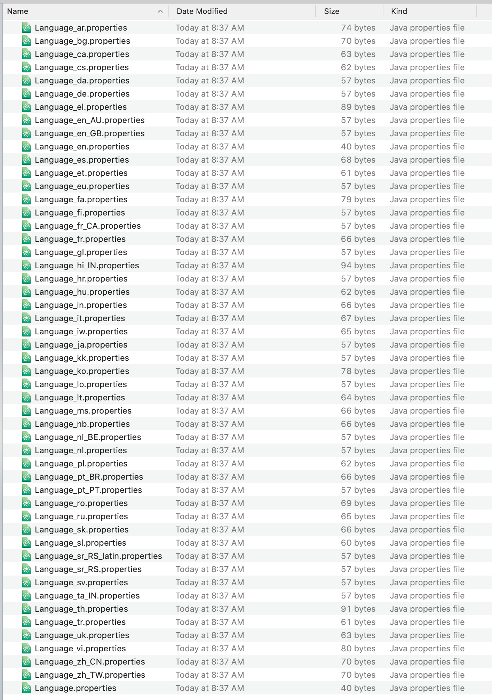

# Automatically Generating Translations

Liferay DXP supports about 50 languages out-of-the-box. Each locale has its own [language properties file](https://github.com/liferay/liferay-portal/tree/master/modules/apps/portal-language/portal-language-lang/src/main/resources/content) containing keys for its language.

If you have custom language keys in your application, it would be tedious and difficult to create keys for all these different languages. Fortunately, you can use Liferay's Language Builder tool to automatically generate translations. Language Builder leverages Microsoft's Translator API to give you a jump start on creating translations.

```{note}
The accuracy and correctness of machine translation can vary from language to language. It is up to you on how to make use of these generated translations.
```

## See the Sample Project

1. Start Liferay DXP. If you don't already have a docker container, use

   ```bash
   docker run -it -m 8g -p 8080:8080 [$LIFERAY_LEARN_DXP_DOCKER_IMAGE$]
   ```

   If you're running a different Liferay Portal version or Liferay DXP, adjust the above command accordingly.

1. Download and unzip [Automatically Generating Translations](./liferay-m7d6.zip).

   ```bash
   curl https://learn.liferay.com/dxp/latest/en/building-applications/core-frameworks/localization/liferay-m7d6.zip -O
   ```

   ```bash
   unzip liferay-m7d6.zip
   ```

1. Open the `gradle.properties` file in the module root folder. Add your Microsoft Translator subscription key:

   ```properties
   microsoft.translator.subscription.key={your unique key}
   ```

   Note for Language Builder to work, you need to obtain your own [Microsoft Translator subscription key](https://www.microsoft.com/en-us/translator/business/translator-api/). 

1. From the module root, run Language Builder.

   ```bash
   ./gradlew buildLang
   ```

   In your terminal window, you will see Language Builder generate the different language properties files. Note, if you see the error `Translation is disabled because credentials are not specified`, double-check that your subscription key is correct.

2. Navigate to the module's `src/main/resources/content` folder to view each of the translated properties files.

   

## Adding Your Language Keys

The sample project has one language key in the `Language.properties` file. Add as many language keys as you need for your application, then run Language Builder.

To deploy the language keys to Liferay, see [Overriding Global Language Keys](../../../liferay-internals/extending-liferay/overriding-global-language-keys.md). The instructions are the same whether overriding existing keys or adding new keys to Liferay.

If you want to exclude some languages from being automatically translated, use the `excludedLanguageIds` property in your project's `build.gradle` file. For example, if you wanted to exclude French:

```properties
buildLang {
	excludedLanguageIds = ["fa"]
}
```

To learn more about the Language Builder tool and additional configuration, see [Lang Builder Gradle Plugin](https://github.com/liferay/liferay-portal/tree/master/modules/sdk/gradle-plugins-lang-builder).