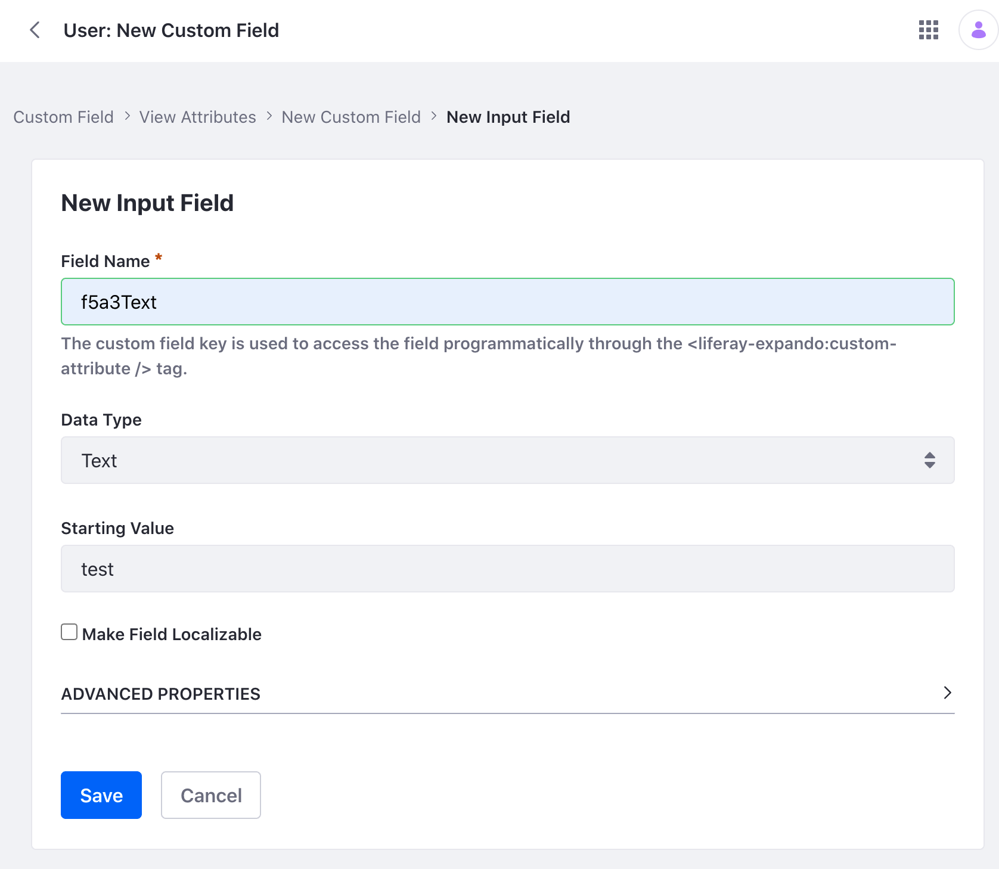
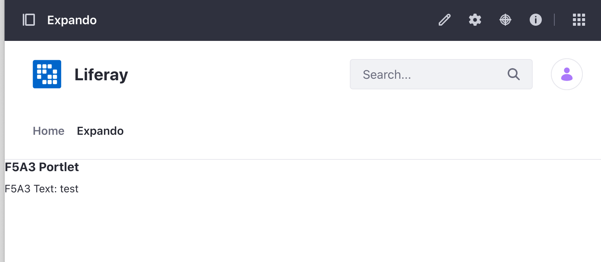

# Accessing Custom Fields With Expandos

When you need additional fields in your application, you can always add them in your [service model definition](../service-builder/service-builder-basics/generating-model-persistence-and-service-code.html#examine-the-service-model-definition) and re-run Service Builder. This adds new columns to your database table. This works, but can be a pain: now you have to write an upgrade process to migrate your users to the new schema. But with Liferay's Expando feature, you can add additional fields without having to modify your database. Expandos work by adding additional properties to an object in Java. The example project demonstrates accessing a custom field to Users.

# See the Example Project

1. Start Liferay DXP. If you don't already have a docker container, use

   ```bash
   docker run -it -m 8g -p 8080:8080 [$LIFERAY_LEARN_DXP_DOCKER_IMAGE$]
   ```

   If you're running a different Liferay Portal version or Liferay DXP, adjust the above command accordingly.

1. Navigate to *Control Panel* &rarr; *Users and Organizations*. Click the admin user's Options icon () and click *Edit*. In the General tab, scroll down to Custom Fields. Click the *Add* button.

1. Select *Input Field* as the field type. Input `f5a3Text` as the Field Name. Input a starting value, such as `test`. Click *Save*.

   

1. Download and unzip [Accessing Expando](./liferay-f5a3.zip).

   ```bash
   curl https://learn.liferay.com/dxp/latest/en/building-applications/data-frameworks/expando-framework/liferay-f5a3.zip -O
   ```

   ```bash
   unzip liferay-f5a3.zip
   ```

1. From the module root, build and deploy.

   ```bash
   ./gradlew deploy -Ddeploy.docker.container.id=$(docker ps -lq)
   ```

   ```{note}
   This command is the same as copying the deployed jars to /opt/liferay/osgi/modules on the Docker container.
   ```

1. Confirm the deployment in the Liferay Docker container console.

   ```bash
   STARTED com.acme.f5a3.web_1.0.0 [1034]
   ```

1. Verify that the example module is working. Open your browser to `https://localhost:8080`.

1. Navigate to a Site page and click the Edit icon (). Add the F5A3 Portlet to the page. The widget can be found under Sample widgets.

   

   The portlet displays the user's custom field that you just created.

## Examine the Portlet

The example project uses a simple MVC Portlet to render a JSP file that displays the custom field. There's no code in the portlet, as it only displays the default JSP file. 

To learn more, see [Using MVC](../../developing-a-java-web-application/using-mvc.md).

## Examine the JSP File

The `<liferay-theme:defineObjects>` tag is included in the JSP to access the Liferay `User` object. Like many Liferay objects, the `User` object has an inherited `ExpandoBridge` service that includes a way to create (i.e. `addAttribute()`), set (i.e. `setAttribute()`), and get (i.e. `getAttribute()`) custom field values. See the [ExpandoBridge javadocs](https://learn.liferay.com/reference/latest/en/dxp/javadocs/portal-kernel/com/liferay/expando/kernel/model/ExpandoBridge.html) to see all the interfaces's methods. 

```{literalinclude} ./accessing-custom-fields-with-expando/resources/liferay-f5a3.zip/f5a3-web/src/main/resources/META-INF/resources/view.jsp
:language: jsp
```

The sample project shows a simple example of getting the value associated with the `f5a3Text` custom field of the user. In your application, write your own code to create, set, and get custom fields.
