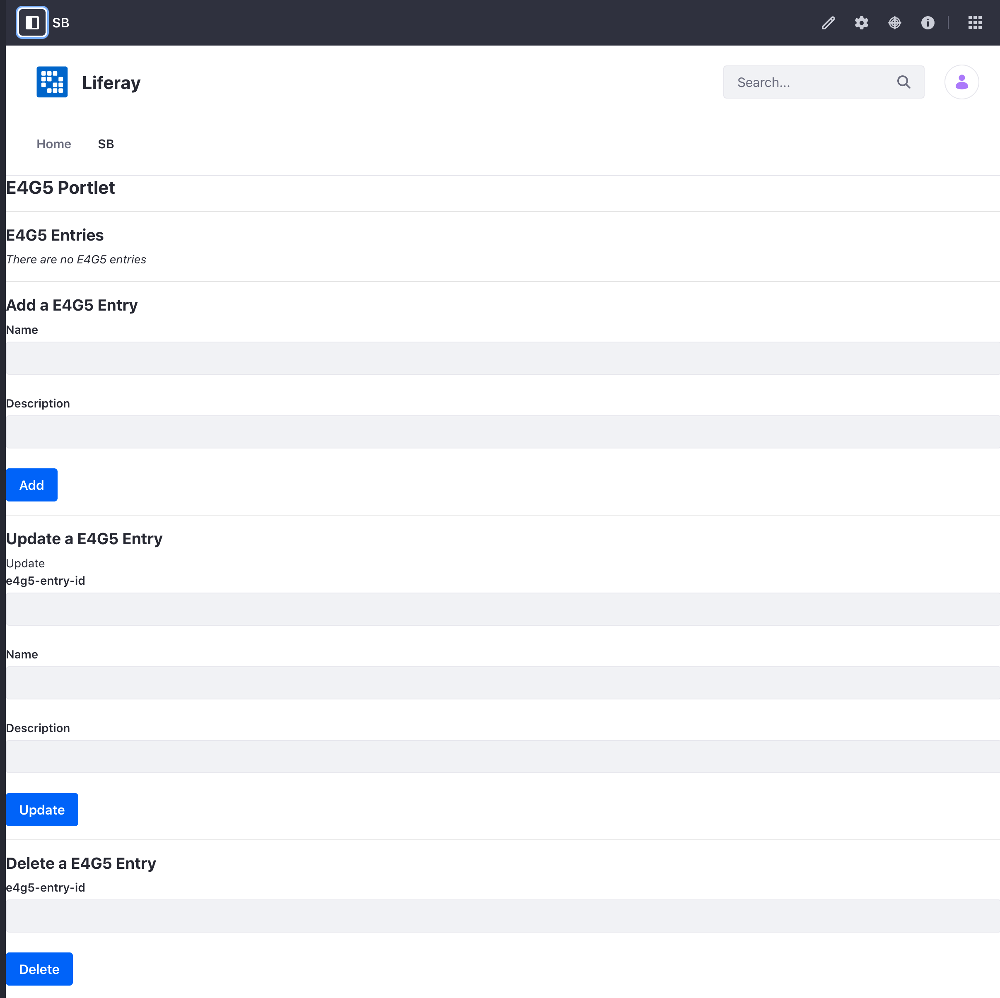

# Business Logic with Service Builder

Once you've [generated model, persistence, and service code](./service-builder-basics/generating-model-persistence-and-service-code.md) with Service Builder, you can begin adding business logic. Entities generated by Service Builder contain a model implementation and local service implementation class. Your application's business logic can be implemented in these classes. The generated service later contains default methods that call CRUD operations from the persistence layer. Once you have business logic, you run Service Builder again to propagate your application's interfaces, which makes your new logic available for invocation.

# See the Example Project

```{include} /_snippets/run-liferay-dxp.md
```

Then, follow these steps:

1. Download and unzip [Business Logic with Service Builder](./liferay-e4g5.zip).

    ```bash
    curl https://learn.liferay.com/dxp/latest/en/building-applications/data-frameworks/service-builder/liferay-e4g5.zip -O
    ```

    ```bash
    unzip liferay-e4g5.zip
    ```

1. From the module root, build and deploy.

    ```bash
    ./gradlew deploy -Ddeploy.docker.container.id=$(docker ps -lq)
    ```

    ```{note}
    This command is the same as copying the deployed jars to /opt/liferay/osgi/modules on the Docker container.
    ```

1. Confirm the deployment in the Liferay Docker container console.

    ```bash
    STARTED com.acme.e4g5.api_1.0.0 [1034]
    STARTED com.acme.e4g5.service_1.0.0 [1035]
    STARTED com.acme.e4g5.web_1.0.0 [1036]
    ```

1. Verify that the example module is working. Open your browser to `https://localhost:8080`.

1. Add the E4G5 Portlet to a page. You can find the example portlet under Sample Widgets.

   

1. Add an entry by entering a name and description (e.g. e4g5_name1 and e4g5_description1). Click `Add`, and the new entry appears under `E4G5 Entries`. Take note of the `e4g5EntryId` number.

1. Next, update this entry but entering the `e4g5EntryId` from the previous step and a new name and description. (e.g. 41804, e4g5_name2, e4g5_description2). Click `Update`, and the entry is now updated.

1. Finally, delete the entry by entering the `e4g5EntryId`. Click `Delete`, and the entry is now deleted.

## Update the Service Layer

Extend the local service by adding methods that can add, update, and delete `E4G5Entry` entries.

### Implement the Add Method

1. Declare an `add*` method with parameters for creating an entity.

```{literalinclude} ./business-logic-with-service-builder/resources/liferay-e4g5.zip/e4g5-service/src/main/java/com/acme/e4g5/service/impl/E4G5EntryLocalServiceImpl.java
:language: java
:lines: 34-44
```

1. The `*Persistence` class associated with your entity has a `create()` method that constructs an entity instance with the given ID. Every `*BaseLocalServiceImpl` has a `counterLocalService` object for the entity. Invoke the counter service's `increment()` method to generate a primary key for your entity instance.

1. Use the entity's setter methods to populate your entity's attributes. The sample sets two attributes: `name` and `description`.

1. Invoke the `*Persistence` class's `update()` method, passing in the entity object.

### Implement the Update Method

1. Declare an `update*` method with parameters for updating an entity. The sample receives `name` and `description` attributes, along with `e4g5EntryId`.

```{literalinclude} ./business-logic-with-service-builder/resources/liferay-e4g5.zip/e4g5-service/src/main/java/com/acme/e4g5/service/impl/E4G5EntryLocalServiceImpl.java
:language: java
:lines: 54-65
```

1. Use the `*Persistence` class's `findByPrimaryKey()` method to retrieve the entity instance by entry ID.

1. Use the entity's setter methods to populate your entity's attributes.

1. Invoke the `*Persistence` class's `update()` method, passing in the entity object.

### Implement the Delete Method

1. Declare a `delete*` method that receives the entity's entry ID.

```{literalinclude} ./business-logic-with-service-builder/resources/liferay-e4g5.zip/e4g5-service/src/main/java/com/acme/e4g5/service/impl/E4G5EntryLocalServiceImpl.java
:language: java
:lines: 46-52
```

1. Invoke the `*Persistence` class's `delete()` method, passing in the entity object.

After implementing your `add*`, `update*`, and `delete*` methods, run Service Builder to propagate your new service methods to the `*LocalService` interface.

## Integrate the Back-end

Now implement the service methods you created into your web module with [portlet actions](../../developing-a-java-web-application/using-mvc/invoking-actions-with-mvc-portlet.md). 

### Portlet Actions

You can use an [MVC Portlet](../../developing-a-java-web-application/using-mvc.md) for your web module. The sample project's Portlet has entry actions for `add`, `update`, and `delete`.

```{literalinclude} ./business-logic-with-service-builder/resources/liferay-e4g5.zip/e4g5-web/src/main/java/com/acme/e4g5/web/internal/portlet/E4G5Portlet.java
:language: java
:lines: 26-51
```

Each method takes an `ActionRequest` and `ActionResponse` parameter. The `ActionRequest` receives information from the view layer and the `ActionResponse` can be used to pass information back to the view layer.

The `addE4G5Entry()` method receives a name and description and calls the service to add the entry. The `updateE4G5Entry()` method receives an entry ID, name, and description and calls the service to updated a specific entry. The `deleteE4G5Entry()` method receives an entry ID and calls the service to delete the entry.

### Map the Actions in the JSP

Now map the action methods you created into your JSP. 

```{literalinclude} ./business-logic-with-service-builder/resources/liferay-e4g5.zip/e4g5-web/src/main/resources/META-INF/resources/view.jsp
:language: jsp
:lines: 43-77
```

The JSP binds actions to UI components using the tag library's `portlet:actionURL` tag. Note that the `portlet:actionURL`'s `name` attribute must match each of the action methods created in the portlet. The `var` attribute assigns the portlet action URL to an arbitrary variable. The `<aui:form>` renders text fields for user input. On submitting the form, its values are passed along with the `ActionRequest` to the portlet method.
