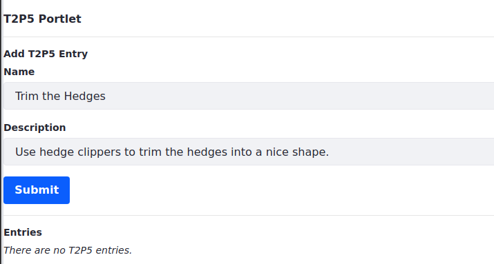
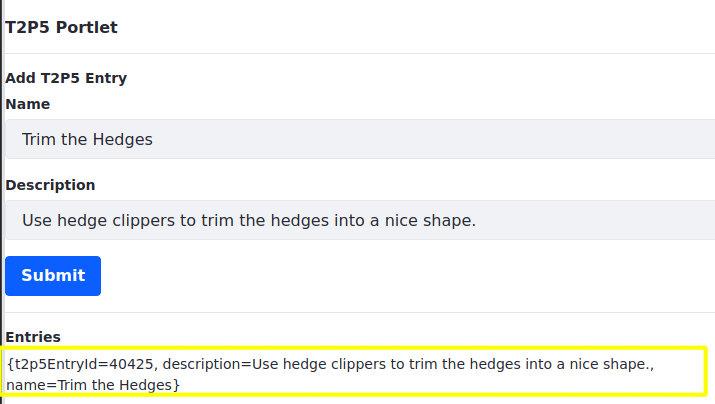

# Invoking a Service Locally

Service Builder services that are deployed to DXP/Portal can be invoked from other classes in the same JVM. These services are *local* to the classes.

Service Builder services are Declarative Services (DS) Components, which means they're managed in a container. Consumers request components from the container and the container provides a matching component instance.

A benefit of implementing a class as DS component is that other components it depends on must be available for it to activate. If your component fails to activate because of an unsatisfied component dependency, the runtime framework reports the issue.

Here you'll invoke a Service Builder service from a [portlet](../../../developing-a-java-web-application/reference/portlets.md) DS component. You'll use an example portlet application that has a form for adding new entries. The form is in a JavaServer Page (JSP). Submitting the form triggers the portlet to invoke the service for creating an entry and persisting it.

## Call a Service from a Portlet

1. Start a [Liferay Docker container](../../../../installation-and-upgrades/installing-liferay/using-liferay-docker-images.md).

   ```bash
   docker run -it -m 8g -p 8080:8080 [$LIFERAY_LEARN_DXP_DOCKER_IMAGE$]
   ```

1. Download and unzip the example.

   ```bash
   curl https://learn.liferay.com/dxp/latest/en/building-applications/data-frameworks/service-builder/service-builder-basics/liferay-t2p5.zip -O
   ```

   ```bash
   unzip liferay-t2p5.zip
   ```

1. Build and deploy the example.

    ```bash
    cd liferay-t2p5
    ```

    ```bash
    ./gradlew deploy -Ddeploy.docker.container.id=$(docker ps -lq)
    ```

    ```{note}
    This command is the same as copying module JARs to `/opt/liferay/osgi/modules` on the Docker container.
    ```

1. Confirm the deployment in the Docker container console.

    ```bash
    STARTED com.acme.t2p5.api_1.0.0
    STARTED com.acme.t2p5.service_1.0.0
    STARTED com.acme.t2p5.web_1.0.0
    ```

1. Open a browser to `http://localhost:8080`.

1. Sign in using the default credentials:

    **User Name:** `test@liferay.com`

    **Password:** `test`

1. Add the *T2P5 Portlet* widget from the *Samples* category to a widget page. The T2P5 Portlet appears.

   

1. Enter an entry name and description in the text fields and Click *Submit*. For example,

    **Name:** `Trim the Hedges`

    **Description:** `Use hedge clippers to trim the hedges into a nice shape.`



A new entry with the name and description appears in the *T2P5 Entries* list.

You invoked a Service Builder service from a portlet. Learn how it works, starting with the service API.

## Examine the Service API

The `t2p5-api` module project's `T2P5EntryLocalService` class has a method called `addT2P5Entry(String description, String name)`.

```{literalinclude} ./invoking-a-service-locally/resources/liferay-t2p5.zip/t2p5-api/src/main/java/com/acme/t2p5/service/T2P5EntryLocalService.java
:dedent: 1
:language: java
:lines: 65-66
```

The `addT2P5Entry` method creates a `T2P5Entry` with the given description and name and persists the entry.

```{note}
The `t2p5-service` module project's `T2P5EntryLocalServiceImpl` class implements the `T2P5EntryLocalService` interface.
```

The `t2p5-api` module's `bnd.bnd` file declares exports for the `com.acme.t2p5.service` package, `com.acme.t2p5.model` package, and other packages for consumers to use. Here's the `bnd.bnd` file:

```{literalinclude} ./invoking-a-service-locally/resources/liferay-t2p5.zip/t2p5-api/bnd.bnd
```

The `t2p5-web` module's portlet application depends on the `T2P5EntryLocalService` class. The web module's `build.gradle` file declares a dependency on the `t2p5-api` project.

```{literalinclude} ./invoking-a-service-locally/resources/liferay-t2p5.zip/t2p5-web/build.gradle
```

```{note}
For information on finding artifacts and specifying dependencies, please see [Configuring Dependencies](../../../../liferay-internals/fundamentals/configuring-dependencies.md).
```

## Examine the Portlet

The `t2p5-web` module's `T2P5Portlet` class handles requests to add `T2P5Entry` instances. Here's the `T2P5Portlet` class:

```{literalinclude} ./invoking-a-service-locally/resources/liferay-t2p5.zip/t2p5-web/src/main/java/com/acme/t2p5/web/internal/portlet/T2P5Portlet.java
:language: java
:lines: 16-38
```

`T2P5Portlet` is an [`MVCPortlet`](../../../developing-a-java-web-application/using-mvc.md). It has a `T2P5EntryLocalService` field called `_t2p5EntryLocalService` and an action-handling method called `addT2P5Entry`.

The `_t2p5EntryLocalService` field's `@Reference` annotation signals the runtime framework to inject a `T2P5EntryLocalService` component instance into the field.

```{note}
For more information on using the `@Reference` annotation and acessing services in other ways, see *Dependency Injection* in [Core Frameworks](../../../core-frameworks.md).
```

The `addT2P5Entry` method calls `T2P5EntryLocalService`'s `addT2P5Entry` method, passing in description and name parameters retrieved from the `ActionRequest`.

The portlet's `view.jsp` template (next) submits `ActionRequest`s to `T2P5Portlet`.

## Examine the JSP

The `view.jsp` provides a form for adding entries and shows all the current entries.

```{literalinclude} ./invoking-a-service-locally/resources/liferay-t2p5.zip/t2p5-web/src/main/resources/META-INF/resources/view.jsp
:language: jsp
```

The JSP uses tags from these tag libraries:

* Core JSTL
* Portlet
* Liferay's Alloy UI (`aui`)

It imports these classes:

* `T2P5Entry`
* `T2P5EntryLocalServiceUtil`
* `java.util.List`

The page's *Add T2P5 Entry* section provides a form for adding an entry. The `<portlet:defineObjects />` tag makes standard portlet objects available to the template. The `aui` tags use these objects.

The `<portlet:actionURL name="addT2P5Entry" var="addT2P5EntryURL" />` tag maps the `addT2P5EntryURL` variable to a portlet action named `addT2P5Entry`. Submitting an `ActionRequest` with this `actionURL` invokes the portlet's method `addT2P5Entry` because it maps to the `actionUrl` name `addT2P5Entry`.

The `<aui:form>` renders text fields for an entry's name and description. On submitting the form, its values are passed along with an `ActionRequest` to the portlet method.

```{note}
For more information on portlet actions, see [Invoking Actions with MVC Portlet](../../../developing-a-java-web-application/using-mvc/invoking-actions-with-mvc-portlet.md).
```

The page's *Entries* section lists all the entries. It gets all the entries by calling `T2P5EntryLocalServiceUtil.getT2P5Entries(-1, -1)` The `-1` min and max range values tell the method to return all the entries.

You've invoked a Service Builder service from a portlet application. These services are easy to use in MVC Portlet.

## What's Next

Now that you know Service Builder basics, you can explore [Defining Entities](../defining-entities.md) to create relationships between entities, localize entities, support queries, and more. Or you can dive into [Business Logic with Service Builder](../business-logic-with-service-builder.md).

## Additional Information

* [Portlets](../../../developing-a-java-web-application/reference/portlets.md)
* [Using MVC](../../../developing-a-java-web-application/using-mvc.md)
* [Using a JSP and MVC Portlet](../../../developing-a-java-web-application/using-mvc/using-a-jsp-and-mvc-portlet.md)
* [MVC Action Command](../../../developing-a-java-web-application/using-mvc/mvc-action-command.md)
