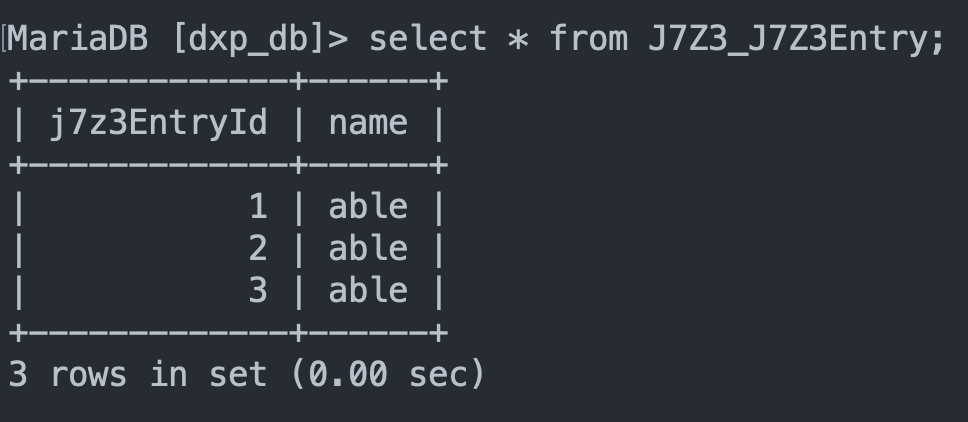
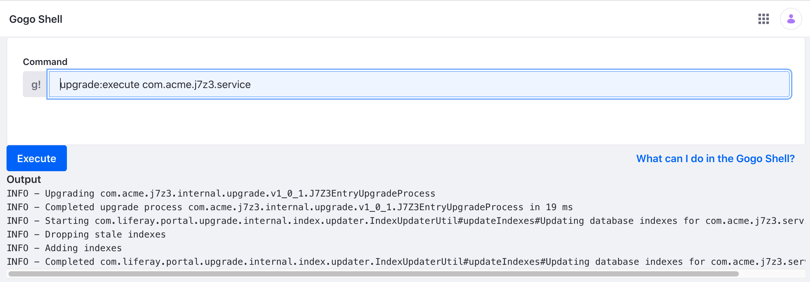
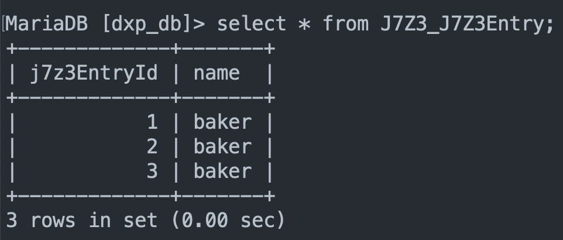

# Multithreading Process

> Available in Liferay DXP 7.4 U10 and above or Liferay Portal 7.4 GA14 and above

Your [Upgrade Processes](../upgrade-processes.md) may involve making complex changes to large data sets. If performance is critical, use the `processConcurrently()` method in the `UpgradeProcess` class of your application. This method executes in multiple threads and can shorten your upgrade times.

## Deploy Version 1.0.0

1. Start Liferay DXP. If you don't already have a docker container, use

    ```bash
    docker run -it -m 8g -p 8080:8080 [$LIFERAY_LEARN_DXP_DOCKER_IMAGE$]
    ```

    If you're running a different Liferay Portal version or Liferay DXP, adjust the above command accordingly. 

1. Download and unzip [Multithreading Process](./liferay-j7z3.zip).

    ```bash
    curl https://learn.liferay.com/dxp/latest/en/building-applications/data-frameworks/upgrade-processes/liferay-j7z3.zip -O
    ```

    ```bash
    unzip liferay-j7z3.zip
    ```

1. Move into the `1.0.0` directory, build and deploy.

   ```bash
   cd 1.0.0
   ```

   ```bash
   ../gradlew deploy -Ddeploy.docker.container.id=$(docker ps -lq)
   ```

   ```{note}
   This command is the same as copying the deployed jars to /opt/liferay/osgi/modules on the Docker container.
   ```

1. Confirm the deployment in the Liferay Docker container console.

    ```bash
    STARTED com.acme.j7z3.api_1.0.0 [1030]
    STARTED com.acme.j7z3.service_1.0.0 [1031]
    ```

## Add Entries to the App

1. Navigate to the Script console at *Control Panel* &rarr; *Server Administration* &rarr; *Script*.

1. Add some entries by executing the following script.

    ```groovy
    import com.acme.j7z3.service.J7Z3EntryLocalServiceUtil;

    import com.liferay.portal.kernel.dao.orm.QueryUtil;

    entry1 = J7Z3EntryLocalServiceUtil.createJ7Z3Entry(1);
    entry2 = J7Z3EntryLocalServiceUtil.createJ7Z3Entry(2);
    entry3 = J7Z3EntryLocalServiceUtil.createJ7Z3Entry(3);

    entry1.setName("able");
    entry2.setName("able");
    entry3.setName("able");

    J7Z3EntryLocalServiceUtil.addJ7Z3Entry(entry1);
    J7Z3EntryLocalServiceUtil.addJ7Z3Entry(entry2);
    J7Z3EntryLocalServiceUtil.addJ7Z3Entry(entry3);

    ```

   The J7Z3_J7Z3Entry table now has three entries.

   

## Execute the Upgrade

1. Move into the `1.0.1` directory, build and deploy.

   ```bash
   cd ../1.0.1    
   ```

   ```bash
   ../gradlew deploy -Ddeploy.docker.container.id=$(docker ps -lq)
   ```

1. Navigate to the Gogo shell console at *Control Panel* &rarr; *Gogo Shell*.

1. Verify that the 1.0.1 upgrade is available by entering the command `upgrade:list com.acme.j7z3.service`. The 1.0.1 version appears as a registered upgrade process in the output window.

1. Execute the upgrade by entering the command `upgrade:execute com.acme.j7z3.service`. The output window shows that the upgrade was completed.

   

1. The J7Z3_J7Z3Entry table entries have now been updated.

   

## Implement the Multithreading Method

In the `UpgradeProcess` class of your application, override the `processConcurrently()` method.

```{literalinclude} ./multithreading-process/resources/liferay-j7z3.zip/1.0.1/j7z3-service/src/main/java/com/acme/j7z3/internal/upgrade/v1_0_1/J7Z3EntryUpgradeProcess.java
:dedent: 1
:language: java
:lines: 26-48
```

The method has four parts:

1. SQL Query - An SQL statement to query the database data.

1. Gathering objects - Receive a result set and return an array of objects based on the result set.

1. Processing objects - Execute business logic on the array of objects.

1. Exception - Send a message if an exception occurs.

The sample project shows a simple example where the `name` field is processed and modified by the `processConcurrently()` method.

1. `select j7z3EntryId, name from J7Z3_J7Z3Entry` - The SQL statement queries all the entries.

1. ```java
   resultSet -> new Object[] {
				resultSet.getLong("j7z3EntryId"), resultSet.getString("name")
   ```
   The objects are gathered and stored in the `resultSet` array.

1. ```java
   columns -> {
	long j7z3EntryId = (Long)columns[0];

	try (PreparedStatement preparedStatement =
			connection.prepareStatement(
				"update J7Z3_J7Z3Entry set name = ? where " +
					"j7z3EntryId = ?")) {

			preparedStatement.setString(1, "baker");
			preparedStatement.setLong(2, j7z3EntryId);

			preparedStatement.executeUpdate();
			}
		}
   ```
   For every `j7z3EntryId`, the `name` field is set as `baker`.

1. The exception is set to `null`.

Note, the `processConcurrently()` method has two different signatures. One signature passes a SQL query as the source, as seen in this tutorial example. The other signature passes an array as the source. See the [BaseDBProcess javadocs](https://learn.liferay.com/reference/latest/en/dxp/javadocs/portal-kernel/com/liferay/portal/kernel/dao/db/BaseDBProcess.html#processConcurrently-java.lang.String-com.liferay.petra.function.UnsafeFunction-com.liferay.petra.function.UnsafeConsumer-java.lang.String-) to learn more.
