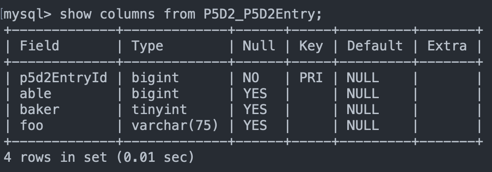
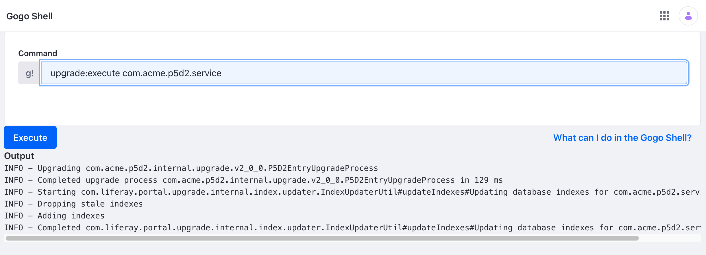
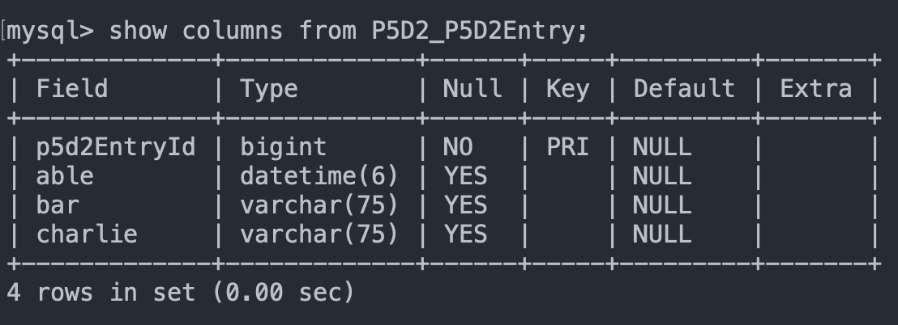

# Upgrading Your Database Tables

{bdg-secondary}`Available Liferay DXP 7.4 U10+ or Liferay Portal 7.4 GA14+`

An upgrade of your application may require making changes to your database tables. Liferay's Upgrade framework makes it easy to make these changes. Deploy the sample project to see this upgrade process. See [Creating Upgrade Processes for Modules](https://help.liferay.com/hc/en-us/articles/360031165751-Creating-Upgrade-Processes-for-Modules) for previous versions of Liferay.

## Deploy Version 1.0.0

```{include} /_snippets/run-liferay-dxp.md
```

Then, follow these steps:

1. Download and unzip [Upgrading Your Database Tables](./liferay-p5d2.zip).

   ```bash
   curl https://learn.liferay.com/dxp/latest/en/building-applications/data-frameworks/upgrade-processes/liferay-p5d2.zip -O
   ```

   ```bash
   unzip liferay-p5d2.zip
   ```

1. Move into the `1.0.0` directory, build and deploy.

   ```bash
   cd 1.0.0
   ```

   ```bash
   ../gradlew deploy -Ddeploy.docker.container.id=$(docker ps -lq)
   ```

   ```{note}
   This command is the same as copying the deployed jars to /opt/liferay/osgi/modules on the Docker container.
   ```

1. Confirm the deployment in the Liferay Docker container console.

   ```bash
   STARTED com.acme.p5d2.api_1.0.0 [1030]
   STARTED com.acme.p5d2.service_1.0.0 [1031]
   ```

1. If you are using an external database, verify the table columns for the app. For example, for MySQL:

   ```sql
   SHOW COLUMNS FROM P5D2_P5D2Entry;
   ```

   

## Upgrade to 2.0.0

1. Now deploy the 2.0.0 version. Move into the `2.0.0` directory, build and deploy.

   ```bash
   cd 2.0.0
   ```

   ```bash
   ../gradlew deploy -Ddeploy.docker.container.id=$(docker ps -lq)
   ```

1. Log into Liferay and navigate to the Gogo shell console at *Control Panel* &rarr; *Gogo Shell*.

1. Verify that the 2.0.0 upgrade is available by entering the command `upgrade:list com.acme.p5d2.service`.

1. Run the upgrade by entering the command `upgrade:execute com.acme.p5d2.service`. The Gogo shell console shows the completed upgrade process.

   

1. You can verify that the table columns have been updated in the database. For example, for MySQL:

   ```sql
   SHOW COLUMNS FROM P5D2_P5D2Entry;
   ```

   

## Examine the Code

The example project demonstrates a simple change of the following table columns:

| Before | After | Comment |
| :--- | :--- | :--- |
| `able` (type: long) | `able` (type: date) | The column datatype is changed. |
| `baker` (type: boolean) | - | The column is dropped |
| `foo` (type: string) | `bar` (type: string) | The column name is changed. |
| - | `charlie` (type: string) | A new column is added. |

Compare the `service.xml` column definitions of [1.0.0](./upgrading-your-database-tables/resources/liferay-p5d2.zip/1.0.0/p5d2-service/service.xml) with [2.0.0](./upgrading-your-database-tables/resources/liferay-p5d2.zip/2.0.0/p5d2-service/service.xml)

### Create an UpgradeStepRegistrator Class

Create a `UpgradeStepRegistrator` class that implements the `UpgradeStepRegister` interface.

```{literalinclude} ./upgrade-process-for-your-application/resources/liferay-p5d2.zip/2.0.0/p5d2-service/src/main/java/com/acme/p5d2/internal/upgrade/P5D2EntryUpgrade.java
:dedent: 1
:language: java
:lines: 26-34
```

Override the `register` method to implement the app's upgrade registration. Make sure to use the `@Component` annotation and identify it as a `UpgradeStepRegistrator.class` service.


### Create an UpgradeProcess Class

Create an `UpgradeProcess` class that extends the base class.

```{literalinclude} ./upgrade-process-for-your-application/resources/liferay-p5d2.zip/2.0.0/p5d2-service/src/main/java/com/acme/p5d2/internal/upgrade/v2_0_0/P5D2EntryUpgradeProcess.java
:dedent: 1
:language: java
:lines: 22-32
```

Override the `doUpgrade()` method with instructions to modify your table. The following operations are available:

| Function | Description |
| :--- | :--- |
| alterColumnName | Change the column name |
| alterColumnType | Change the column datatype |
| alterTableAddColumn | Add a new column |
| alterTableDropColumn | Remove a column |

```{warning}
`alterTableDropColumn` does not work in MariaDB. This is a [known bug](https://github.com/liferay-upgrades/liferay-portal/pull/263/commits/9a59708c40e19b209d99eeee2f7e68a815d5cd1b). Follow the [previous guidelines](https://help.liferay.com/hc/en-us/articles/360031165751-Creating-Upgrade-Processes-for-Modules) instead.
```

Re-run Service Builder after making your changes. You are now ready to build an deploy your upgrade.
