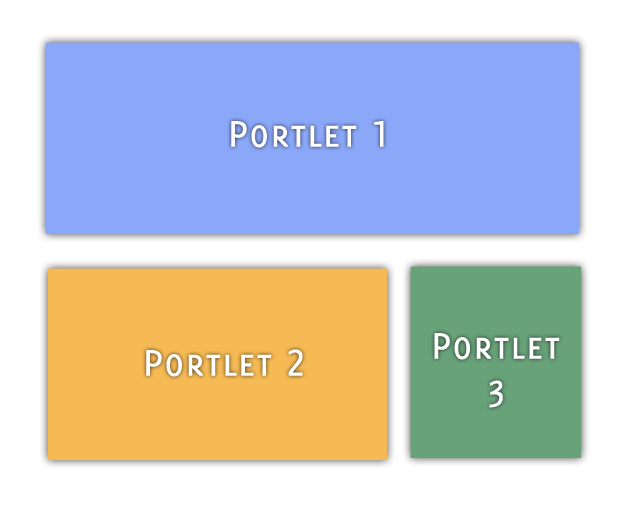

# Portlets

Liferay DXP started off as a portal server for Java-based web applications called *portlets* (see [JSR 168](https://jcp.org/en/jsr/detail?id=168), [JSR-286](https://jcp.org/en/jsr/detail?id=286), and [JSR-362](https://jcp.org/en/jsr/detail?id=362)). Portlets process requests and generate responses like any other web application. One key difference, however, between portlets and other web apps is that portlets run in a portion of the web page. When you're writing a portlet application, you need only worry about that application: the rest of the page---the navigation, the top banner, and other global components of the interface---is handled by other components. Portlets run only in a portal server. They use the portal's existing support for user management, authentication, permissions, page management, and more. This frees you to focus on developing the portlet's core functionality. In many ways, writing your application as a portlet is easier than writing a standalone application.

Many portlets can be placed on a single page by users (if they have permission) or portal administrators. For example, a page could have a calendar portlet for community events, an announcements portlet for important announcements, and a bookmarks portlet for links of interest to the community. You can reposition and resize portlets on a page through drag and drop without altering any portlet code. A single portlet, such as a forum or a Wiki, can take up an entire page if it's the only app you need on that page. In short, portlets alleviate many of the traditional pain points associated with developing Java-based web apps.

## Portlet Phases 

Portlets handle requests in multiple phases. This makes portlets much more flexible than servlets. Each portlet phase executes a different operation:

**Render:** Generates the portlet's content based on its current state. When this phase runs on one portlet, it also runs on all other portlets on the page. The Render phase runs after any portlets on the page complete their Action or Event phases.

**Action:** In response to a user action, the Action phase performs operations that change the portlet's state. The Action phase can also trigger events that are processed by the Event phase. Following the Action phase and optional Event phase, the Render phase regenerates the portlet's contents.

**Event:** Processes events triggered in the Action phase. Events are used for inter-portlet communication (IPC). Once the portlet processes all events, the portal calls the Render phase on all portlets on the page.

**Resource-serving:** Serves a resource independently from the rest of the life cycle, enabling a portlet to serve dynamic content without running the Render phase on all portlets on a page. The Resource-serving phase handles AJAX requests.

**Header:** Lets you specify resource dependencies, such as CSS, prior to the Render phase.

## Portlet Modes

Portlets also differ from servlets by having distinct modes and window states. Mode names distinguish the portlet's current function, though most modern applications use View Mode only.

**View mode:** The portlet's default mode, where its main functionality is implemented. 

**Edit mode:** The portlet's configuration mode. For example, a weather portlet might use Edit mode to define the location for a weather report. 

**Help mode:** A mode for displaying help information or documentation.

Portlet window states control the amount of space a portlet takes on a page. Window states mimic a traditional desktop environments' window behavior: 

**Normal:** The portlet can be on a page that contains other portlets. This is the default window state.

**Maximized:** The portlet takes up an entire page.

**Minimized:** Only the portlet's title bar shows.

## More Differences From Servlets

Since portlets only render a portion of a page, global tags like `<html>`, `<head>`, and `<body>` aren't allowed. And because you don't know the portlet's page ahead of time, you can't create portlet URLs directly. Instead, the portlet API contains methods to create portlet URLs programmatically. Also, because portlets don't have direct access to the `javax.servlet.ServletRequest`, they can't read query parameters directly from a URL. Portlets instead access a `javax.portlet.PortletRequest` object. The portlet specification provides a mechanism for a portlet to read only its own URL parameters or those declared as public render parameters. Liferay DXP does, however, provide utility methods that can access the `ServletRequest` and query parameters. Portlets also have a *portlet filter* available for each phase in the portlet lifecycle. Portlet filters are similar to servlet filters in that they allow request and response modification on the fly.

All of the ways to develop web front-ends on Liferay DXP involve portlets. The JavaScript-based widgets use Liferay's JS Portlet Extender behind the scenes and the Java-based web front-ends are explicitly portlets. All of the web front-end types vary in their support of Portlet 3.0, dependency injection (DI), Model View Controller (MVC), and modularity, giving you plenty of good options for developing portlets.

Here are some ways to get started developing portlets:

* [Using MVC](../using-mvc.md)
* [Using Spring](../using-spring.md)
* [Using JSF](../using-jsf.md)
* [Using Bean Portlet](../using-bean-portlet.md)
