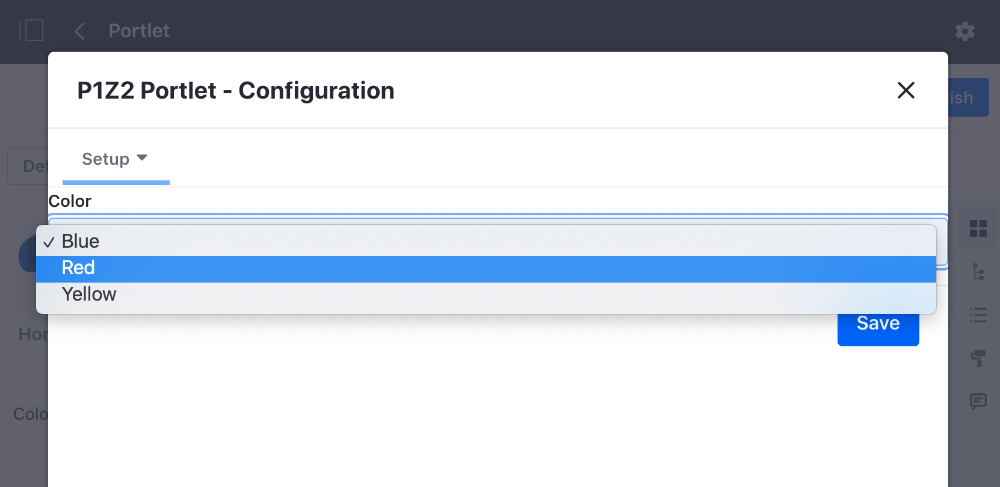

# Portlet Preferences

You can give administrators and users a way to customize a portlet with portlet preferences. Portlet preferences can be added to any MVC Portlet to give users a UI to access and set their preferences.

Note, portlet preferences are properties that are stored separately from an application's configuration. To learn more see [Portlet Level Configuration](../../core-frameworks/configuration-framework/portlet-level-configuration.md).

## See a Sample Implementation

1. Start Liferay DXP. If you don't already have a docker container, use

    ```bash
    docker run -it -m 8g -p 8080:8080 [$LIFERAY_LEARN_PORTAL_DOCKER_IMAGE$]
    ```

    If you're running a different Liferay Portal version or Liferay DXP, adjust the above command accordingly. 

1. Download and unzip the example.

    ```bash
    curl https://learn.liferay.com/dxp/latest/en/building-applications/developing-a-java-web-application/using-mvc/liferay-p1z2.zip -O
    ```

    ```bash
    unzip liferay-p1z2.zip
    ```

1. From the module root, build and deploy.

    ```bash
    ./gradlew deploy -Ddeploy.docker.container.id=$(docker ps -lq)
    ```

    ```{note}
    This command is the same as copying the deployed jars to /opt/liferay/osgi/modules on the Docker container.
    ```

1. Confirm the deployment in the Liferay Docker container console.

    ```bash
    STARTED com.acme.p1z2.web_1.0.0 [2725]
    ```

1. Verify that the example module is working. Open your browser to `https://localhost:8080`

1. Add the P1Z2 portlet to a page. You can find the example portlet under Sample Widgets. Note the default color variable is set to blue.

1. Click the portlet's options icon () and click *Configuration*. The portlet's preferences window opens.

    

1. Select a different color and click *Save*. Close the preferences menu and now the portlet shows your new selection.

Here's how the preferences work.

## Create the Configuration JSP

The user interface for portlet preferences is provided by the `configuration.jsp` file. 

```{literalinclude} ./portlet-preferences/resources/liferay-p1z2.zip/p1z2-web/src/main/resources/META-INF/resources/configuration.jsp
:language: jsp
:lines: 8-30
```

The JSP file uses `<liferay-portlet:actionURL />` and `<liferay-portlet:renderURL />` tags to construct URLs in the variables `configurationActionURL` and `configurationRenderURL`. 

When someone submits the form, the `configurationActionURL` is invoked, which triggers the application's `processAction` method with the `color` variable included as a request parameter.

A URL parameter named `cmd` is supplied indicating the purpose of the request. The value of the `cmd` parameter is `update`. 

## Create the Configuration Action

Create a custom configuration action class to be able to access the portlet's preferences. 

```{literalinclude} ./portlet-preferences/resources/liferay-p1z2.zip/p1z2-web/src/main/java/com/acme/p1z2/web/internal/portlet/action/P1Z2ConfigurationAction.java
:language: java
:lines: 14-34
```

In the `@Component` annotation, specify the portlet the action class applies to with a `property` tag.

Add the `processAction()` method which reads the portlet preferences from the configuration form and stores them in the database. In the sample portlet, the method reads the `color` URL parameter and sets the value as a portlet preference.

## Add the Preference Logic

Add some logic to the `view.jsp` file to access the portlet's preference.

```{literalinclude} ./portlet-preferences/resources/liferay-p1z2.zip/p1z2-web/src/main/resources/META-INF/resources/view.jsp
:language: jsp
:lines: 7
```

The JSP file checks for the selected portlet preference and returns the value. If no value has yet been saved, `blue` is returned as the default value.

Note that the `<portlet:defineObjects />` tag makes `portletPreferences` available, which you use to retrieve the `color` preference in the JSP. 

## Add the Portlet's Path Parameters

In the portlet's `@Component` annotation, add the view template and configuration template path parameters.

```{literalinclude} ./portlet-preferences/resources/liferay-p1z2.zip/p1z2-web/src/main/java/com/acme/p1z2/web/internal/portlet/P1Z2Portlet.java
:language: java
:lines: 9-18
```

## Related Information

* [Portlet Level Configuration](../../core-frameworks/configuration-framework/portlet-level-configuration.md)
