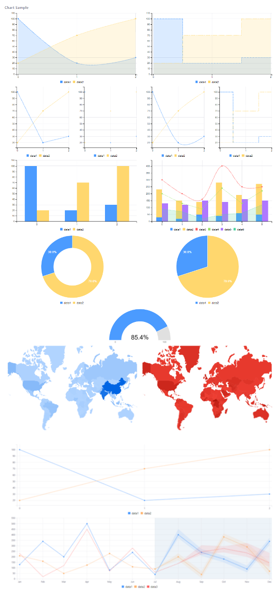

# Chart Tag Library 

```{toctree}
:maxdepth: 3

chart-tag-library/bar-chart.md
chart-tag-library/combination-chart.md
chart-tag-library/donut-chart.md
chart-tag-library/geomap-chart.md
chart-tag-library/gauge-chart.md
chart-tag-library/line-chart.md
chart-tag-library/pie-chart.md
chart-tag-library/predictive-chart.md
chart-tag-library/scatter-chart.md
chart-tag-library/spline-chart.md
chart-tag-library/step-chart.md
chart-tag-library/refreshing-charts-to-reflect-real-time-data.md
```

Lines, splines, bars, pies and more, the Chart tag Library provides everything you need to model data. Each taglib gives you access to the corresponding [Clay component](https://github.com/liferay/clay/tree/2.x-stable/packages/clay-charts/src). These components contain the default configuration for the UI.

To use the Chart taglib in your apps, add the following declaration to your JSP:

```jsp
<%@ taglib prefix="chart" uri="http://liferay.com/tld/chart" %>
```

This section covers the types of charts you can create with the Chart taglibs. Each article contains a set of chart examples along with sample Java data and a figure displaying the rendered results. 

