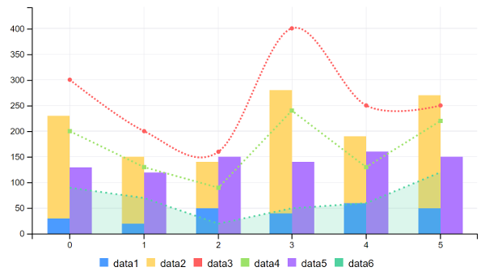

# Combination Charts

Combination charts have minor differences from other charts. In a combination chart, you must define the representation type of each data set: `AREA`, `AREA_SPLINE`, `AREA_STEP`, `BAR`, `BUBBLE`, `DONUT`, `GAUGE`, `LINE`, `PIE`, `SCATTER`, `SPLINE`, or `STEP`. Each data set in a combination chart is an instance of the `TypedMultiValueColumn` object. Each object receives an ID, the representation type, and values for the data. Follow these steps to configure your portlet to use combination charts. 

1. Import the chart taglib along with the `CombinationChartConfig`, `MultiValueColumn`, and `MultiValueColumn.Type` classes into your bundle's `init.jsp` file:

    ```jsp
    <%@ taglib prefix="chart" uri="http://liferay.com/tld/chart" %>
    <%@ page import="com.liferay.frontend.taglib.chart.model.combination.CombinationChartConfig" %>
    <%@ page import="com.liferay.frontend.taglib.chart.model.MultiValueColumn" %>
    <%@ page import="com.liferay.frontend.taglib.chart.model.TypedMultiValueColumn.Type" %>
    ```

1. Add the following Java scriptlet to the top of your `view.jsp`:

    ```java
    <%
    CombinationChartConfig _combinationChartConfig = 
    new CombinationChartConfig();

    _combinationChartConfig.addColumns(
      new TypedMultiValueColumn(
        "data1", Type.BAR, 30, 20, 50, 40, 60, 50),
      new TypedMultiValueColumn(
        "data2", Type.BAR, 200, 130, 90, 240, 130, 220),
      new TypedMultiValueColumn(
        "data3", Type.SPLINE, 300, 200, 160, 400, 250, 250),
      new TypedMultiValueColumn(
        "data4", Type.LINE, 200, 130, 90, 240, 130, 220),
      new TypedMultiValueColumn(
        "data5", Type.BAR, 130, 120, 150, 140, 160, 150),
      new TypedMultiValueColumn(
        "data6", Type.AREA, 90, 70, 20, 50, 60, 120));

    _combinationChartConfig.addGroup("data1", "data2");

    %>
    ```

1. Add the `<chart>` taglib to the `view.jsp`, passing the `_combinationChartConfig` as the `config` attribute's value:

    ```jsp
    <chart:combination
      config="<%= _combinationChartConfig %>"
    />
    ```



Awesome! Now you know how to create combination charts for your apps. 

## Related Topics

* [Bar Charts](./bar-chart.md)
* [Donut Charts](./donut-chart.md)
* [Pie Charts](./pie-chart.md)