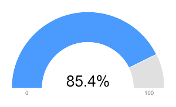

# Gauge Charts

Gauge charts are percentage-based. A gauge chart shows where percentage-based data falls over a given range. Each data set must be defined as a new instance of the `SingleValueColumn` object <!--[`SingleValueColumn` object](https://docs.liferay.com/dxp/apps/foundation/latest/javadocs/com/liferay/frontend/taglib/chart/model/SingleValueColumn.html)-->. Follow these steps to configure your portlet to use gauge charts. 

1. Import the chart taglib along with the `GaugeChartConfig` and `SingleValueColumn` classes into your bundle's `init.jsp` file:

    ```markup
    <%@ taglib prefix="chart" uri="http://liferay.com/tld/chart" %>
    <%@ page import="com.liferay.frontend.taglib.chart.model.gauge.GaugeChartConfig" %>
    <%@ page import="com.liferay.frontend.taglib.chart.model.SingleValueColumn" %>
    ```

1. Add the following Java scriptlet to the top of your `view.jsp`:

    ```java
    <%
    GaugeChartConfig _gaugeChartConfig = new GaugeChartConfig();

    _gaugeChartConfig.addColumn(
      new SingleValueColumn("data1", 85.4)
    );

    %>
    ```

1. Add the `<chart>` taglib to the `view.jsp`, passing the `_gaugeChartConfig` as the `config` attribute's value:

    ```markup
    <chart:gauge
      config="<%= _gaugeChartConfig %>"
    />
    ```



Awesome! Now you know how to create gauge charts for your apps. 

## Related Topics

* [Gauge Charts](./gauge-chart.md)
* [Geomap Charts](./geomap-chart.md)
* [Pie Charts](./pie-chart.md)