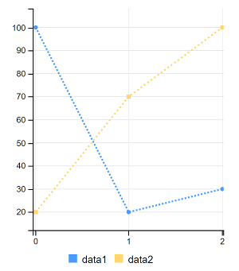

# Line Charts

Line charts contain multiple sets of data. A Line chart displays the data linearly. Each data series (created with the `addColumns()` method) is defined with a new instance of the  [`MultiValueColumn` object](https://docs.liferay.com/ce/apps/frontend-taglib/latest/javadocs/com/liferay/frontend/taglib/chart/model/MultiValueColumn.html), which takes an ID and a set of values. Follow these steps to configure your portlet to use line charts. 

1. Import the chart taglib along with the `LineChartConfig` and `MultiValueColumn` classes into your bundle's `init.jsp` file:

    ```jsp
    <%@ taglib prefix="chart" uri="http://liferay.com/tld/chart" %>
    <%@ page import="com.liferay.frontend.taglib.chart.model.point.line.LineChartConfig" %>
    <%@ page import="com.liferay.frontend.taglib.chart.model.MultiValueColumn" %>
    ```

1. Add the following Java scriptlet to the top of your `view.jsp`:

    ```java
    <%
    LineChartConfig _lineChartConfig = new LineChartConfig();

    _lineChartConfig.addColumns(
      new MultiValueColumn("data1", 100, 20, 30),
      new MultiValueColumn("data2", 20, 70, 100));
    }
    %>
    ```

1. Add the `<chart>` taglib to the `view.jsp`, passing the `_lineChartConfig` as the `config` attribute's value:

    ```jsp
    <chart:line
      config="<%= _lineChartConfig %>"
    />
    ```



Awesome! Now you know how to create line charts for your apps. 

## Related Topics

* [Bar Charts](./bar-chart.md)
* [Scatter Charts](./scatter-chart.md)
* [Step Charts](./step-chart.md)