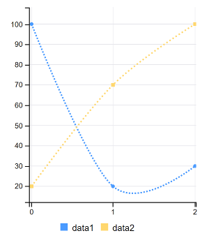
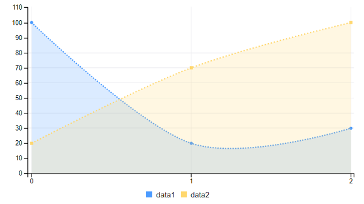

# Spline Charts

Spline charts contain multiple sets of data. A spline chart connects points of data with a smooth curve. Each data series (created with the `addColumns()` method) is defined with a new instance of the `MultiValueColumn` object <!--[`MultiValueColumn` object](https://docs.liferay.com/dxp/apps/foundation/latest/javadocs/com/liferay/frontend/taglib/chart/model/MultiValueColumn.html)-->, which takes an ID and a set of values. Follow these steps to configure your portlet to use spline charts. 

1. Import the chart taglib along with the `SplineChartConfig` and `MultiValueColumn` classes into your bundle's `init.jsp` file:

    ```markup
    <%@ taglib prefix="chart" uri="http://liferay.com/tld/chart" %>
    <%@ page import="com.liferay.frontend.taglib.chart.model.point.spline.SplineChartConfig" %>
    <%@ page import="com.liferay.frontend.taglib.chart.model.MultiValueColumn" %>
    ```

1. Add the following Java scriptlet to the top of your `view.jsp`:

    ```java
    <%
    SplineChartConfig _splineChartConfig = new SplineChartConfig();

    _splineChartConfig.addColumns(
      new MultiValueColumn("data1", 100, 20, 30),
      new MultiValueColumn("data2", 20, 70, 100));
    }
    %>
    ```

1. Add the `<chart>` taglib to the `view.jsp`, passing the `_splineChartConfig` as the `config` attribute's value:

    ```markup
    <chart:spline
      config="<%= _splineChartConfig %>"
    />
    ```



You can also use an area spline chart if you prefer. An area spline chart highlights the area under the spline curve.

```markup
<chart:area-spline 
  config="<%= _splineChartConfig %>" 
/>
```



Awesome! Now you know how to create spline charts for your apps. 

## Related Topics

* [Bar Charts](./bar-chart.md)
* [Scatter Charts](./scatter-chart.md)
* [Step Charts](./step-chart.md)