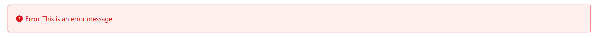
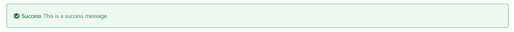
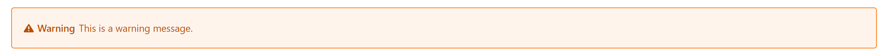
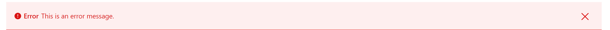
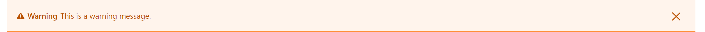

# Clay Alerts

Clay alerts come in two types: embedded and stripe. Both types, along with several examples of each, are shown below.

## Embedded Alerts

Embedded alerts are usually used inside forms. The element that contains it determines an embedded alert's width. The close action is not required for embedded alerts. The following embedded alerts can be created with Clay taglibs:

Danger alert (embedded):

```markup
<clay:alert
	message="This is an error message."
	style="danger"
	title="Error"
/>
```



Success alert (embedded):

```markup
<clay:alert
	message="This is a success message."
	style="success"
	title="Success"
/>
```



Info alert (embedded):

```markup
<clay:alert
	message="This is an info message."
	title="Info"
/>
```


Warning alert (embedded):

```markup
<clay:alert
	message="This is a warning message."
	style="warning"
	title="Warning"
/>
```



## Stripe Alerts

Stripe alerts are placed below the last navigation element (either the header or the navigation bar), and they usually appear on *Save* action, communicating the status of the action once received from the server. Unlike embedded alerts, stripe alerts require the close action. A stripe alert is always the full width of the container and pushes all the content below it. The following stripe alerts can be created with Clay taglibs:

Danger alert (stripe):

```markup
<clay:stripe
	message="This is an error message."
	style="danger"
	title="Error"
/>
```



Success alert (stripe):

```markup
<clay:stripe
	message="This is a success message."
	style="success"
	title="Success"
/>
```


Info alert (stripe):

```markup
<clay:stripe
	message="This is an info message."
	title="Info"
/>
```


Warning alert (stripe):

```markup
<clay:stripe
	message="This is a warning message."
	style="warning"
	title="Warning"
/>
```
 


Now you know how to alert users!

## Related Topics

* [Clay Buttons](./clay-buttons.md)
* [Clay Form Elements](./clay-form-elements.md)
* [Clay Labels and Links](./clay-links-and-labels.md)