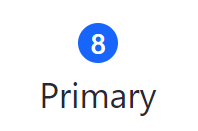
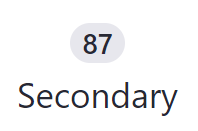
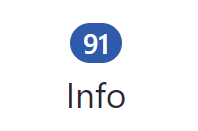
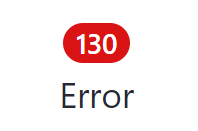
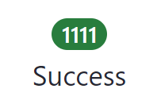
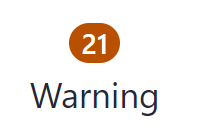

# Clay Badges

Badges help highlight important information such as notifications or new and unread messages. Badges have circular borders and are only used to specify a number. This covers the different types of Clay badges you can add to your app.

## Badge Types

The following badge styles are available:

Primary badge:

```markup
<div class="col-md-1">
    <clay:badge label="8" />

    <div>Primary</div>
</div>
```



Secondary badge:

```markup
<div class="col-md-1">
    <clay:badge label="87" style="secondary" />

    <div>Secondary</div>
</div>
```



Info badge:

```markup
<div class="col-md-1">
    <clay:badge label="91" style="info" />

    <div>Info</div>
</div>
```



Error badge:

```markup
<div class="col-md-1">
    <clay:badge label="130" style="danger" />

    <div>Error</div>
</div>
```



Success badge:

```markup
<div class="col-md-1">
    <clay:badge label="1111" style="success" />

    <div>Success</div>
</div>
```



Warning badge:

```markup
<div class="col-md-1">
    <clay:badge label="21" style="warning" />

    <div>Warning</div>
</div>
```



Now you know how to use badges to keep track of values in your app.

## Related Topics

* [Clay Labels and Links](./clay-links-and-labels.md)
* [Clay Cards](./clay-cards.md)
* [Clay Stickers](./clay-stickers.md)