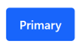
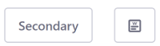
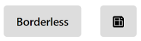
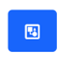
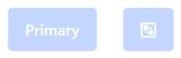
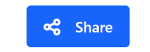
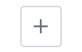
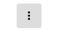

# Clay Buttons

Buttons come in several types and variations. This tutorial covers the different styles and variations of buttons you can create with the Clay taglibs.

## Types

**Primary button:** Used for the most important actions. Two primary buttons should not be together or near each other.

Primary button with label:

```jsp
<clay:button label="Primary" />
```



**Secondary button:** Used for secondary actions. There can be multiple secondary buttons together or near each other.

```jsp
<div class="col">
    <clay:button label="Secondary" style="secondary" />
</div>
<div class="col">
    <clay:button ariaLabel="Wiki" icon="wiki" style="secondary" />
</div>
```



**Borderless button:** Used in cases such as toolbars where the secondary button would be too heavy for the design. This keeps the design clean.

```jsp
<div class="col">
    <clay:button label="Borderless" style="borderless" />
</div>
<div class="col">
    <clay:button ariaLabel="Page Template" icon="page-template" style="borderless" />
</div>
```



**Link button:** Used for Cancel actions.

```jsp
<div class="col">
    <clay:button label="Link" style="link" />
</div>
<div class="col">
    <clay:button ariaLabel="Add Role" icon="add-role" style="link" />
</div>
```


You can use labels or icons for your buttons. Below is an example of a Primary button with an icon:

```jsp
<clay:button ariaLabel="Workflow" icon="workflow" />
```



You can disable a button by adding the `disabled` attribute:

```jsp
<div class="col">
    <clay:button disabled="<%= true %>" label="Primary" />
</div>
<div class="col">
    <clay:button ariaLabel="Workflow" disabled="<%= true %>" icon="workflow" />
</div>
```



## Variations

Button with icon and text:

```jsp
<clay:button icon="share" label="Share" />
```



Button with monospaced text:

```jsp
<clay:button icon="indent-less" monospaced="<%= true %>" style="secondary" />
```


Block level button:

```jsp
<clay:button block="<%= true %>" label="Button" />
 ```
 


Plus button:

```jsp
<clay:button icon="plus" monospaced="<%= true %>" style="secondary" />
```



Action button:

```jsp
<clay:button icon="ellipsis-v" monospaced="<%= true %>" style="borderless" />
 ```
 


## Related Topics

* [Clay Alerts](./clay-alerts.md)
* [Clay Buttons](./clay-buttons.md)
* [Clay Labels and Links](./clay-links-and-labels.md)