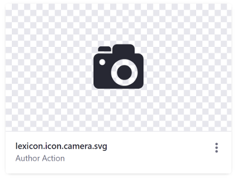
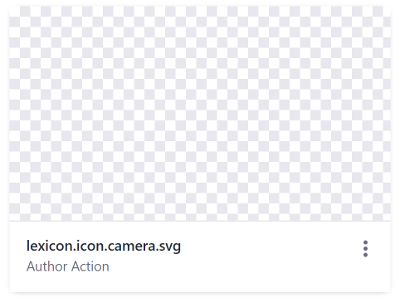
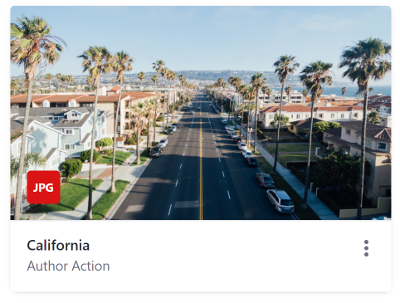
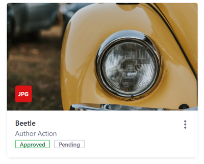
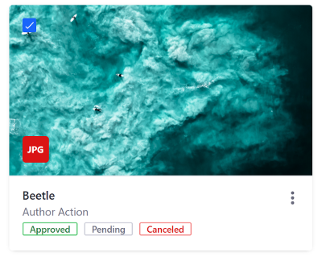
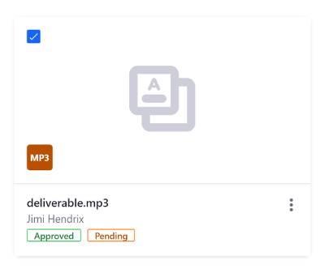
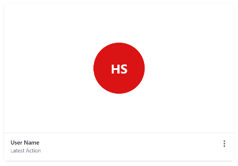
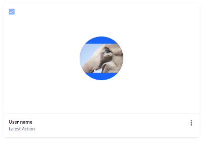
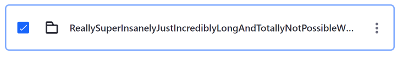

# Clay Cards

Cards visually represent data. Use them for images, document libraries, user profiles and more. There are four main types of Cards:

* Image Cards
* File Cards
* User Cards
* Horizontal Cards

Each of these types is covered below.

## Image Cards

Image Cards are used for image/document galleries.

Image Card:

```markup
<clay:image-card
	actionItems="<%= cardsDisplayContext.getDefaultActionItems() %>"
	href="#1"
	imageAlt="thumbnail"
	imageSrc="https://images.unsplash.com/photo-1506976773555-b3da30a63b57"
	subtitle="Author Action"
	title="Madrid"
/>
```


Image Card with icon:

```markup
<clay:image-card
	actionItems="<%= cardsDisplayContext.getDefaultActionItems() %>"
	icon="camera"
	subtitle="Author Action"
	title="<%= SVG_FILE_TITLE %>"
/>
```



Image Card empty:

```markup
<clay:image-card 
  actionItems="<%= cardsDisplayContext.getDefaultActionItems() %>"
	subtitle="Author Action"
	title="<%= SVG_FILE_TITLE %>"
/>
```



Cards can also contain file types. Specify the file type with the `filetype` attribute:

```markup
<clay:image-card
	actionItems="<%= cardsDisplayContext.getDefaultActionItems() %>"
	fileType="JPG"
	fileTypeStyle="danger"
	href="#1"
	imageAlt="thumbnail"
	imageSrc="https://images.unsplash.com/photo-1499310226026-b9d598980b90"
	subtitle="Author Action"
	title="California"
/>
```



Include the `labels` attribute to add a label to a Card:

```markup
<clay:image-card
	actionItems="<%= cardsDisplayContext.getDefaultActionItems() %>"
	fileType="JPG"
	fileTypeStyle="danger"
	href="#1"
	imageAlt="thumbnail"
	imageSrc="https://images.unsplash.com/photo-1503703294279-c83bdf7b4bf4"
	labels="<%= cardsDisplayContext.getLabels() %>"
	subtitle="Author Action"
	title="Beetle"
/>
```



Include the `selectable` attribute to make cards selectable (include a checkbox):

```markup
<clay:image-card
	actionItems="<%= cardsDisplayContext.getDefaultActionItems() %>"
	fileType="JPG"
	fileTypeStyle="danger"
	href="#1"
	imageAlt="thumbnail"
	imageSrc="https://images.unsplash.com/photo-1506020647804-b04ee956dc04"
	labels="<%= cardsDisplayContext.getLabels() %>"
	selectable="<%= true %>"
	selected="<%= true %>"
	subtitle="Author Action"
	title="Beetle"
/>
```



## File Cards

File Cards display an icon of the file's type. They represent file types other than image files (i.e. PDF, MP3, DOC, etc.).

```markup
<clay:file-card
	actionItems="<%= cardsDisplayContext.getDefaultActionItems() %>"
	fileType="MP3"
	fileTypeStyle="warning"
	labels="<%= cardsDisplayContext.getLabels() %>"
	labelStylesMap="<%= cardsDisplayContext.getLabelStylesMap() %>"
	selectable="<%= true %>"
	selected="<%= true %>"
	subtitle="Jimi Hendrix"
	title="<%= MP3_FILE_TITLE %>"
/>
```



You can optionally use the `labelStylesMap` attribute to pass a `HashMap` of  multiple labels, as shown above.

The example below specifies a list `icon` instead of the default file icon:

```markup
<clay:file-card
	actionItems="<%= cardsDisplayContext.getDefaultActionItems() %>"
	fileType="DOC"
	fileTypeStyle="info"
	icon="list"
	labels="<%= cardsDisplayContext.getLabels() %>"
	selectable="<%= true %>"
	selected="<%= true %>"
	subtitle="Paco de Lucia"
	title="<%= DOC_FILE_TITLE %>"
/>
```

```{note}
The full list of available Liferay icons can be found on the [Clay CSS website](https://claycss.com/docs/components/icons-lexicon.html#clay-lexicon-icons).
```

## User Cards

User Cards display user profile images or the initials of the user's name or name+surname.

User Card with initials:

```markup
<clay:user-card
	actionItems="<%= cardsDisplayContext.getDefaultActionItems() %>"
	initials="HS"
	name="User Name"
	subtitle="Latest Action"
	userColor="danger"
/>
```



User Card with profile image:

```markup
<clay:user-card
	actionItems="<%= cardsDisplayContext.getDefaultActionItems() %>"
	disabled="<%= true %>"
	imageAlt="thumbnail"
	imageSrc="https://images.unsplash.com/photo-1502290822284-9538ef1f1291"
	name="User name"
	selectable="<%= true %>"
	selected="<%= true %>"
	subtitle="Latest Action"
/>
```



## Horizontal Cards

Horizontal Cards represent folders and can have the same amount of information as other Cards. The key difference is that horizontal Cards let you remove the image portion of the Card, since only the folder icon is required.

```markup
<clay:horizontal-card
	actionItems="<%= cardsDisplayContext.getDefaultActionItems() %>"
	selectable="<%= true %>"
	selected="<%= true %>"
	title="ReallySuperInsanelyJustIncrediblyLongAndTotallyNotPossibleWordButWeAreReallyTryingToCoverAllOurBasesHereJustInCaseSomeoneIsNutsAsPerUsual"
/>
```



Now you know how to use Cards in your UI to display information in your apps.

## Related Topics

* [Clay Badges](./clay-badges.md)
* [Clay Labels and Links](./clay-links-and-labels.md)
* [Clay Stickers](./clay-stickers.md)