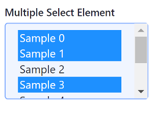

# Clay Form Elements

The Liferay Clay tag library provides several tags for creating form elements. An example of each tag is shown below.

## Checkbox

Checkboxes give the user a true or false input.

```jsp	
<clay:checkbox 
		checked="<%= true %>" 
		hideLabel="<%= true %>" 
		label="My Input" 
		name="name" 
/>
```

Attributes:

**checked:** Whether the checkbox is checked

**disabled:** Whether the checkbox is enabled

**hideLabel:** Whether to display the checkbox label

**indeterminate:** Checkbox variable for multiple selection

**label:** The checkbox's label

**name:** The checkbox's name


## Radio

A radio button lets the user select one choice from a set of options in a form.

```jsp
<clay:radio 
		checked="<%= true %>" 
		hideLabel="<%= true %>" 
		label="My Input" 
		name="name" 
/>
```

Attributes:

**checked:** Whether the radio button is checked

**hideLabel:** Whether to display the radio button label

**disabled:** Whether the radio button is enabled

**label:** The radio button's label

**name:** The radio button's name


## Selector

A selector gives the user a select box with a set of options to choose from.

The Java scriplet below creates eight dummy options for the selector:

```java
<%
List<Map<String, Object>> options = new ArrayList<>();

for (int i = 0; i < 8; i++) {
	Map<String, Object> option = new HashMap<>();

	option.put("label", "Sample " + i);
	option.put("value", i);

	options.add(option);
}
%>
```

```jsp
<clay:select 
		label="Regular Select Element" 
		name="name" 
		options="<%= options %>" 
/>
```


If you want let users select multiple options at once, set the `multiple`  attribute to `true`:

```jsp
<clay:select 
		label="Multiple Select Element" 
		multiple="<%= true %>" 
		name="name" 
		options="<%= options %>" 
/>
```



Attributes:

**disabled:** Whether the selector is enabled **label:** The selector's label **multiple:** Whether multiple options can be selected **name:** The selector's name

Now you know how to use Clay taglibs to add common form elements to your app!

## Related Topics

* [Clay Buttons](./clay-buttons.md)
* [Clay Icons](./clay-icons.md)
* [Clay Labels and Links](./clay-links-and-labels.md)