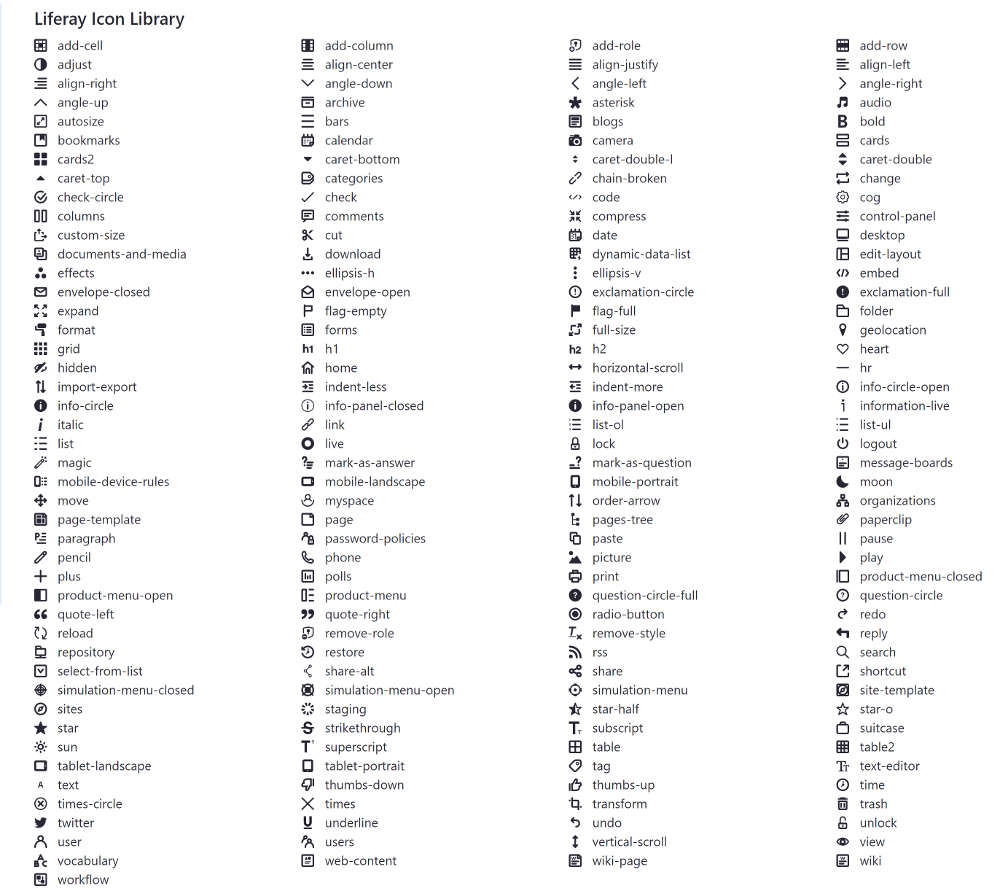
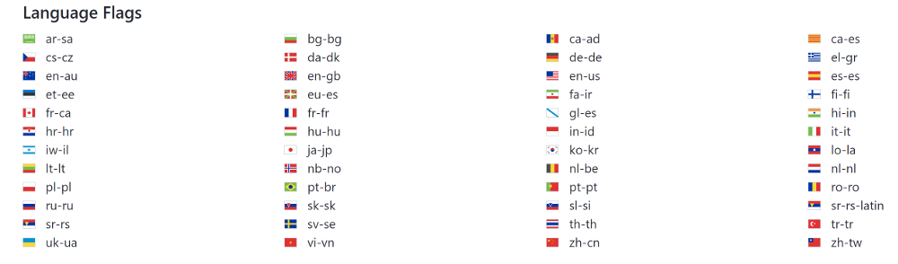

# Clay Icons

The Liferay Clay taglibs provide several icons that you can use in your apps. Use the `clay:icon` tag and specify the icon with the `symbol` attribute:

```markup
<clay:icon symbol="folder" />
```


The full list of icons is shown below:



The Liferay Clay taglibs also provide a set of language flag icons that you can  use in your app. The full list of language flags is shown below:



## Related Topics

* [Clay Badges](./clay-badges.md)
* [Clay Stickers](./clay-stickers.md)
* [Using Clay Icons in a Theme](/docs/7-2/frameworks/-/knowledge_base/f/using-clay-icons-in-a-theme)