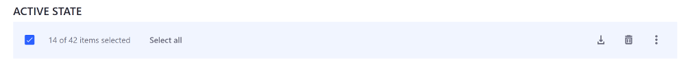
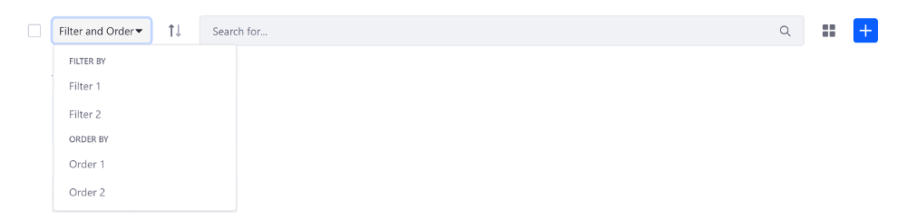
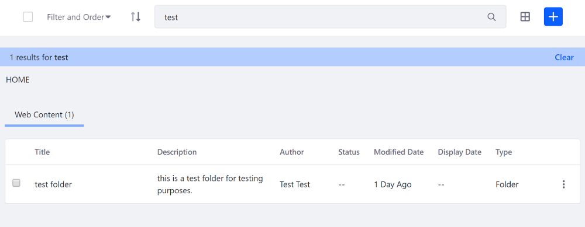
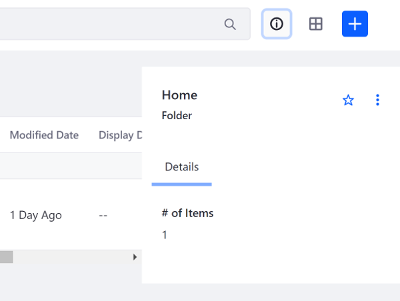
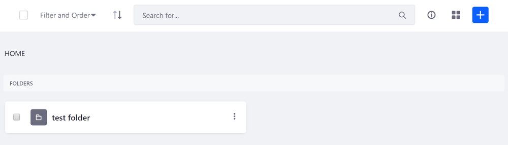
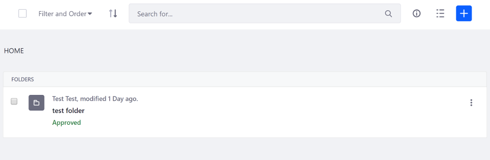
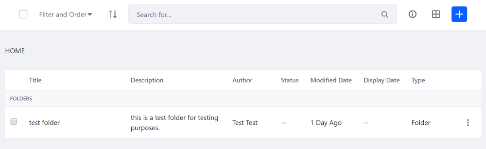
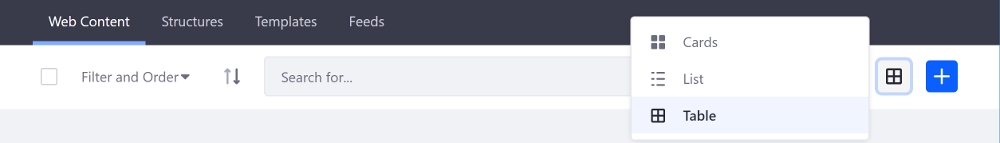

# Clay Management Toolbar

The Management Toolbar gives administrators control over search container results in their apps. It lets you filter, sort, and choose a view type for search results, so you can quickly identify the document, web content, asset entry, or whatever you're looking for. The Management Toolbar is fully customizable, so you can implement all the controls or just the ones your app requires. 


To create a management toolbar, use the `clay:management-toolbar` taglib. The  toolbar contains a few key sections. Each section is grouped and configured using different attributes. These attributes are described in more detail below.

## Using a Display Context to Configure the Management Toolbar

If you're using a Display Context---a separate class to configure your display options for your management toolbar---to define all or some of the configuration options for the toolbar, you can specify the Display Context with the `displayContext` attribute. An example is shown below:

```markup
<clay:management-toolbar 
    displayContext="<%= viewUADEntitiesManagementToolbarDisplayContext %>" 
/>
```

You can see an example use case of a Display Context in [Filtering and Sorting Items with the Management Toolbar](/docs/7-2/frameworks/-/knowledge_base/ffiltering-and-sorting-items-with-the-management-toolbar). A Display Context is not required for a management toolbar's configuration. You  can provide as much or as little of the configuration options for your management toolbar through the Display Context as you like.  

## Checkbox and Actions

The `actionItems`, `searchContainerId`, `selectable`, and `totalItems` attributes let you include a checkbox in the toolbar to select all search container results and run bulk actions on them. Actions and total items display when an individual result is checked, or when the master checkbox is checked in the toolbar. 

`actionItems`: The list of dropdown items to display when a result is checked or the master checkbox in the Management Toolbar is checked. You can select multiple results between pages. The Management Toolbar keeps track of the number of selected results for you.

`searchContainerId`: The ID of the search container connected to the Management Toolbar

`selectable`: Whether to include a checkbox in the Management Toolbar

`totalItems`: The total number of items across pagination. This number displays when one or multiple items are selected.

An example configuration is shown below:

```java
actionItems="<%=
    new JSPDropdownItemList(pageContext) {
        {
          add(
            dropdownItem -> {
              dropdownItem.setHref("#edit");
              dropdownItem.setLabel("Edit");
            });
  
          add(
            dropdownItem -> {
              dropdownItem.setHref("#download");
              dropdownItem.setIcon("download");
              dropdownItem.setLabel("Download");
              dropdownItem.setQuickAction(true);
            });
  
          add(
            dropdownItem -> {
              dropdownItem.setHref("#delete");
              dropdownItem.setLabel("Delete");
              dropdownItem.setIcon("trash");
              dropdownItem.setQuickAction(true);
            });
        }
    }
%>"
```

Action items are listed in the Actions menu, along with the number of items selected across pagination. 


If an action has an icon specified, such as the Delete and Download actions in the example above, the icon is displayed next to the action menu as well.



## Filtering and Sorting Search Results

The `filterItems`, `sortingOrder`, and `sortingURL` attributes let you filter and sort search container results. Filtering and sorting are grouped together in one convenient dropdown menu. 

`filterItems`: Sets the search container's filtering options. This filter should  be included in all control panel applications. Filtering options can include sort criteria, sort ordering, and more.

`filterLabelItems`: Sets the search container's filter labels to display. This lets the user know which filters are currently applied.

`sortingOrder`: The current sorting order: ascending or descending.

`sortingURL`: The URL to change the sorting order

The example below adds two filter options and two sorting options:

```java
filterItems="<%=
    new DropdownItemList(_request) {
        {
            addGroup(
                dropdownGroupItem -> {
                    dropdownGroupItem.setDropdownItemList(
                        new DropdownItemList(_request) {
                            {
                                add(
                                    dropdownItem -> {
                                        dropdownItem.setHref("#1");
                                        dropdownItem.setLabel("Filter 1");
                                    });

                                add(
                                    dropdownItem -> {
                                        dropdownItem.setHref("#2");
                                        dropdownItem.setLabel("Filter 2");
                                    });
                            }
                        }
                    );
                    dropdownGroupItem.setLabel("Filter By");
                });
                
            addGroup(
                dropdownGroupItem -> {
                    dropdownGroupItem.setDropdownItemList(
                        new DropdownItemList(_request) {
                            {
                                add(
                                    dropdownItem -> {
                                        dropdownItem.setHref("#3");
                                        dropdownItem.setLabel("Order 1");
                                    });

                                add(
                                    dropdownItem -> {
                                        dropdownItem.setHref("#4");
                                        dropdownItem.setLabel("Order 2");
                                    });
                            }
                        }
                    );
                    dropdownGroupItem.setLabel("Order By");
                });
        }
    }
%>"
```

```java
filterLabelItems="<%=
  new LabelItemList() {
    {
      add(
        labelItem -> {
          labelItem.setLabel("Filter 1");
        });

      add(
        labelItem -> {
          labelItem.setLabel("Filter 2");
        });
    }
  };
%>"
```




## Search Form

The `clearResultsURL`, `searchActionURL`, `searchFormName`, `searchInputName`, and `searchValue` attributes let you configure the search form. The main portion of the Management Toolbar is reserved for the search form.

`clearResultsURL`: The URL to reset the search

`searchActionURL`: The action URL to send the search form

`searchFormName`: The search form's name

`searchInputName`: The search input's name

`searchValue`: The search input's value

An example configuration is shown below:

```markup
<clay:management-toolbar
    clearResultsURL="<%= searchURL %>"
    disabled="<%= isDisabled %>"
    namespace="<%= renderResponse.getNamespace() %>"
    searchActionURL="<%= searchURL %>"
    searchFormName="fm"
    searchInputName="<%= DisplayTerms.KEYWORDS %>"
    searchValue="<%= ParamUtil.getString(request, searchInputName) %>"
    selectable="<%= false %>"
    totalItems="<%= totalItems %>"
/>
```



## Info Panel

The `infoPanelId` and `showInfoButton` attributes let you add a retractable sidebar panel that displays additional information related to a search container result.

`infoPanelId`: The ID of the info panel to toggle

`showInfoButton`: Whether to show the info button

In the example configuration below, the `showInfoButton` attribute is provided in the Display Context---specified with the `displayContext` attribute---and the `infoPanelId` is explicitly set in the JSP:

```markup
<clay:management-toolbar
    displayContext="<%= journalDisplayContext %>"
    infoPanelId="infoPanelId"
    namespace="<%= renderResponse.getNamespace() %>"
    searchContainerId="<=% searchContainerId %>"
/>
```



## View Types

The `viewTypes` attribute specifies the display options for the search container results. There are three display options to choose from:

**Cards:** Displays search result columns on a horizontal or vertical card.



**List:** Displays a detailed description along with summarized details for the search result columns.



**Table:** The default view. Lists the search result columns from left to right.



An example configuration is shown below:

```java
viewTypes="<%=
    new JSPViewTypeItemList(pageContext, baseURL, selectedType) {
        {
        	addCardViewTypeItem(
        		viewTypeItem -> {
        			viewTypeItem.setActive(true);
        			viewTypeItem.setLabel("Card");
        		});

        	addListViewTypeItem(
        		viewTypeItem -> {
        			viewTypeItem.setLabel("List");
        		});

        	addTableViewTypeItem(
        		viewTypeItem -> {
        			viewTypeItem.setLabel("Table");
        		});
        }
    }
%>"
```

While the example above shows how to configure the view types in the JSP, you must also [specify when to use each view type](/docs/7-2/frameworks/-/knowledge_base/f/implementing-the-view-types).



## Creation Menu

The `creationMenu` attribute creates an add menu button for one or multiple items. It's used for creating new entities (e.g. a new blog entry).

Use the `addPrimaryDropdownItem()` method to add the top level items to the dropdown menu, or use the `addFavoriteDropdownItem()` method to add secondary items to the dropdown menu.

The example configuration below adds two primary creation menu items and two secondary creation menu items:

```java
creationMenu="<%= 
    new JSPCreationMenu(pageContext) {
  			{
  				addPrimaryDropdownItem(
  					dropdownItem -> {
  						dropdownItem.setHref("#1");
  						dropdownItem.setLabel("Sample 1");
  					});
  
  				addPrimaryDropdownItem(
  					dropdownItem -> {
  						dropdownItem.setHref("#2");
  						dropdownItem.setLabel("Sample 2");
  					});
  
  				addFavoriteDropdownItem(
  					dropdownItem -> {
  						dropdownItem.setHref("#3");
  						dropdownItem.setLabel("Favorite 1");
  					});
  
  				addFavoriteDropdownItem(
  					dropdownItem -> {
  						dropdownItem.setHref("#4");
  						dropdownItem.setLabel("Other item");
  					});
  			}
  	};
%>"
```


## Related Topics

* [Clay Dropdown Menus and Action Menus](./clay-dropdown-and-action-menus.md)
* [Clay Icons](./clay-icons.md)
* [Clay Navigation Bars](./clay-navigation-bars.md)