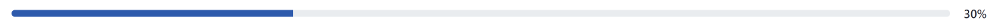
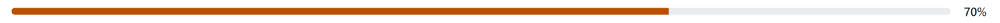

# Clay Progress Bars

You can add progress bars to your app with the `clay:progressbar` tag. These indicate the completion percentage of a task and come in three status styles: `default` (blue), `warning` (red), and `complete` (green with checkmark). You can provide a minimum value (`minValue`) and a maximum value (`maxValue`).

Default progress bar:

```markup
<clay:progressbar 
    maxValue="<%= 100 %>" 
    minValue="<%= 0 %>" 
    value="<%= 30 %>" 
/>
```



Warning progress bar:

```markup
<clay:progressbar 
    maxValue="<%= 100 %>" 
    minValue="<%= 0 %>" 
    status="warning" 
    value="<%= 70 %>" 
/>
```



Complete progress bar:

```markup
<clay:progressbar 
    status="complete" 
/>
```


Clay taglibs make it easy to track progress in your apps.

## Related Topics

* [Clay Dropdown Menus and Action Menus](./clay-dropdown-and-action-menus.md)
* [Clay Icons](./clay-icons.md)
* [Clay Navigation Bars](./clay-navigation-bars.md)