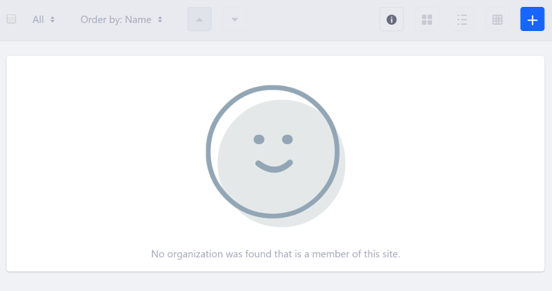

# Disabling All or Portions of the Management Bar

When there are no search results to display, you should disable all the Management Bar's buttons, except the sidenav toggler button. 

You can disable the Management Bar by adding the `disabled` attribute to the `liferay-frontend:management-bar` tag:

```markup
<liferay-frontend:management-bar
        disabled="<%= total == 0 %>"
        includeCheckBox="<%= true %>"
        searchContainerId="<%= searchContainerId %>"
>
```

You can also disable individual components by adding the `disabled` attribute to the corresponding tag. The example below disables the display buttons when the search container displays 0 results, since changing the display style has no  effect when there aren't any results to view:

```markup
<liferay-frontend:management-bar-display-buttons
        disabled="<%= total == 0 %>"
        displayViews='<%= new String[] {"descriptive", "icon", "list"} %>'
        portletURL="<%= changeDisplayStyleURL %>"
        selectedDisplayStyle="<%= displayStyle %>"
/>
```



## Related Topics

* [Including Actions in the Management Bar](./including-actions-in-the-management-bar.md)
* [Clay Management Toolbar](../clay-tag-library/clay-management-toolbar.md)