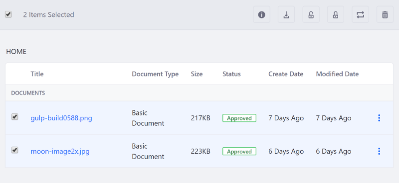
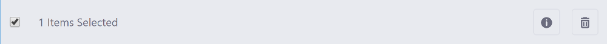

# Including Actions in the Management Bar

While an actions menu is typically included with each search container result, you can also include these actions in the management bar. This keeps everything organized within the same UI. This update adds a checkbox next to each search container result, as well as adds one in the management bar itself to select all results. The actions are displayed when a checkbox is checked---individual or select all---and hidden from view otherwise. 



Follow these steps to include actions in your management bar:

1. Update the `<liferay-frontend:management-bar>` tag to include the checkbox and provide the search container's ID:

    ```markup
    <liferay-frontend:management-bar
    	includeCheckBox="<%= true %>"
    	searchContainerId="mySearchContainerId"
    >
    ```

1. After the closing `</liferay-frontend:management-bar-filters>` tag, add the `<liferay-frontend:management-bar-action-buttons>` tags:

    ```markup
    <liferay-frontend:management-bar-action-buttons>

    </liferay-frontend:management-bar-action-buttons>
    ```

1. Use the available management bar button taglibs (e.g. `management-bar-button`) to build the action buttons for your app's management bar. A code snippet from the Site admin portlet is shown below: 

    ```markup
    <liferay-frontend:management-bar-action-buttons>
    	<liferay-frontend:management-bar-sidenav-toggler-button
    		icon="info-circle"
    		label="info"
    	/>

    	<liferay-frontend:management-bar-button
    		href="javascript:deleteEntries();"
    		icon="trash"
    		id="deleteSites"
    		label="delete"
    	/>
    </liferay-frontend:management-bar-action-buttons>
    ```



## Related Topics

- [Disabling All or Portions of the Management Bar](./disabling-the-management-bar.md)
- [Clay Management Toolbar](../clay-tag-library/clay-management-toolbar.md)