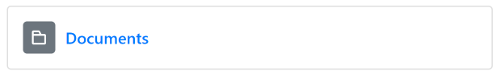
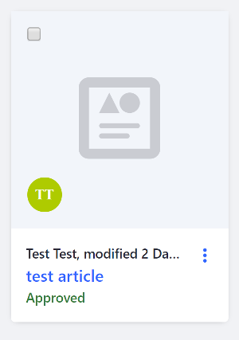
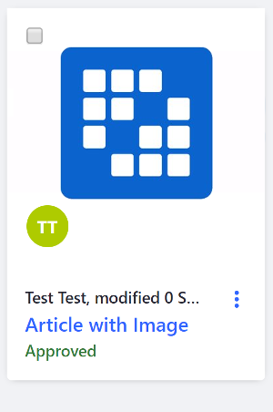
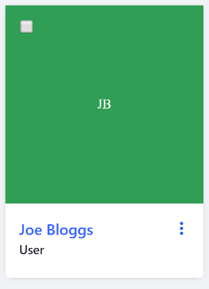

# Liferay Front-end Cards

If you have data you want to compare that's heavy on image usage, cards are the component for the job. Cards visually represent data in a minimal and compact format. Use them for images, document libraries, user profiles, and more. There are four main types of Cards:

* Horizontal Cards
* Icon Cards
* Vertical Cards
* User Cards

Examples of each card are shown below.

## Horizontal Card

Horizontal cards are used primarily to display documents, such as files and folders. An example configuration is shown below:

```jsp
<liferay-frontend:horizontal-card
	text="Documents"
  url="https://portal.liferay.dev/docs/7-1/tutorials/-/knowledge_base/t/clay-icons"
>
	<liferay-frontend:horizontal-card-col>
				<liferay-frontend:horizontal-card-icon
					icon="folder"
				/>
	</liferay-frontend:horizontal-card-col>
</liferay-frontend:horizontal-card>
```



The `<liferay-frontend:horizontal-card-icon>` tag uses [Clay Icons](../clay-tag-library/clay-icons.md) for its `icon` attribute. 

## Icon Vertical Card

Icon vertical cards, as the name suggests, are cards that display information in a vertical format that emphasizes an icon. These cards show content that doesn't have an associated image. Instead, an icon representing the type of content is displayed. The example snippet below displays information for a web content article:

```jsp
<liferay-frontend:icon-vertical-card
  cssClass="article-preview-content"
  icon="web-content"
  title="<%= title %>"
>
  <liferay-frontend:vertical-card-sticker-bottom>
    <liferay-ui:user-portrait
      cssClass="sticker sticker-bottom"
      userId="<%= assetRenderer.getUserId() %>"
    />
  </liferay-frontend:vertical-card-sticker-bottom>

  <liferay-frontend:vertical-card-footer>
    <aui:workflow-status 
      markupView="lexicon" 
      showIcon="<%= false %>" 
      showLabel="<%= false %>" 
      status="<%= article.getStatus() %>" 
    />
  </liferay-frontend:vertical-card-footer>
</liferay-frontend:icon-vertical-card>
```



## Vertical Card

Vertical cards display information in a vertical card format, as opposed to a horizontal format. If the content has an associated image (like a blog header image) you can use a vertical card to display the image. If there is no associated image, you can use an icon vertical card to represent the content's type instead (e.g. a PDF file). The example below displays a vertical card for a web content article when an image preview is available:

```jsp
<liferay-frontend:vertical-card
  cssClass="article-preview-content"
  imageUrl="<%= articleImageURL %>"
  title="<%= title %>"
>
  <liferay-frontend:vertical-card-sticker-bottom>
    <liferay-ui:user-portrait
      cssClass="sticker sticker-bottom"
      userId="<%= assetRenderer.getUserId() %>"
    />
  </liferay-frontend:vertical-card-sticker-bottom>

  <liferay-frontend:vertical-card-footer>
    <aui:workflow-status 
      markupView="lexicon" 
      showIcon="<%= false %>" 
      showLabel="<%= false %>" 
      status="<%= article.getStatus() %>" 
    />
  </liferay-frontend:vertical-card-footer>
</liferay-frontend:vertical-card>
```



## HTML Vertical Card

The HTML Vertical card lets you display custom HTML in the header of the vertical card. The example below embeds a video:

```
<liferay-util:buffer var = "customThumbnailHtml">
	<div class="embed-responsive embed-responsive-16by9">
	  <iframe class="embed-responsive-item" 
    src="https://www.youtube.com/embed/8Bg9jPJpGOM?rel=0" 
    allowfullscreen></iframe>
	</div>
</liferay-util:buffer>

<div class="container">
  <div class="row">
    <div class="col-md-4">
      <liferay-frontend:html-vertical-card
      	html="<%= customThumbnailHtml %>"
      	title="My Video"
      >
      </liferay-frontend:html-vertical-card>
    </div>
  </div>
</div>
```


## User Vertical Card

The User Vertical card displays user profile selections in the icon view of the Management Bar. Below is an example snippet from the User Admin portlet:

```jsp
<liferay-frontend:user-vertical-card
  actionJsp="/membership_request_action.jsp"
  actionJspServletContext="<%= application %>"
  resultRow="<%= row %>"
  subtitle="<%= membershipRequestUser.getEmailAddress() %>"
  title="<%= HtmlUtil.escape(membershipRequestUser.getFullName()) %>"
  userId="<%= membershipRequest.getUserId() %>"
>
  <liferay-frontend:vertical-card-header>
    <liferay-ui:message 
      arguments="<%= LanguageUtil.getTimeDescription(
      request, 
      System.currentTimeMillis() - membershipRequest.getCreateDate().getTime(), 
      true) %>" 
      key="x-ago" 
      translateArguments="<%= false %>" 
    />
  </liferay-frontend:vertical-card-header>
</liferay-frontend:user-vertical-card>
```



## Related Topics

* [Liferay Front-end Add Menu](./liferay-frontend-add-menu.md)
* [Liferay Front-end Info Bar](./liferay-frontend-info-bar.md)
* [Liferay Front-end Management Bar](./liferay-frontend-management-bar.md)