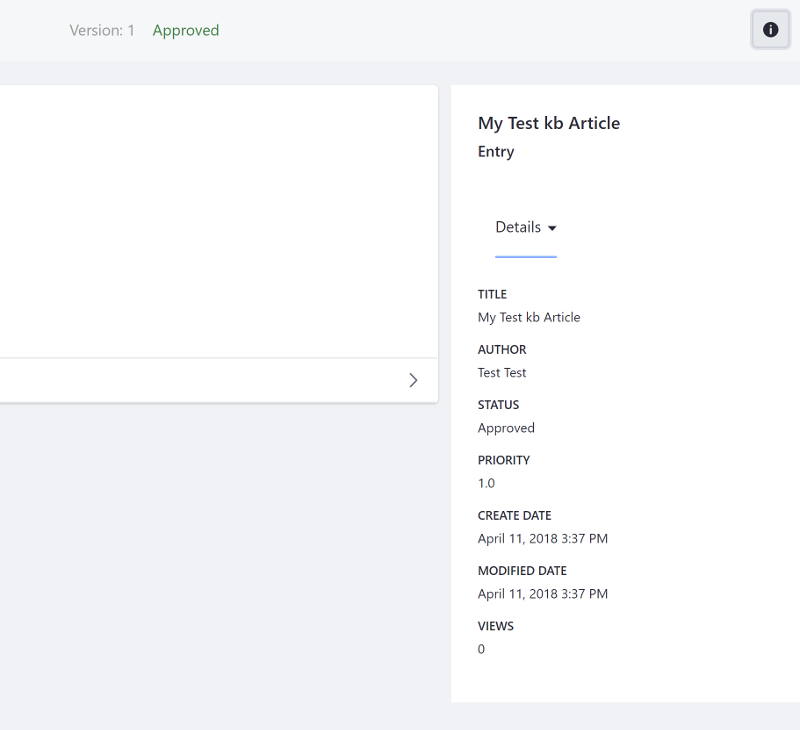
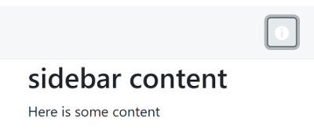

# Liferay Front-end Info Bar

An info bar provides a button that toggles the visibility of additional sidebar information. This is perfect for providing more detailed metadata for a search result, such as the file size, type, URL, etc. 



The configuration has two key parts: the info bar---and buttons---and the sidebar panel. 

Info bar:

```markup
<liferay-frontend:info-bar>
  <liferay-frontend:info-bar-buttons>
    <liferay-frontend:info-bar-sidenav-toggler-button
      icon="info-circle"
      label="my info"
    />
  </liferay-frontend:info-bar-buttons>
</liferay-frontend:info-bar>
```

The `<liferay-frontend:info-bar-sidenav-toggler-button>` tag uses [Clay Icons](../clay-tag-library/clay-icons.md) for the `icon` attribute. 

Sidebar panel:

```markup
<div class="closed container-fluid-1280 sidenav-container sidenav-right" id="<portlet:namespace />infoPanelId">
    <liferay-frontend:sidebar-panel>
      <div>
      <h2>sidebar content</h2>
      <p>Here is some content</p>
      </div>
    </liferay-frontend:sidebar-panel>
</div>
```

Note that the sidebar panel's wrapper `<div>` has the classes `closed` and `sidenav-right`. The info button toggles the classes `open` and `closed`, showing and hiding the sidebar panel. The `sidenav-right` class specifies that the panel should open on the right.



The examples above use some of the available attributes. See the [info bar](https://docs.liferay.com/dxp/apps/foundation/latest/taglibdocs/liferay-frontend/info-bar.html), [info bar buttons](https://docs.liferay.com/dxp/apps/foundation/latest/taglibdocs/liferay-frontend/info-bar-buttons.html), [info bar sidenav toggler button](https://docs.liferay.com/dxp/apps/foundation/latest/taglibdocs/liferay-frontend/info-bar-sidenav-toggler-button.html), and [sidebar panel](https://docs.liferay.com/dxp/apps/foundation/latest/taglibdocs/liferay-frontend/sidebar-panel.html)  taglibdocs for the full list of available attributes for the tags. 

## Related Topics

- [Liferay Front-end Add Menu](./liferay-frontend-add-menu.md)
- [Liferay Front-end Cards](./liferay-frontend-cards.md)
- [Liferay Front-end Management Bar](./liferay-frontend-management-bar.md)