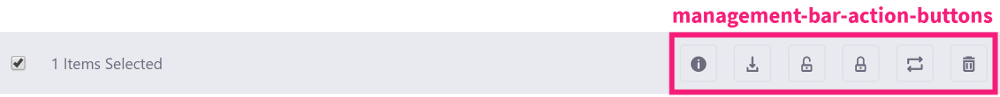

# Liferay Front-end Management Bar

The Management Bar gives administrators control over search container results. It lets you filter, sort, and choose a display style for search results, so you can quickly identify the document, web content, asset entry, or whatever you're looking for in your app. The Management Bar is fully customizable, so you can implement all the controls, or just the ones your app requires. 


```{note}
   The Liferay Front-end Management Bar is deprecated as of @product-ver@. We recommend that you use the [Clay Management Toolbar](../clay-tag-library/clay-management-toolbar.md) instead.
```

The Management Bar has a few key sections. Each section is grouped and configured using different taglibs:

The [`<liferay-frontend:management-bar-buttons>` tag](https://docs.liferay.com/dxp/apps/foundation/latest/taglibdocs/liferay-frontend/management-bar-buttons.html) wraps the Management Bar's button elements:


The [`<liferay-frontend:management-bar-sidenav-toggler-button>` tag](https://docs.liferay.com/dxp/apps/foundation/latest/taglibdocs/liferay-frontend/management-bar-sidenav-toggler-button.html)  implements slide-out navigation for the info button.

The [`<liferay-frontend:management-bar-display-buttons>` tag](https://docs.liferay.com/dxp/apps/foundation/latest/taglibdocs/liferay-frontend/management-bar-display-buttons.html) renders the app's display style options.


The [`<liferay-frontend:management-bar-filters>` tag](https://docs.liferay.com/dxp/apps/foundation/latest/taglibdocs/liferay-frontend/management-bar-filters.html) wraps the app's filtering options. This filter should be included in all control  panel applications. Filtering options can include sort criteria, sort ordering, and more. 


Finally, the [`<liferay-frontend:management-bar-action-buttons>` tag](https://docs.liferay.com/dxp/apps/foundation/latest/taglibdocs/liferay-frontend/management-bar-action-buttons.html) wraps the actions that you can execute over selected items. You can select multiple items between pages. The management bar keeps track of the number of selected items for you. 



For example, here's the Management Bar configuration in the Trash app:

```markup
<liferay-frontend:management-bar
   includeCheckBox="<%= true %>"
   searchContainerId="trash"
>
   <liferay-frontend:management-bar-buttons>
       <liferay-frontend:management-bar-sidenav-toggler-button />

       <liferay-portlet:actionURL name="changeDisplayStyle"
       varImpl="changeDisplayStyleURL">
           <portlet:param name="redirect" value="<%= currentURL %>" />
       </liferay-portlet:actionURL>

       <liferay-frontend:management-bar-display-buttons
           displayViews='<%= new String[] {"descriptive", "icon",
           "list"} %>'
           portletURL="<%= changeDisplayStyleURL %>"
           selectedDisplayStyle="<%= trashDisplayContext.getDisplayStyle()
           %>"
       />
   </liferay-frontend:management-bar-buttons>

   <liferay-frontend:management-bar-filters>
       <liferay-frontend:management-bar-navigation
           navigationKeys='<%= new String[] {"all"} %>'
           portletURL="<%= trashDisplayContext.getPortletURL() %>"
       />

       <liferay-frontend:management-bar-sort
           orderByCol="<%= trashDisplayContext.getOrderByCol() %>"
           orderByType="<%= trashDisplayContext.getOrderByType() %>"
           orderColumns='<%= new String[] {"removed-date"} %>'
           portletURL="<%= trashDisplayContext.getPortletURL() %>"
       />
   </liferay-frontend:management-bar-filters>

   <liferay-frontend:management-bar-action-buttons>
       <liferay-frontend:management-bar-sidenav-toggler-button />

       <liferay-frontend:management-bar-button href="javascript:;"
       icon="trash" id="deleteSelectedEntries" label="delete" />
   </liferay-frontend:management-bar-action-buttons>
</liferay-frontend:management-bar>
```