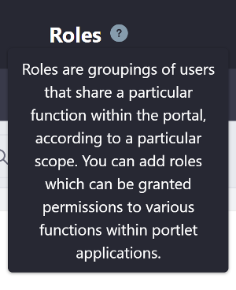
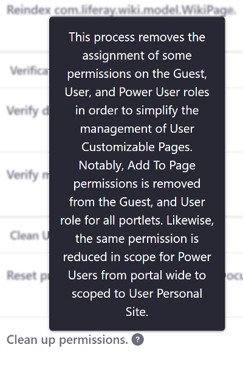

# Liferay UI Icon Help

The icon help tag lets you communicate additional information to your users in an unobtrusive way. It renders as an iconic question mark that provides more information through a pop-up tooltip on mouse over. You can see an example of this in the Control Panel:



```{note}
If you have installed a custom theme you may also need to add the following imports to your ``view.jsp`` to make ``liferay-ui:icon-help`` tag work:

<%@ taglib uri="http://liferay.com/tld/theme" prefix="liferay-theme"%> <liferay-theme:defineObjects />
```

Add the `<liferay-ui:icon-help/>` tag next to the UI that needs tooltip  information. Define the informational text with the required `message`  attribute. Below is an example snippet for one of the Server Administration's  clean up actions:

```markup
<h5>
    <liferay-ui:message key="clean-up-permissions" />
    <liferay-ui:icon-help message="clean-up-permissions-help" />
</h5>
```



Note that the message is supplied via a [language key](https://help.liferay.com/hc/en-us/articles/360028746692-Localizing-Your-Application). While you can use a string for the tooltip's message for testing purposes, a language key is considered best practice and should be used in production. 

## Related Topics

* [Clay Badges](../clay-tag-library/clay-badges.md)
* [Clay Stickers](../clay-tag-library/clay-stickers.md)
* [Liferay UI Icon Menus](./liferay-ui-icon-menus.md)