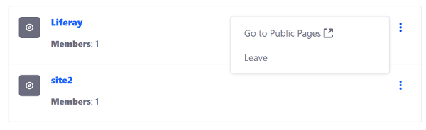

# Liferay UI Icon Menus

You can add a pop-up navigation menu to your app with the `liferay-ui:icon-menu` tag. Icon menus display menu options when needed, storing them away in a collapsed menu when they're not. This keeps the UI clean and uncluttered. Just as with an icon list, you nest [icons](./liferay-ui-icons.md) for each navigation item. You can see an example of a icon menu in a site's actions menu in the My Sites portlet:



Example JSP configuration:

```markup
<liferay-ui:icon-menu
    direction="left-side"
    icon="<%= StringPool.BLANK %>"
    markupView="lexicon"
    message="<%= StringPool.BLANK %>"
    showWhenSingleIcon="<%= true %>"
>

				<liferay-ui:icon
					message="go-to-public-pages"
					target="_blank"
					url="<%= group.getDisplayURL(themeDisplay, false) %>"
				/>

				<liferay-ui:icon
					message="leave"
					url="<%= leaveURL %>"
				/>

</liferay-ui:icon-menu>
```

Note that the `url` attribute is required for icons to render properly. See the [Icon Menu taglibdocs](https://learn.liferay.com/reference/latest/en/dxp/taglibs/util-taglib/liferay-ui/icon-menu.html) for the full list of attributes. 

## Related Topics

* [Clay Icons](../clay-tag-library/clay-icons.md)
* [Liferay UI Icon Lists](./liferay-ui-icon-lists.md)
* [Liferay UI Icons](./liferay-ui-icons.md)