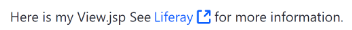

# Using Liferay Util Buffer

The buffer tag is not a self-closing tag. The content placed between the opening and closing of this tag is saved to a buffer and its output is assigned to the Java variable declared with the tag's `var` attribute. The output is returned as a String, letting you post-process it. For example, you can use this to [override a JSP's existing contents](https://help.liferay.com/hc/en-us/articles/360029122451-JSP-Overrides-Using-OSGi-Fragments). 

The example below saves the link's generated markup to a buffer and then uses the returned string as the argument for a `liferay-ui:message` key:

```jsp
<liferay-util:buffer
		var="linkContent"
>
		<aui:a 
			href="https://www.liferay.com/" 
			target="_blank">Liferay
		</aui:a>
</liferay-util:buffer>

<liferay-ui:message 
		arguments="<%= linkContent %>" 
		key="see-x-for-more-information" 
		translateArguments="<%= false %>" 
/>
```

Now you know how to use the `<liferay-util:buffer>` tag to save content to a buffer. 


    
## Related Topics

* [JSP Overrides Using OSGi Fragments](https://help.liferay.com/hc/en-us/articles/360029122451-JSP-Overrides-Using-OSGi-Fragments)
* [Using the Liferay Util Param Tag](./liferay-util-param.md)
* [Using the Liferay Front-End Taglibs](../liferay-frontend-tag-library.md)