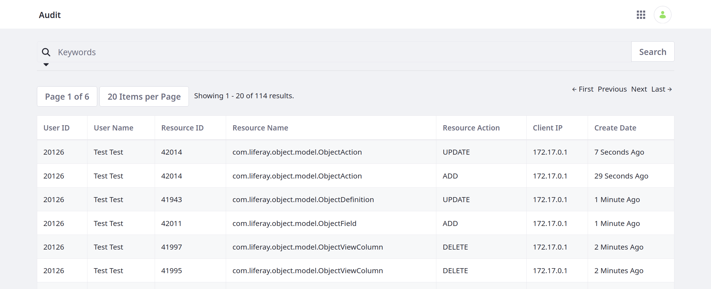
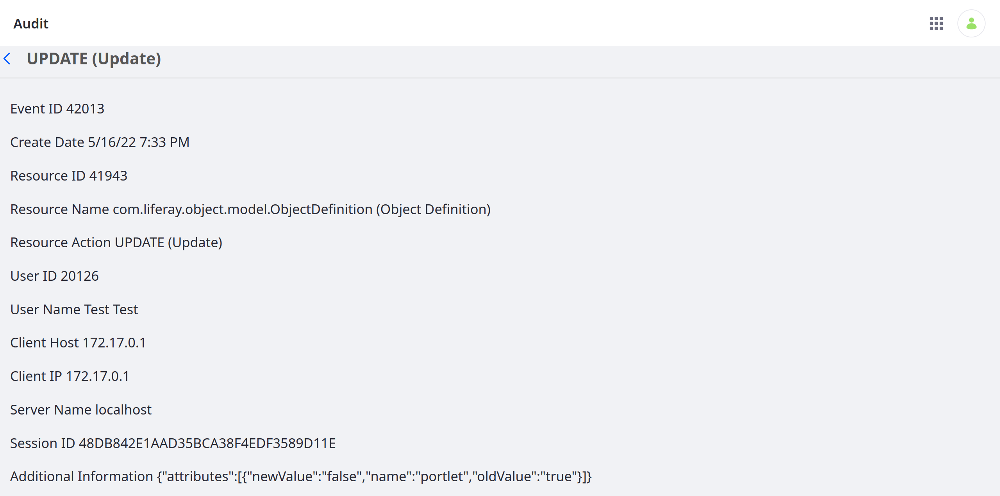

# Auditing Object Definition Events

{bdg-secondary}`Available DXP 7.4 U24+ and Portal GA24+`

The Objects application is integrated with Liferay's Audit framework, so you can keep track of events related to Object definitions. The Audit application lists these events in a table and includes both user and resource information.

To access the Audit application, open the *Global Menu* (), go to the *Control Panel* tab, and click *Audit*.

The table includes the following columns:

| Column | Description |
| :--- | :--- |
| User ID | ID of the acting user |
| User Name | Name of the acting user |
| Resource ID | ID of the affected resource |
| Resource Name | Name of the affected resource |
| Resource Action | Action performed (`ADD`, `UPDATE`, or `DELETE`) |
| Client IP | IP address responsible for the action |
| Create Date | When the event record was created |

You can click on any event field to view more a more complete record, including specific action details.

If desired, you can search and filter results using keywords and other facets.

## Additional Information

* [Objects](../../objects.md)
* [Creating and Managing Objects](../creating-and-managing-objects.md)
